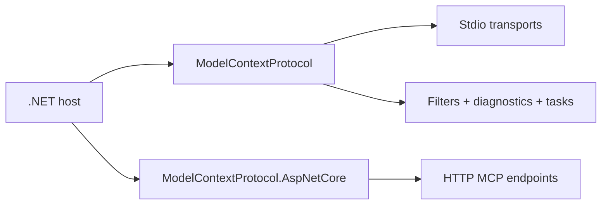

# MCP C# SDK Tutorial: Production MCP in .NET with Hosting, ASP.NET Core, and Task Workflows

> Learn how to build and operate MCP clients and servers with `modelcontextprotocol/csharp-sdk`, including package choices, auth patterns, tasks, diagnostics, and versioning strategy.

## Why This Track Matters

The C# SDK is one of the strongest MCP implementations for enterprise .NET stacks, with first-class hosting/DI integration, ASP.NET Core transport support, and detailed concept docs.

This track focuses on:

- selecting the right package layer (`ModelContextProtocol`, `.Core`, `.AspNetCore`)
- implementing client/server patterns with host-friendly abstractions
- using filters, diagnostics, and versioning guidance for safer evolution
- deploying protected MCP endpoints with OAuth-compatible flows

## Current Snapshot (Verified February 12, 2026)

- repository: [`modelcontextprotocol/csharp-sdk`](https://github.com/modelcontextprotocol/csharp-sdk)
- stars: about **3.9k**
- package posture: preview NuGet packages (no GitHub releases published)
- recent activity: updated on **February 12, 2026**
- runtime baseline: .NET 9+ for samples (project tooling references .NET 10 SDK for full dev workflow)
- license: Apache-2.0

## Mental Model

## Chapter Guide

| Chapter | Key Question | Outcome |
|:--------|:-------------|:--------|
| [01 - Getting Started and Package Selection](01-getting-started-and-package-selection.md) | Which C# SDK package should I use for my app shape? | Correct package boundary |
| [02 - Client/Server Hosting and stdio Basics](02-client-server-hosting-and-stdio-basics.md) | How do I stand up MCP clients and servers in typical .NET hosts? | Faster onboarding |
| [03 - ASP.NET Core HTTP Transport and Session Routing](03-aspnetcore-http-transport-and-session-routing.md) | How do I design HTTP MCP deployments with route/session control? | Better HTTP architecture |
| [04 - Tools, Prompts, Resources, and Filter Pipelines](04-tools-prompts-resources-and-filter-pipelines.md) | How do I keep primitive behavior and interception predictable? | Cleaner extensibility |
| [05 - Logging, Progress, Elicitation, and Tasks](05-logging-progress-elicitation-and-tasks.md) | How do advanced capabilities work end to end in C#? | Stronger feature execution |
| [06 - OAuth-Protected MCP Servers and Clients](06-oauth-protected-mcp-servers-and-clients.md) | How do we secure MCP endpoints and clients in production? | Lower security risk |
| [07 - Diagnostics, Versioning, and Breaking-Change Management](07-diagnostics-versioning-and-breaking-change-management.md) | How do teams evolve safely while APIs are still moving? | Safer upgrade process |
| [08 - Testing, Operations, and Contribution Workflows](08-testing-operations-and-contribution-workflows.md) | How do we operationalize reliability and contribute upstream? | Long-term maintainability |

## What You Will Learn

- how to map package boundaries to real .NET deployment scenarios
- how to use filters, diagnostics, and concept docs as operational tools
- how to secure and test protected MCP deployments in ASP.NET Core
- how to handle preview-stage versioning with lower blast radius

## Source References

- [C# SDK README](https://github.com/modelcontextprotocol/csharp-sdk/blob/main/README.md)
- [Docs Overview](https://github.com/modelcontextprotocol/csharp-sdk/blob/main/docs/index.md)
- [Concepts Index](https://github.com/modelcontextprotocol/csharp-sdk/blob/main/docs/concepts/index.md)
- [Core Package README](https://github.com/modelcontextprotocol/csharp-sdk/blob/main/src/ModelContextProtocol.Core/README.md)
- [AspNetCore Package README](https://github.com/modelcontextprotocol/csharp-sdk/blob/main/src/ModelContextProtocol.AspNetCore/README.md)
- [Versioning Policy](https://github.com/modelcontextprotocol/csharp-sdk/blob/main/docs/versioning.md)
- [Diagnostics List](https://github.com/modelcontextprotocol/csharp-sdk/blob/main/docs/list-of-diagnostics.md)
- [Protected Server Sample](https://github.com/modelcontextprotocol/csharp-sdk/blob/main/samples/ProtectedMcpServer/README.md)
- [Protected Client Sample](https://github.com/modelcontextprotocol/csharp-sdk/blob/main/samples/ProtectedMcpClient/README.md)

## Related Tutorials

- [MCP Specification Tutorial](../mcp-specification-tutorial/)
- [MCP Go SDK Tutorial](../mcp-go-sdk-tutorial/)
- [MCP Java SDK Tutorial](../mcp-java-sdk-tutorial/)
- [MCP TypeScript SDK Tutorial](../mcp-typescript-sdk-tutorial/)

---

Start with [Chapter 1: Getting Started and Package Selection](01-getting-started-and-package-selection.md).
