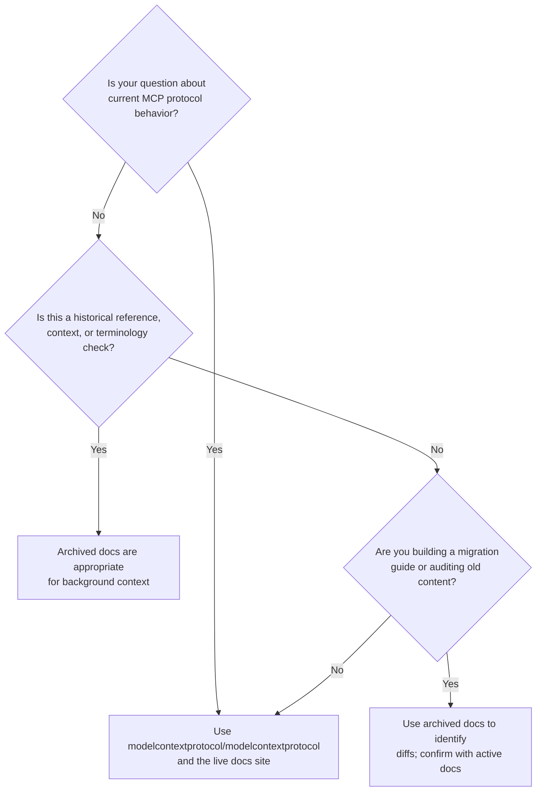
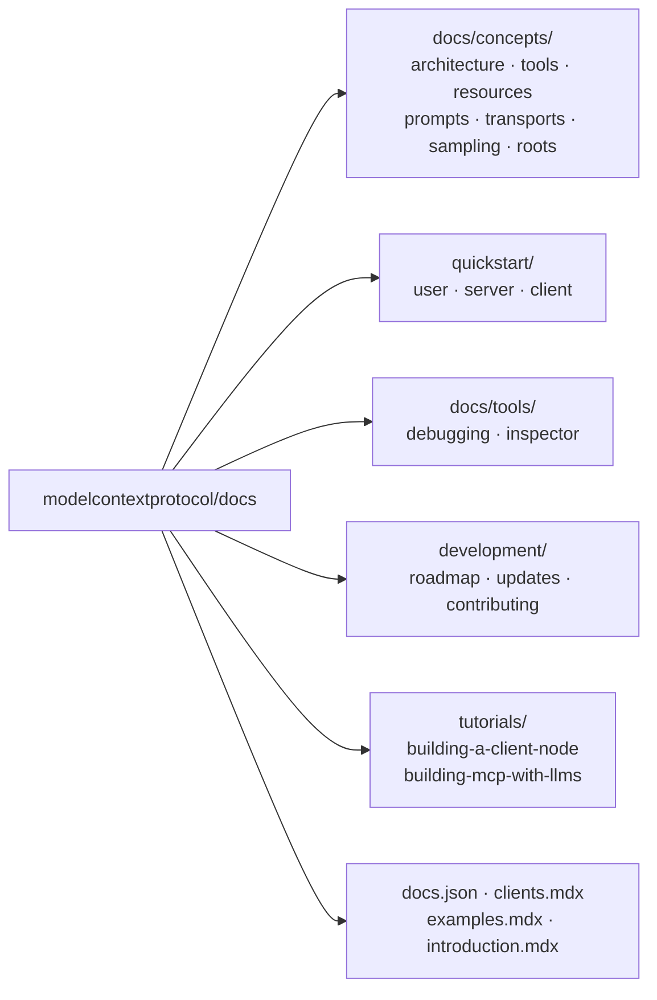

# Chapter 1: Getting Started and Archive Context

This chapter defines the current role of the `modelcontextprotocol/docs` repository, why it is archived, and how teams should calibrate their trust in its content relative to the authoritative upstream source.

## Learning Goals

- Identify the archive status and practical implications for new MCP projects
- Map when archived docs are useful versus when active docs are required
- Avoid treating archived content as authoritative for recent protocol changes
- Establish source-of-truth expectations across your engineering team

## What the Repository Is

The `modelcontextprotocol/docs` repository is an **archived** snapshot of the Mintlify-hosted MCP documentation site. It captured the documentation as it existed when the content was migrated to the canonical `modelcontextprotocol/modelcontextprotocol` monorepo. The repo is read-only — no new issues, pull requests, or releases are accepted here.

The live documentation website at `modelcontextprotocol.io` is now driven by the monorepo. The archived repo preserves the Mintlify site structure (`.mdx` pages, `docs.json` navigation config, image assets) for reference and historical study.

## Archive Status Decision Tree



## Source-of-Truth Map

| Resource | Status | Use Case |
|:---------|:-------|:---------|
| `modelcontextprotocol/docs` (this repo) | Archived | Historical reference, migration auditing |
| `modelcontextprotocol/modelcontextprotocol/docs` | Active | Protocol spec, concepts, current guidance |
| `modelcontextprotocol.io` (live site) | Active | End-user and developer documentation |
| SDK repositories (`python-sdk`, `typescript-sdk`) | Active | Language-specific implementation guides |

## Repository File Layout

The archive preserves the full Mintlify project structure:

```
docs/                        # conceptual guides (architecture, tools, resources, etc.)
quickstart/                  # user/server/client onboarding flows
tutorials/                   # building MCP servers and clients
development/                 # roadmap and update history
docs.json                    # Mintlify site navigation configuration
introduction.mdx             # top-level introduction page
clients.mdx                  # client ecosystem compatibility matrix
examples.mdx                 # reference example index
```

## Why the Archive Matters

Even though the repository is frozen, the content has high value for several use cases:

1. **Conceptual grounding** — The `docs/concepts/` pages (architecture, tools, resources, prompts, transports, sampling, roots) provide stable conceptual prose that complements the protocol specification.
2. **Onboarding history** — The `quickstart/` flows capture patterns that many existing tutorials and blog posts reference.
3. **Client ecosystem context** — `clients.mdx` contains a client feature matrix useful for compatibility planning.
4. **Migration source** — Teams moving internal docs from the old site structure benefit from having this reference.

## What the Archive Does Not Cover

- Protocol changes after the migration cutoff date
- New SDK features (Python, TypeScript, Java, etc.)
- Updated transport specifications (StreamableHTTP was added post-migration)
- Security advisories or breaking changes published post-archive

## Repository Content Diagram



## Practical Onboarding Checklist

Before using archived docs in your project or team:

- [ ] Confirm you have the active docs URL bookmarked (`modelcontextprotocol.io`)
- [ ] Identify which sections of the archive you need (concepts, quickstart, tooling)
- [ ] Flag any links or commands you extract with an "archived — verify against active docs" annotation
- [ ] Set a team policy: archived docs are read-only reference, never source-of-truth for protocol behavior

## Source References

- [Docs Repository README](https://github.com/modelcontextprotocol/docs/blob/main/README.md)
- [Canonical Docs Location (Active)](https://github.com/modelcontextprotocol/modelcontextprotocol/tree/main/docs)
- [Mintlify Navigation Config](https://github.com/modelcontextprotocol/docs/blob/main/docs.json)

## Summary

The `modelcontextprotocol/docs` repo is a frozen Mintlify site snapshot. Its conceptual guides, quickstart flows, client matrix, and tooling docs retain high reference value — but all protocol-behavior questions and new development should reference the active canonical source. Set this expectation explicitly with your team before pointing anyone at archived content.

Next: [Chapter 2: Repository Layout and Canonical Migration Path](02-repository-layout-and-canonical-migration-path.md)
