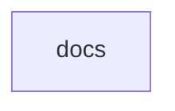

# Chapter 2: Repository Layout and Canonical Migration Path

Welcome to **Chapter 2: Repository Layout and Canonical Migration Path**. In this part of **MCP Docs Repo Tutorial: Navigating the Archived MCP Documentation Repository**, you will build an intuitive mental model first, then move into concrete implementation details and practical production tradeoffs.


This chapter maps content areas and migration strategy between archived and active docs repositories.

## Learning Goals

- navigate major content areas (concepts, quickstarts, tools, tutorials)
- decide migration priorities for internal documentation links
- reduce broken references during docs transitions
- keep teams aligned on active update channels

## Layout Overview

| Area | Use Today |
|:-----|:----------|
| quickstart/ | historical onboarding reference |
| docs/concepts/ | conceptual background and terminology |
| docs/tools/ | practical debugging and inspector guidance |
| development/ | historical roadmap/update context |

## Source References

- [Introduction](https://github.com/modelcontextprotocol/docs/blob/main/introduction.mdx)
- [Development Roadmap](https://github.com/modelcontextprotocol/docs/blob/main/development/roadmap.mdx)
- [Development Updates](https://github.com/modelcontextprotocol/docs/blob/main/development/updates.mdx)

## Summary

You now have a migration-aware map of archived docs content.

Next: [Chapter 3: Quickstart Flows: User, Server, and Client](03-quickstart-flows-user-server-and-client.md)

## Source Code Walkthrough

### `docs.json`

The `docs` module in [`docs.json`](https://github.com/modelcontextprotocol/docs/blob/HEAD/docs.json) handles a key part of this chapter's functionality:

```json
{
  "$schema": "https://mintlify.com/docs.json",
  "theme": "willow",
  "name": "Model Context Protocol",
  "colors": {
    "primary": "#09090b",
    "light": "#FAFAFA",
    "dark": "#09090b"
  },
  "favicon": "/favicon.svg",
  "navigation": {
    "tabs": [
      {
        "tab": "Documentation",
        "groups": [
          {
            "group": "Get Started",
            "pages": [
              "introduction",
              {
                "group": "Quickstart",
                "pages": [
                  "quickstart/server",
                  "quickstart/client",
                  "quickstart/user"
                ]
              },
              "examples",
              "clients"
            ]
          },
          {
            "group": "Tutorials",
            "pages": [
              "tutorials/building-mcp-with-llms",
```

This module is important because it defines how MCP Docs Repo Tutorial: Navigating the Archived MCP Documentation Repository implements the patterns covered in this chapter.


## How These Components Connect


