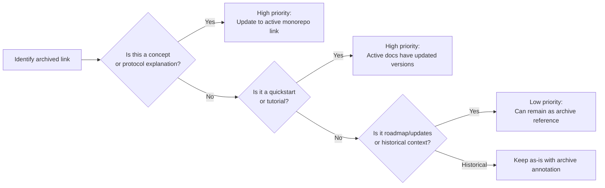

# Chapter 2: Repository Layout and Canonical Migration Path

This chapter maps every content area in the archived docs repository, explains its function, and gives a concrete migration checklist for teams who need to move internal documentation links from this archive to the active canonical source.

## Learning Goals

- Navigate the major content areas: concepts, quickstarts, tools, tutorials, SDK docs
- Decide migration priorities when updating internal documentation links
- Reduce broken references during documentation transitions
- Keep teams aligned on active update channels and file naming conventions

## Full Content Map

```mermaid
graph TD
    ROOT[modelcontextprotocol/docs root]

    ROOT --> INTRO[introduction.mdx\nTop-level entry point]
    ROOT --> CLIENTS[clients.mdx\nClient feature matrix]
    ROOT --> EXAMPLES[examples.mdx\nReference example index]

    ROOT --> QS[quickstart/]
    QS --> QSU[user.mdx]
    QS --> QSS[server.mdx]
    QS --> QSC[client.mdx]

    ROOT --> CONCEPTS[docs/concepts/]
    CONCEPTS --> CA[architecture.mdx]
    CONCEPTS --> CT[tools.mdx]
    CONCEPTS --> CR[resources.mdx]
    CONCEPTS --> CP[prompts.mdx]
    CONCEPTS --> CTRANS[transports.mdx]
    CONCEPTS --> CS[sampling.mdx]
    CONCEPTS --> CRO[roots.mdx]

    ROOT --> TOOLING[docs/tools/]
    TOOLING --> TI[inspector.mdx]
    TOOLING --> TD[debugging.mdx]

    ROOT --> DEV[development/]
    DEV --> DR[roadmap.mdx]
    DEV --> DU[updates.mdx]
    DEV --> DC[contributing.mdx]

    ROOT --> TUT[tutorials/]
    TUT --> TN[building-a-client-node.mdx]
    TUT --> TL[building-mcp-with-llms.mdx]

    ROOT --> SDK[sdk/java/]
    SDK --> SJO[mcp-overview.mdx]
    SDK --> SJC[mcp-client.mdx]
    SDK --> SJS[mcp-server.mdx]
```



## Content Area Reference Table

| Area | Path | Historical Use | Active Replacement |
|:-----|:-----|:---------------|:-------------------|
| Introduction | `introduction.mdx` | Entry-point prose | `modelcontextprotocol/modelcontextprotocol/docs` |
| Client Matrix | `clients.mdx` | Ecosystem compatibility | Active `clients.mdx` in monorepo |
| Examples | `examples.mdx` | Reference example index | Active `examples.mdx` in monorepo |
| Quickstart: User | `quickstart/user.mdx` | End-user setup | Active quickstart in monorepo |
| Quickstart: Server | `quickstart/server.mdx` | Server onboarding | Active quickstart in monorepo |
| Quickstart: Client | `quickstart/client.mdx` | Client onboarding | Active quickstart in monorepo |
| Architecture | `docs/concepts/architecture.mdx` | Protocol lifecycle model | Active concepts in monorepo |
| Tools | `docs/concepts/tools.mdx` | Tool primitive semantics | Active concepts in monorepo |
| Resources | `docs/concepts/resources.mdx` | Resource model | Active concepts in monorepo |
| Prompts | `docs/concepts/prompts.mdx` | Prompt primitive | Active concepts in monorepo |
| Transports | `docs/concepts/transports.mdx` | Transport options | Active concepts (includes StreamableHTTP) |
| Sampling | `docs/concepts/sampling.mdx` | Human-in-the-loop model | Active concepts in monorepo |
| Roots | `docs/concepts/roots.mdx` | Context boundary model | Active concepts in monorepo |
| Inspector | `docs/tools/inspector.mdx` | Inspector usage | Active tooling docs in monorepo |
| Debugging | `docs/tools/debugging.mdx` | Claude Desktop debugging | Active tooling docs in monorepo |
| Roadmap | `development/roadmap.mdx` | Historical roadmap | GitHub Discussions / Issues |
| Updates | `development/updates.mdx` | Changelog history | GitHub releases |
| Contributing | `development/contributing.mdx` | Contribution guide | `CONTRIBUTING.md` in monorepo |
| Node Client Tutorial | `tutorials/building-a-client-node.mdx` | TypeScript client guide | Active TypeScript SDK docs |
| LLM-assisted Building | `tutorials/building-mcp-with-llms.mdx` | LLM-aided server building | Active tutorial in monorepo |
| Java Overview | `sdk/java/mcp-overview.mdx` | Java SDK overview | Java SDK repository |

## Mintlify Navigation Config (`docs.json`)

The `docs.json` file is the Mintlify site configuration — it controls navigation tabs, page groupings, and sidebar ordering. This is **not** a runtime config or a protocol file; it is purely the documentation site's CMS configuration.

```json
{
  "$schema": "https://mintlify.com/docs.json",
  "theme": "willow",
  "name": "Model Context Protocol",
  "navigation": {
    "tabs": [
      {
        "tab": "Documentation",
        "groups": [
          { "group": "Get Started", "pages": ["introduction", "quickstart/server", ...] },
          { "group": "Concepts", "pages": ["docs/concepts/architecture", ...] },
          { "group": "Tutorials", "pages": ["tutorials/building-mcp-with-llms", ...] }
        ]
      },
      { "tab": "SDKs", ... },
      { "tab": "Tools", ... }
    ]
  }
}
```

Key `docs.json` facts:
- `"theme": "willow"` — Mintlify theme, has no protocol significance
- Navigation order reflects the original documentation hierarchy
- Tab groupings show how content was categorized for end-users
- Useful for auditing which pages existed and what order they appeared in

## Migration Priority Framework

When migrating internal links from this archive to active documentation:



### Migration Checklist

- [ ] Audit all internal documentation for `github.com/modelcontextprotocol/docs` links
- [ ] Replace concept page links with monorepo equivalents
- [ ] Replace quickstart links — note that the server quickstart now includes multiple language tabs
- [ ] Replace tooling links — inspector and debugging pages have been updated with new screenshots
- [ ] Archive historical context links (roadmap, updates) with a note that they are frozen
- [ ] Verify that Java SDK links point to the `modelcontextprotocol/java-sdk` repository, not this archive

## Source References

- [Introduction](https://github.com/modelcontextprotocol/docs/blob/main/introduction.mdx)
- [Development Roadmap](https://github.com/modelcontextprotocol/docs/blob/main/development/roadmap.mdx)
- [Development Updates](https://github.com/modelcontextprotocol/docs/blob/main/development/updates.mdx)
- [docs.json Navigation Config](https://github.com/modelcontextprotocol/docs/blob/main/docs.json)
- [Active Canonical Docs](https://github.com/modelcontextprotocol/modelcontextprotocol/tree/main/docs)

## Summary

Every file in the archived repo has a direct counterpart in the active monorepo. The `docs.json` config is a Mintlify site artifact (not a protocol file) that maps the original navigation hierarchy — useful for auditing coverage during migration but irrelevant to protocol behavior. Use the content area table and migration checklist above to methodically transition any internal documentation that references this archive.

Next: [Chapter 3: Quickstart Flows: User, Server, and Client](03-quickstart-flows-user-server-and-client.md)
