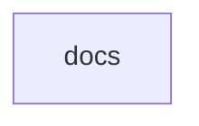

# Chapter 3: Quickstart Flows: User, Server, and Client

Welcome to **Chapter 3: Quickstart Flows: User, Server, and Client**. In this part of **MCP Docs Repo Tutorial: Navigating the Archived MCP Documentation Repository**, you will build an intuitive mental model first, then move into concrete implementation details and practical production tradeoffs.


This chapter highlights onboarding flows preserved in archived quickstart docs.

## Learning Goals

- compare user, server, and client onboarding paths
- identify reusable setup/troubleshooting patterns across runtimes
- use quickstart material as baseline context for active docs updates
- avoid outdated command/config assumptions

## Source References

- [Quickstart: User](https://github.com/modelcontextprotocol/docs/blob/main/quickstart/user.mdx)
- [Quickstart: Server](https://github.com/modelcontextprotocol/docs/blob/main/quickstart/server.mdx)
- [Quickstart: Client](https://github.com/modelcontextprotocol/docs/blob/main/quickstart/client.mdx)

## Summary

You now have a quickstart-oriented onboarding map for archived MCP docs.

Next: [Chapter 4: Core Concepts: Architecture, Tools, Resources, Prompts](04-core-concepts-architecture-tools-resources-prompts.md)

## Depth Expansion Playbook

## Source Code Walkthrough

### `docs.json`

The `docs` module in [`docs.json`](https://github.com/modelcontextprotocol/docs/blob/HEAD/docs.json) handles a key part of this chapter's functionality:

```json
{
  "$schema": "https://mintlify.com/docs.json",
  "theme": "willow",
  "name": "Model Context Protocol",
  "colors": {
    "primary": "#09090b",
    "light": "#FAFAFA",
    "dark": "#09090b"
  },
  "favicon": "/favicon.svg",
  "navigation": {
    "tabs": [
      {
        "tab": "Documentation",
        "groups": [
          {
            "group": "Get Started",
            "pages": [
              "introduction",
              {
                "group": "Quickstart",
                "pages": [
                  "quickstart/server",
                  "quickstart/client",
                  "quickstart/user"
                ]
              },
              "examples",
              "clients"
            ]
          },
          {
            "group": "Tutorials",
            "pages": [
              "tutorials/building-mcp-with-llms",
```

This module is important because it defines how MCP Docs Repo Tutorial: Navigating the Archived MCP Documentation Repository implements the patterns covered in this chapter.


## How These Components Connect


