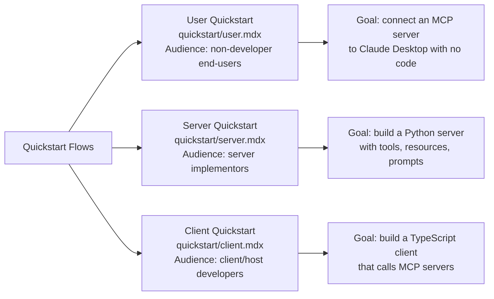
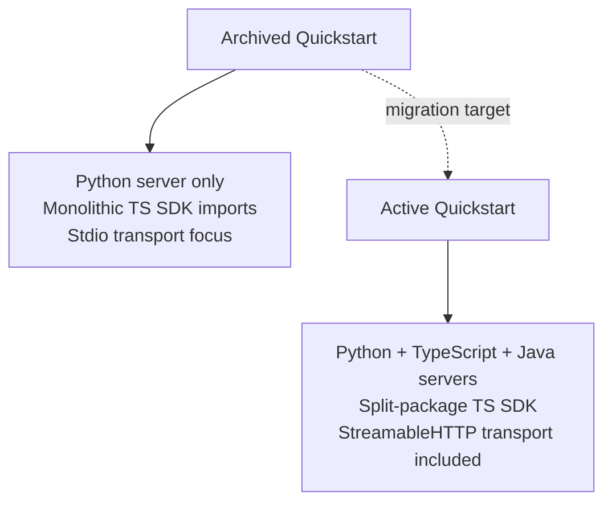

# Chapter 3: Quickstart Flows: User, Server, and Client

This chapter examines the three onboarding paths preserved in the archived quickstart section: the user flow (connecting an MCP server to Claude Desktop), the server flow (building and running a Python server), and the client flow (building a TypeScript MCP client).

## Learning Goals

- Compare user, server, and client onboarding paths and their distinct audiences
- Identify reusable setup and troubleshooting patterns across runtimes
- Use archived quickstart content as baseline context when reviewing active doc updates
- Avoid outdated command and configuration assumptions from the frozen content

## The Three Quickstart Audiences



## User Quickstart (`quickstart/user.mdx`)

The user quickstart targets non-developers who want to use an existing MCP server — specifically the `filesystem` server bundled with Claude Desktop.

Key steps preserved in this flow:
1. Install Claude Desktop (macOS or Windows)
2. Open `claude_desktop_config.json` and add an entry under `mcpServers`
3. Restart Claude Desktop
4. Verify the MCP hammer icon appears in the UI
5. Invoke a tool call in conversation

Example config snippet from the archived page:
```json
{
  "mcpServers": {
    "filesystem": {
      "command": "npx",
      "args": ["-y", "@modelcontextprotocol/server-filesystem", "/Users/you/Desktop"]
    }
  }
}
```

**Archive note**: The `npx -y` pattern and config path remain valid in the active docs. The filesystem server package name is unchanged.

## Server Quickstart (`quickstart/server.mdx`)

The server quickstart walks a developer through building a minimal "weather" MCP server in Python using the `mcp` SDK. This was the primary onboarding path for Python server developers.

Typical flow:
1. Install `uv` package manager
2. Create project with `uv init` and add `mcp[cli]` dependency
3. Define a tool using `@mcp.tool()` decorator
4. Register a resource with `@mcp.resource()`
5. Run with `mcp dev server.py` for inspector testing
6. Add to Claude Desktop config

```python
# Pattern from archived server quickstart
import mcp.server.fastmcp as fastmcp

mcp = fastmcp.FastMCP("weather")

@mcp.tool()
async def get_current_weather(city: str) -> str:
    """Get current weather for a city."""
    # implementation
    return f"Weather for {city}: 72F, sunny"

if __name__ == "__main__":
    mcp.run()
```

**Archive note**: The `FastMCP` decorator API is still the recommended path in active docs. The `mcp dev` command (MCP CLI) is a current tool.

## Client Quickstart (`quickstart/client.mdx`)

The client quickstart shows how to connect to any MCP server via TypeScript using the `@modelcontextprotocol/sdk` package.

Core pattern:
1. Install `@modelcontextprotocol/sdk`
2. Instantiate a `Client` with capability declarations
3. Connect via `StdioClientTransport` (stdio-based server)
4. Call `listTools()` then `callTool()`
5. Handle structured results

```typescript
// Pattern from archived client quickstart
import { Client } from "@modelcontextprotocol/sdk/client/index.js";
import { StdioClientTransport } from "@modelcontextprotocol/sdk/client/stdio.js";

const client = new Client({ name: "my-client", version: "1.0.0" });
const transport = new StdioClientTransport({
  command: "python",
  args: ["server.py"]
});

await client.connect(transport);
const tools = await client.listTools();
const result = await client.callTool({ name: "get_current_weather", arguments: { city: "NYC" } });
```

**Archive note**: The TypeScript SDK import paths changed significantly in v2 (the split-package model). The active docs cover the new import paths. Do not use the archived import paths for new projects.

## Quickstart Content Comparison

| Dimension | User | Server | Client |
|:----------|:-----|:-------|:-------|
| Audience | End-user | Backend developer | Client/host developer |
| Language | No code | Python | TypeScript |
| Transport | Stdio (Claude Desktop) | Stdio | Stdio (dev) |
| Primary artifact | Config file | `server.py` | `client.ts` |
| Archive relevance | High — config format is stable | High — FastMCP API is current | Medium — import paths changed in v2 |

## What Changed After the Archive Cutoff

The server quickstart in active docs now covers multiple languages (Python, TypeScript, Java) in tabbed views. The archived page is Python-only. If you are directing a TypeScript or Java server developer, send them to the active docs.

The client quickstart in active docs reflects the v2 TypeScript SDK with the split-package model (`@modelcontextprotocol/client`). The archived page uses the v1 monolithic import path.



## Reusable Patterns from the Archives

Despite the staleness of specific commands, these patterns from the archived quickstarts remain valid:

- The `claude_desktop_config.json` schema (`mcpServers`, `command`, `args`, `env`)
- The separation of concerns: hosts configure servers, servers implement primitives, clients call them
- The `mcp dev <server.py>` development workflow
- The three-primitive model: tools (callable), resources (readable), prompts (templatable)

## Source References

- [Quickstart: User](https://github.com/modelcontextprotocol/docs/blob/main/quickstart/user.mdx)
- [Quickstart: Server](https://github.com/modelcontextprotocol/docs/blob/main/quickstart/server.mdx)
- [Quickstart: Client](https://github.com/modelcontextprotocol/docs/blob/main/quickstart/client.mdx)

## Summary

The three archived quickstart flows each target a distinct audience. The user flow (Claude Desktop config) remains highly accurate. The server flow (Python + FastMCP) is current. The client flow's TypeScript import paths are outdated for v2 SDK users. Extract patterns and conceptual flows from the archive, but verify specific commands and import paths against active documentation before using them in new projects.

Next: [Chapter 4: Core Concepts: Architecture, Tools, Resources, Prompts](04-core-concepts-architecture-tools-resources-prompts.md)
