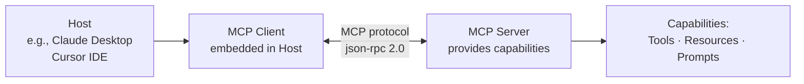
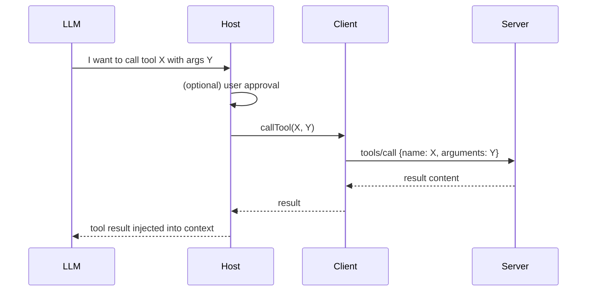
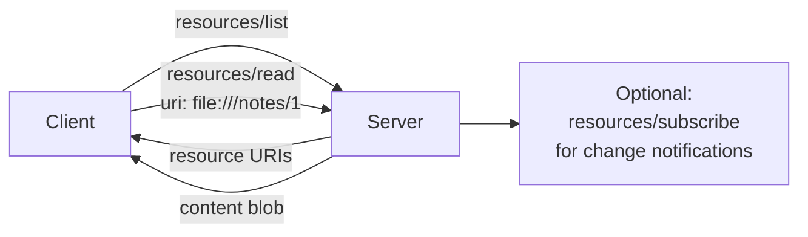
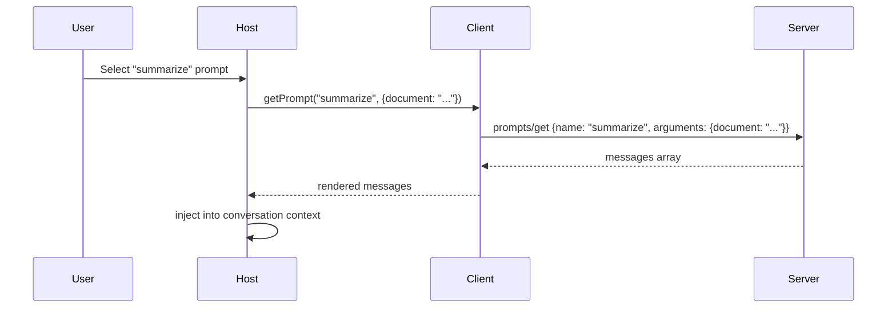
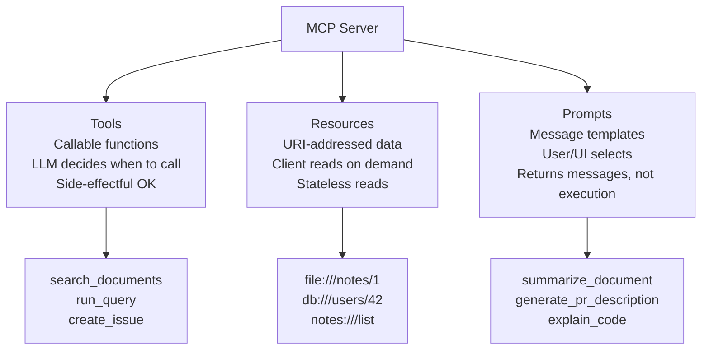

# Chapter 4: Core Concepts: Architecture, Tools, Resources, Prompts

This chapter examines the four foundational conceptual guides in `docs/concepts/`: architecture, tools, resources, and prompts. These pages provide the most stable content in the archive — the underlying protocol model has not fundamentally changed even after the migration cutoff.

## Learning Goals

- Refresh the protocol architecture and lifecycle model from the archived concepts
- Align tool, resource, and prompt semantics across implementations and teams
- Apply concept docs when reviewing SDK-specific behavior or writing integration tests
- Avoid conceptual drift in internal documentation and team onboarding materials

## Architecture (`docs/concepts/architecture.mdx`)

The architecture concept page describes the three-role model that underlies every MCP interaction.



Key points from the archived architecture doc:
- **Host**: The application the end-user runs (Claude Desktop, an IDE). Embeds one or more clients.
- **Client**: Manages a single connection to one server. Handles capability negotiation.
- **Server**: Exposes tools, resources, and/or prompts. Stateless or stateful depending on implementation.
- **Connection lifecycle**: Initialize → capability exchange → request/response loop → shutdown.

The JSON-RPC 2.0 message format is the wire protocol for all exchanges:
```json
{ "jsonrpc": "2.0", "method": "tools/call", "params": { "name": "...", "arguments": {} }, "id": 1 }
```

## Tools (`docs/concepts/tools.mdx`)

Tools are callable functions exposed by a server. A tool has a name, an optional description, and a JSON Schema input definition. The LLM decides when to invoke a tool; the host confirms (in hosts that require approval).



Tool registration pattern (from archived Python examples):
```python
@mcp.tool()
async def search_documents(query: str, limit: int = 10) -> list[dict]:
    """Search the document store for relevant results."""
    return await db.search(query, limit=limit)
```

Key tool design principles from the archived concepts:
- Tools should be **idempotent** where possible; document side effects clearly
- Descriptions drive LLM selection — write them as instructions, not just labels
- Input schemas should be strict — required fields, typed properties, clear descriptions

## Resources (`docs/concepts/resources.mdx`)

Resources are URI-addressed data blobs that a server exposes for a client to read. Unlike tools (which are invoked), resources are fetched. Resources can be static (files, database rows) or dynamic (live feeds, computed views).



Resource URI scheme (from archived examples):
```
file:///path/to/file         # file system resources
note:///notes/{id}           # application-defined scheme
db:///table/{row_id}         # database record resource
```

Resources return content blobs typed as `text/plain`, `application/json`, `image/*`, etc. The client and host decide how to inject resource content into the LLM context — a resource itself has no say in this.

## Prompts (`docs/concepts/prompts.mdx`)

Prompts are server-defined message templates with typed arguments. They allow servers to package reusable prompt structures that clients can render in conversation context. Unlike tools, prompts are not executed server-side; they return message content for the client to use.



Prompt definition pattern (from archived examples):
```python
@mcp.prompt()
def summarize_document(document: str) -> list[Message]:
    """Generate a document summary."""
    return [
        UserMessage(f"Please summarize the following document:\n\n{document}")
    ]
```

Prompts are registered with argument schemas and descriptions, enabling UIs to build dynamic forms for prompt parameterization.

## The Three Primitives Together



## Concept Stability Assessment

The archived concept docs are the most stable content in the repo. The three-primitive model (tools/resources/prompts) and the three-role architecture (host/client/server) are unchanged in the active protocol.

| Concept Area | Archive Accuracy | What Changed |
|:-------------|:-----------------|:-------------|
| Architecture model | High | Elicitation added post-archive |
| Tool semantics | High | Output schemas added post-archive |
| Resource model | High | Resource size field added post-archive |
| Prompt model | High | No significant changes |

## Source References

- [Architecture Concepts](https://github.com/modelcontextprotocol/docs/blob/main/docs/concepts/architecture.mdx)
- [Tools Concepts](https://github.com/modelcontextprotocol/docs/blob/main/docs/concepts/tools.mdx)
- [Resources Concepts](https://github.com/modelcontextprotocol/docs/blob/main/docs/concepts/resources.mdx)
- [Prompts Concepts](https://github.com/modelcontextprotocol/docs/blob/main/docs/concepts/prompts.mdx)

## Summary

The four core concept pages are the most reliable content in the archive. Architecture, tool, resource, and prompt semantics are foundational and largely unchanged. Use these pages for team onboarding, internal glossary definitions, and as a reference when reviewing implementation behavior — but check the active docs for any additions (output schemas, elicitation, resource size hints) added after the archive cutoff.

Next: [Chapter 5: Advanced Concepts: Transports, Sampling, and Roots](05-advanced-concepts-transports-sampling-and-roots.md)
