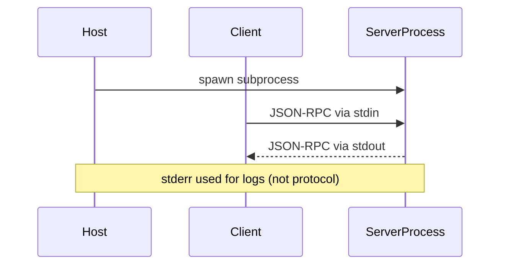
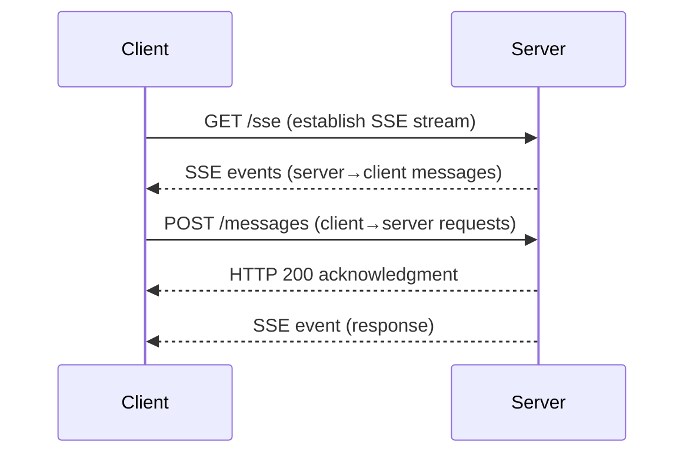
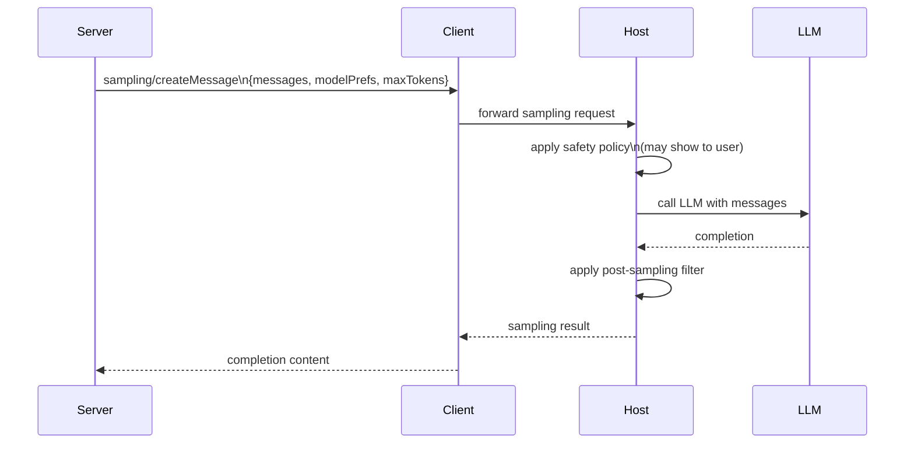
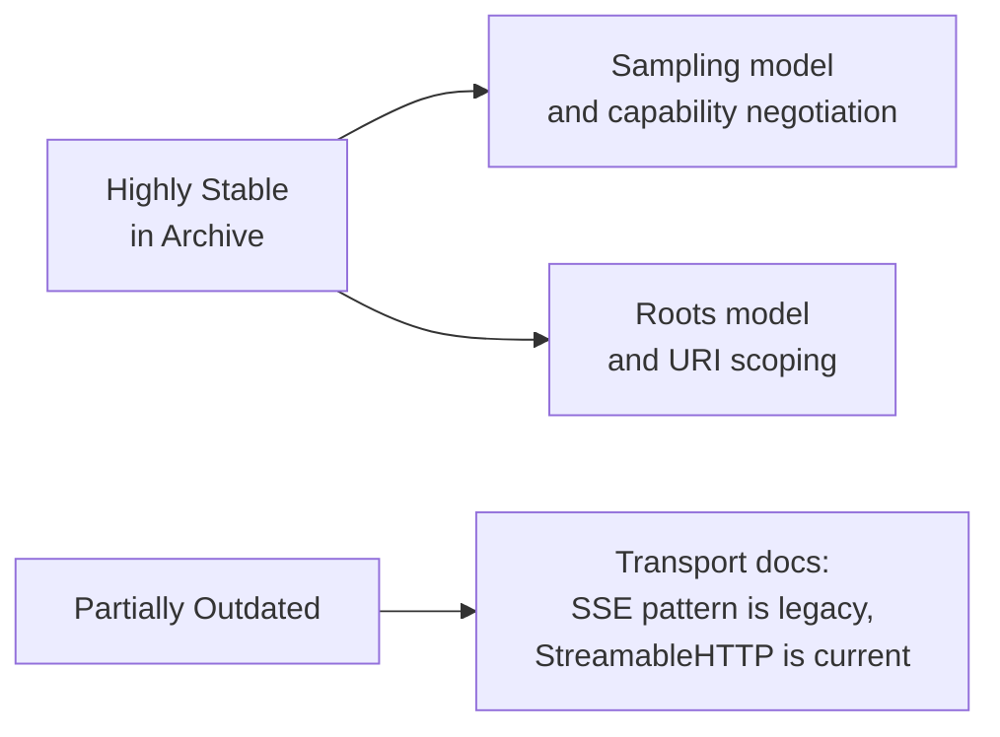

# Chapter 5: Advanced Concepts: Transports, Sampling, and Roots

This chapter covers the three advanced concept pages that govern how data moves between clients and servers (transports), how servers can invoke LLM inference on their behalf (sampling), and how clients communicate workspace context (roots). These are production-relevant design decisions that the archived concepts explain well — with one significant caveat on transports.

## Learning Goals

- Evaluate transport options and their security and deployment tradeoffs
- Understand the sampling workflow and human-in-the-loop control model
- Reason about roots and context boundaries in client-server interactions
- Apply best-practice constraints in production architecture decisions

## Transports (`docs/concepts/transports.mdx`)

Transports define how JSON-RPC messages travel between client and server. The archived docs cover two transports: **stdio** and **SSE (HTTP)**. The active docs add a third: **StreamableHTTP**, which is now the recommended remote transport.

### Stdio Transport

Used for local processes. The host spawns the server as a child process; communication is via stdin/stdout. This is the dominant model for desktop MCP clients (Claude Desktop, Cursor).



Stdio advantages:
- No network exposure — lowest attack surface for local-only servers
- Simple process lifecycle tied to host application
- No port management or firewall rules needed

### SSE Transport (Archived)

The archived docs describe an HTTP+SSE pattern where the server exposes an HTTP endpoint; the client posts requests and receives responses as SSE events. **This pattern is superseded by StreamableHTTP in the current protocol.**



**Archive warning**: If your architecture uses the SSE transport pattern documented here, verify against active docs. The active protocol specifies StreamableHTTP as the canonical HTTP transport, which uses a single bidirectional HTTP+SSE channel rather than two separate endpoints.

### Transport Selection Guide

| Scenario | Recommended Transport | Notes |
|:---------|:---------------------|:------|
| Local desktop app (Claude Desktop, Cursor) | Stdio | Subprocess model, lowest friction |
| Remote hosted server | StreamableHTTP (active docs) | SSE pattern is legacy |
| Testing and development | Stdio via `mcp dev` | Inspector uses stdio by default |
| Multi-tenant cloud service | StreamableHTTP with auth | Active docs, not covered in archive |

## Sampling (`docs/concepts/sampling.mdx`)

Sampling is the mechanism by which an MCP server can request the host to perform LLM inference. This allows servers to build agentic workflows without holding API keys or managing LLM connections directly.



Key design points from the archived sampling concept:

1. **Human in the loop** — Hosts are expected to show sampling requests to users before executing them in sensitive contexts. The server has no guarantee the request will be executed as-is.
2. **Model preferences** — Servers can specify `modelPreferences` (cost vs. intelligence tradeoffs) but the host makes the final model selection.
3. **Capability negotiation** — Clients only advertise the `sampling` capability if the host supports it; servers must check before calling.

Sampling enables a class of server behaviors impossible without it:
- Recursive agent loops (server calls LLM, processes result, calls LLM again)
- Tool-to-LLM pipelines (fetch resource → summarize via LLM → return to user)
- Quality checks (run tool → validate output via LLM → retry if needed)

```python
# Server requesting a sampling call (Python SDK pattern)
result = await ctx.sample(
    messages=[{"role": "user", "content": f"Summarize: {document}"}],
    max_tokens=500
)
summary = result.content.text
```

## Roots (`docs/concepts/roots.mdx`)

Roots allow clients to inform servers about which parts of the file system (or other URI namespaces) are relevant to the current workspace. This gives servers context about scope without requiring servers to guess or enumerate.

```mermaid
graph LR
    CLIENT[MCP Client]
    CLIENT -->|roots/list response\n[file:///project/src, file:///docs]| SERVER[MCP Server]
    SERVER --> SCOPED[Server scopes operations\nto declared root URIs]
    SERVER --> RESP[Respects boundaries:\nnever reads outside roots]
```

Example roots declaration from the archived concept:
```json
{
  "roots": [
    { "uri": "file:///home/user/project", "name": "My Project" },
    { "uri": "file:///home/user/notes", "name": "Notes" }
  ]
}
```

Roots use cases:
- File system servers that should only operate within declared project directories
- Code analysis servers scoped to the active workspace
- Servers that need to construct resource URIs relative to the workspace root

Roots are advisory — the server should respect them, but the protocol does not enforce hard boundaries. Well-behaved servers validate that all resource URIs fall within declared roots.

## Advanced Concept Stability



| Concept | Archive Accuracy | Key Gap |
|:--------|:-----------------|:--------|
| Stdio transport | High | No gaps |
| SSE/HTTP transport | Low | StreamableHTTP supersedes this in active docs |
| Sampling | High | Active docs add elicitation (server-initiated input) |
| Roots | High | No significant changes |

## Source References

- [Transports Concepts](https://github.com/modelcontextprotocol/docs/blob/main/docs/concepts/transports.mdx)
- [Sampling Concepts](https://github.com/modelcontextprotocol/docs/blob/main/docs/concepts/sampling.mdx)
- [Roots Concepts](https://github.com/modelcontextprotocol/docs/blob/main/docs/concepts/roots.mdx)

## Summary

Transports, sampling, and roots are the three advanced levers in MCP architecture. The archived transport docs are partially outdated — the SSE pattern is superseded by StreamableHTTP, so verify against active docs for any remote deployment design. Sampling and roots concepts are stable and accurately described in the archive. Use this chapter as a lens for evaluating where archived guidance is safe to use directly versus where you must check the current spec.

Next: [Chapter 6: Tooling Docs: Inspector and Debugging](06-tooling-docs-inspector-and-debugging.md)
