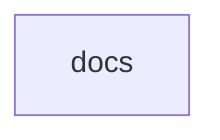

# Chapter 5: Advanced Concepts: Transports, Sampling, and Roots

Welcome to **Chapter 5: Advanced Concepts: Transports, Sampling, and Roots**. In this part of **MCP Docs Repo Tutorial: Navigating the Archived MCP Documentation Repository**, you will build an intuitive mental model first, then move into concrete implementation details and practical production tradeoffs.


This chapter covers advanced protocol topics that influence real-world architecture decisions.

## Learning Goals

- evaluate transport options and security tradeoffs
- understand sampling workflows and human-in-the-loop controls
- reason about roots/context boundaries in client-server interactions
- apply best-practice constraints in production design

## Source References

- [Transports Concepts](https://github.com/modelcontextprotocol/docs/blob/main/docs/concepts/transports.mdx)
- [Sampling Concepts](https://github.com/modelcontextprotocol/docs/blob/main/docs/concepts/sampling.mdx)
- [Roots Concepts](https://github.com/modelcontextprotocol/docs/blob/main/docs/concepts/roots.mdx)

## Summary

You now have an advanced concept map for transport and context-design decisions.

Next: [Chapter 6: Tooling Docs: Inspector and Debugging](06-tooling-docs-inspector-and-debugging.md)

## Depth Expansion Playbook

## Source Code Walkthrough

### `docs.json`

The `docs` module in [`docs.json`](https://github.com/modelcontextprotocol/docs/blob/HEAD/docs.json) handles a key part of this chapter's functionality:

```json
{
  "$schema": "https://mintlify.com/docs.json",
  "theme": "willow",
  "name": "Model Context Protocol",
  "colors": {
    "primary": "#09090b",
    "light": "#FAFAFA",
    "dark": "#09090b"
  },
  "favicon": "/favicon.svg",
  "navigation": {
    "tabs": [
      {
        "tab": "Documentation",
        "groups": [
          {
            "group": "Get Started",
            "pages": [
              "introduction",
              {
                "group": "Quickstart",
                "pages": [
                  "quickstart/server",
                  "quickstart/client",
                  "quickstart/user"
                ]
              },
              "examples",
              "clients"
            ]
          },
          {
            "group": "Tutorials",
            "pages": [
              "tutorials/building-mcp-with-llms",
```

This module is important because it defines how MCP Docs Repo Tutorial: Navigating the Archived MCP Documentation Repository implements the patterns covered in this chapter.


## How These Components Connect


