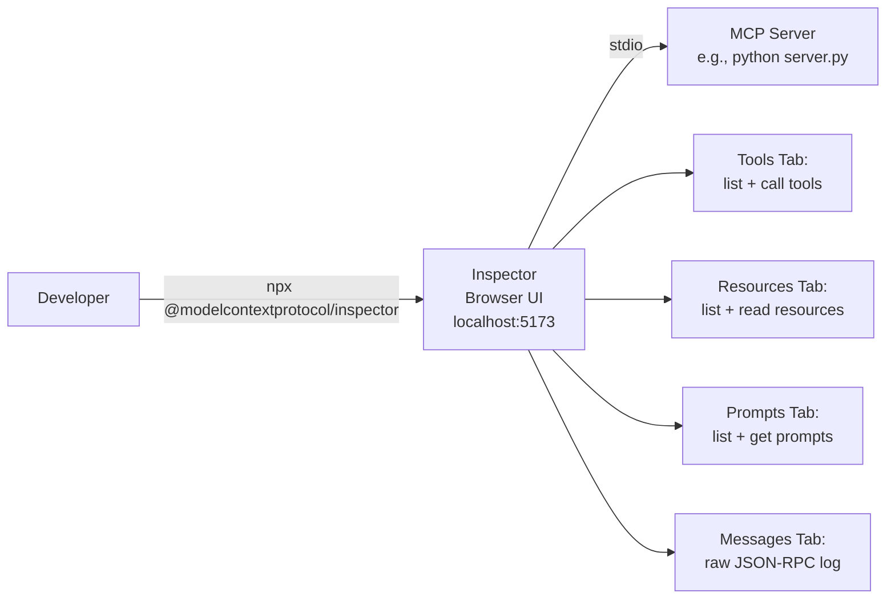
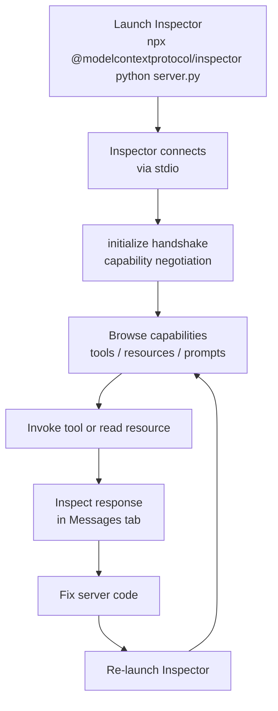
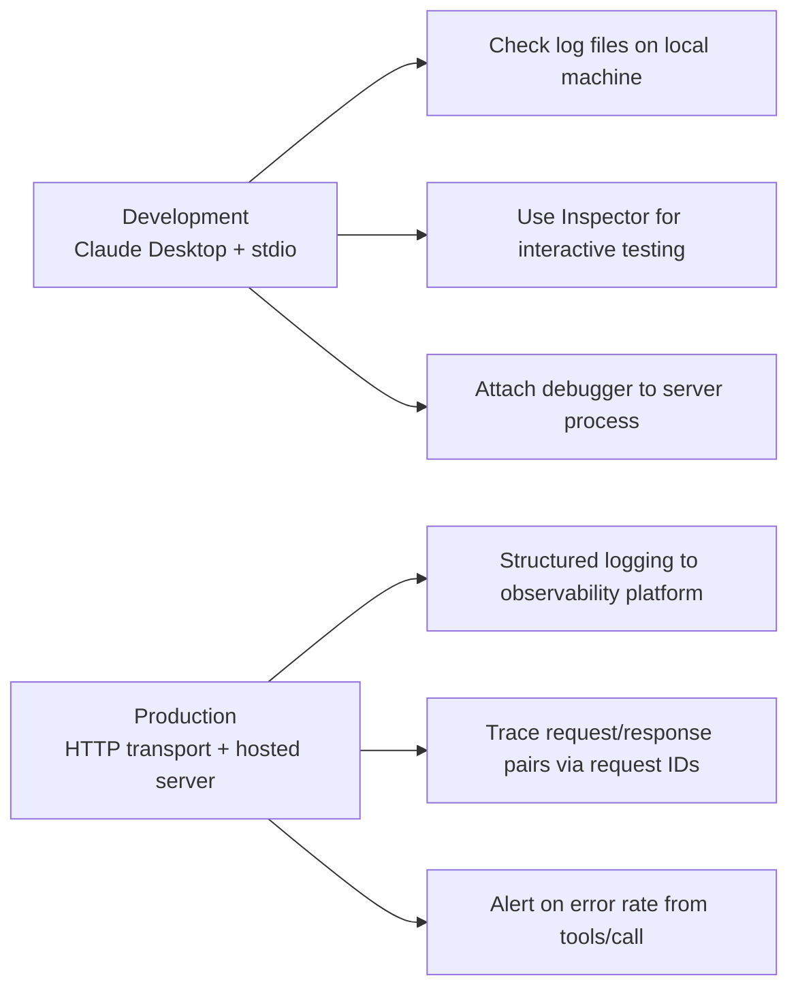

# Chapter 6: Tooling Docs: Inspector and Debugging

This chapter extracts practical debugging workflows from the archived `docs/tools/` section, covering the MCP Inspector and Claude Desktop debugging guidance. These pages describe developer tooling that remains mostly current — the Inspector is an actively maintained project.

## Learning Goals

- Apply Inspector usage patterns for server validation and development testing
- Use debugging workflows for Claude Desktop and local server diagnostics
- Structure log collection and troubleshooting steps for faster issue resolution
- Translate archived guidance to current tooling versions safely

## MCP Inspector (`docs/tools/inspector.mdx`)

The MCP Inspector is a browser-based developer tool that connects to any MCP server via stdio and provides an interactive UI for exercising tools, browsing resources, and testing prompts.



### Launching the Inspector

```bash
# Connect to a Python server
npx @modelcontextprotocol/inspector python server.py

# Connect to a Node.js server
npx @modelcontextprotocol/inspector node build/index.js

# Connect to a uvx-based server
npx @modelcontextprotocol/inspector uvx my-mcp-server
```

The Inspector launches a web server on `localhost:5173` and opens the browser UI. The `--` separator passes arguments to the server process:

```bash
npx @modelcontextprotocol/inspector python server.py -- --debug --port 8080
```

### Inspector Workflow

The typical development loop with the Inspector:

1. **List capabilities**: Navigate to Tools, Resources, and Prompts tabs to verify registration
2. **Call a tool**: Select a tool, fill in arguments via the generated form, observe response
3. **Read a resource**: Enter a URI in the Resources tab and inspect the content blob
4. **Test a prompt**: Select a prompt, provide arguments, review the rendered message array
5. **Monitor raw messages**: Use the Messages tab to see every JSON-RPC request and response



### What the Inspector Validates

- Tool registration (name, description, input schema shape)
- Resource URI scheme and content type handling
- Prompt argument binding and message output structure
- Error responses (malformed args, missing resources)
- Raw JSON-RPC compliance (valid `id`, `jsonrpc: "2.0"`, proper result/error shape)

## Debugging Guide (`docs/tools/debugging.mdx`)

The debugging guide covers diagnosing integration failures when a server is connected through Claude Desktop or another host application.

### Log Collection Points

```mermaid
graph TD
    PROBLEM[Issue: tool not appearing or failing]
    PROBLEM --> CLAUDE_LOGS[1. Check Claude Desktop logs]
    PROBLEM --> SERVER_LOGS[2. Check server stderr output]
    PROBLEM --> MCP_LOGS[3. Check MCP log file]

    CLAUDE_LOGS --> MAC_PATH[macOS: ~/Library/Logs/Claude/\nmcp-server-{name}.log]
    CLAUDE_LOGS --> WIN_PATH[Windows: %APPDATA%\Claude\logs\]
    SERVER_LOGS --> STDERR[Server writes debug to stderr\nnever to stdout\nstdout is reserved for JSON-RPC]
    MCP_LOGS --> COMBINED[Combined protocol trace]
```

**Critical debugging rule**: MCP servers communicating via stdio must **never** write to stdout except for JSON-RPC responses. Any `print()` statement, logging handler, or library that writes to stdout will corrupt the protocol stream. All diagnostic output must go to stderr.

### Debugging Checklist from the Archive

1. **Verify config syntax** — `claude_desktop_config.json` must be valid JSON; a single missing comma prevents all servers from loading
2. **Check process spawn** — Look for the server process in Activity Monitor (macOS) or Task Manager (Windows) after starting Claude Desktop
3. **Read the MCP log** — `mcp-server-{name}.log` contains the full JSON-RPC trace; look for `initialize` request and response
4. **Test in Inspector first** — If a server works in Inspector but fails in Claude Desktop, the issue is the config or the host environment
5. **Check stderr** — Server stderr is captured to `mcp-server-{name}.log`; add explicit debug logging to key handlers

### Common Failure Patterns

| Symptom | Likely Cause | Fix |
|:--------|:-------------|:----|
| Server not in tool list | Config syntax error or process spawn failure | Validate JSON, check logs |
| Tool appears but calls fail | Handler throws unhandled exception | Add try/except with proper error response |
| Intermittent failures | Race condition in async handler | Audit async/await hygiene |
| Garbled responses | stdout pollution | Move all logging to stderr |
| "Method not found" error | Tool name mismatch between registration and call | Verify exact name string |

### Development vs. Production Debugging

The archived debug guide focuses on local development with Claude Desktop. For production deployments on HTTP transports, the debugging approach shifts:



## Source References

- [Inspector Guide](https://github.com/modelcontextprotocol/docs/blob/main/docs/tools/inspector.mdx)
- [Debugging Guide](https://github.com/modelcontextprotocol/docs/blob/main/docs/tools/debugging.mdx)

## Summary

The Inspector and debugging pages are among the most directly usable content in the archive. The Inspector launch pattern (`npx @modelcontextprotocol/inspector`) is current. The debugging log locations and the stdout-must-be-clean rule are both valid and important. Use the Inspector as the primary development validation tool and follow the log collection checklist for Claude Desktop integration failures.

Next: [Chapter 7: Tutorial Assets and Client Ecosystem Matrix](07-tutorial-assets-and-client-ecosystem-matrix.md)
