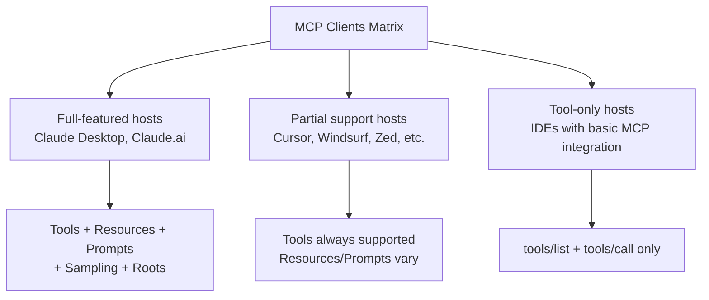
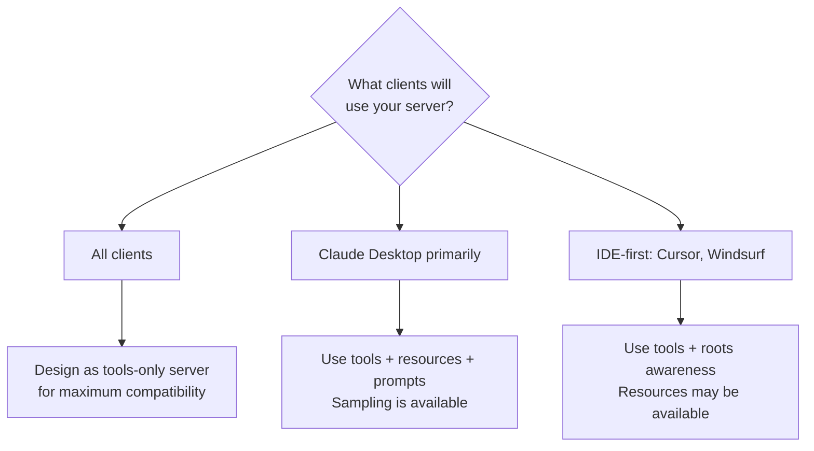
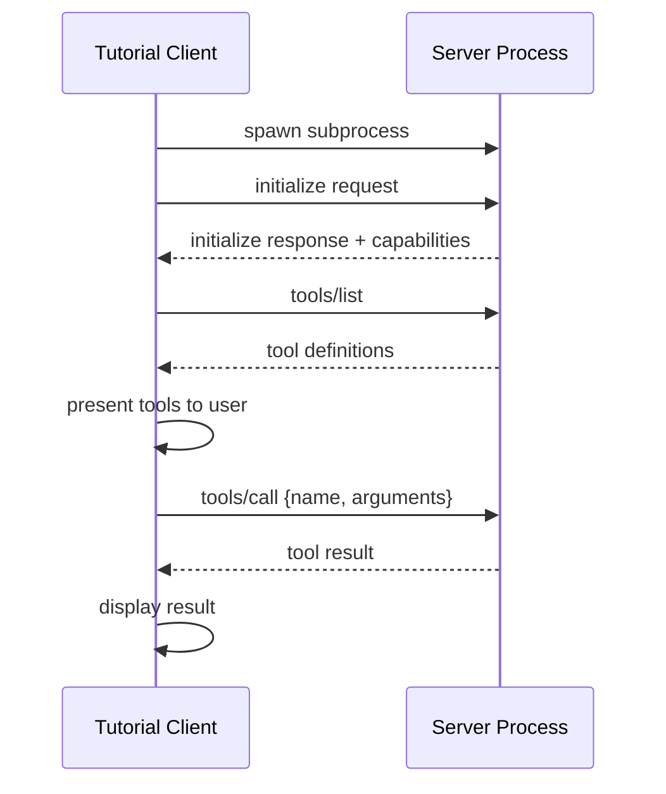
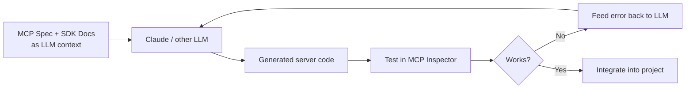
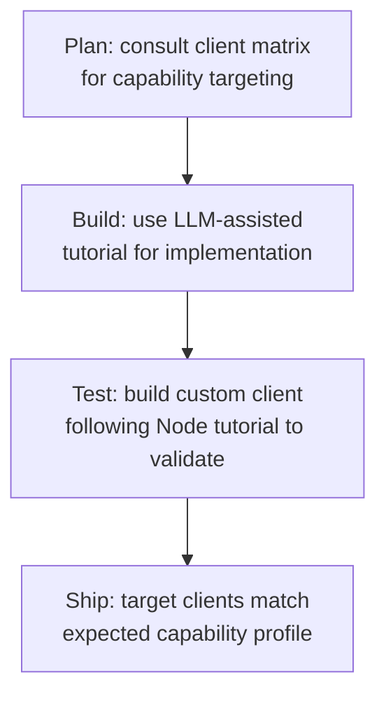

# Chapter 7: Tutorial Assets and Client Ecosystem Matrix

This chapter examines the two tutorial pages and the client ecosystem matrix (`clients.mdx`) preserved in the archive. These resources provide implementation guidance and compatibility context that remains useful for planning and validation workflows — with appropriate caveats about the rapidly evolving client landscape.

## Learning Goals

- Use the client feature matrix for compatibility planning across MCP hosts
- Interpret tutorial assets as implementation references while accounting for API changes
- Prioritize client-target testing by feature support profiles
- Keep compatibility assumptions documented and actively updated

## Client Ecosystem Matrix (`clients.mdx`)

The `clients.mdx` page contains a comprehensive matrix of MCP clients (hosts) and the MCP features each supports. This is invaluable for understanding which capabilities your server can rely on versus which require fallbacks.



### Feature Support by Capability

Based on the archived matrix, tool calls (`tools/list`, `tools/call`) are the most universally supported capability. Resources and prompts have narrower support. Sampling support is limited to clients that have explicit LLM integration.

| Capability | Broad Support | Notes |
|:-----------|:-------------|:------|
| `tools/list` + `tools/call` | Yes — near universal | Safe to rely on in all clients |
| `resources/list` + `resources/read` | Partial | Claude Desktop, some IDE clients |
| `prompts/list` + `prompts/get` | Partial | Claude Desktop, fewer IDEs |
| `sampling/createMessage` | Narrow | Requires host LLM integration |
| `roots/list` | Narrow | Context-aware clients (IDEs) |

### Using the Matrix for Server Design



**Practical rule**: If you want your server to work in any MCP client without configuration, implement tools only. Add resources and prompts as progressive enhancements for clients that support them.

### Matrix Staleness Warning

The archived matrix captures the client landscape as of the archive cutoff. The MCP client ecosystem has grown significantly since then. Notable additions post-archive:
- Additional IDE integrations (VS Code extensions, JetBrains plugins)
- New web-based clients
- API-based client libraries

Always check the active `clients.mdx` in the monorepo for the current list.

## Tutorial: Building a Client in Node.js (`tutorials/building-a-client-node.mdx`)

This tutorial guides developers through building a full MCP client in TypeScript/Node.js that can connect to any stdio-based server and interactively call tools.

Key implementation steps from the archived tutorial:
1. Create a `Client` instance with name and version
2. Instantiate a `StdioClientTransport` pointing at the server binary
3. Call `client.connect()` to run the initialize handshake
4. Call `client.listTools()` to enumerate available tools
5. Build an interactive loop: read user input → call tool → print result

```typescript
// Archived Node.js client pattern (v1 imports — use active docs for v2)
import { Client } from "@modelcontextprotocol/sdk/client/index.js";
import { StdioClientTransport } from "@modelcontextprotocol/sdk/client/stdio.js";

const transport = new StdioClientTransport({
  command: process.argv[2],
  args: process.argv.slice(3)
});

const client = new Client({ name: "tutorial-client", version: "1.0.0" }, {
  capabilities: { sampling: {} }
});

await client.connect(transport);

const { tools } = await client.listTools();
console.log("Available tools:", tools.map(t => t.name));
```

**Import path note**: The v2 TypeScript SDK uses split packages (`@modelcontextprotocol/client`, `@modelcontextprotocol/core`). The import paths above are from the v1 monolithic package and will fail with the v2 SDK. See the active TypeScript SDK docs for current imports.



## Tutorial: Building MCP with LLMs (`tutorials/building-mcp-with-llms.mdx`)

This tutorial takes a different angle — using an LLM (Claude) to assist in writing MCP server code. The workflow is:

1. Paste the MCP specification into context
2. Describe your desired tool, resource, or prompt behavior
3. Have the LLM generate the handler implementation
4. Test with Inspector, iterate



Key recommendation from the archived tutorial: Provide the LLM with the complete spec context (the specification markdown) and SDK-specific examples. Generic prompts without spec context produce poor results.

**Relevance today**: This workflow remains valid and is explicitly encouraged in the active docs. The active tutorial at `modelcontextprotocol.io/tutorials/building-mcp-with-llms` provides updated spec reference links.

## Putting the Matrix and Tutorials Together

The client matrix and tutorials form a complete planning toolkit:

- **Client matrix** → decide which primitives to implement
- **Node client tutorial** → validate your server against a custom client
- **LLM-assisted tutorial** → accelerate server implementation



## Source References

- [Client Ecosystem Matrix](https://github.com/modelcontextprotocol/docs/blob/main/clients.mdx)
- [Building a Client (Node)](https://github.com/modelcontextprotocol/docs/blob/main/tutorials/building-a-client-node.mdx)
- [Building MCP with LLMs](https://github.com/modelcontextprotocol/docs/blob/main/tutorials/building-mcp-with-llms.mdx)

## Summary

The client matrix is essential for capability targeting — use it to decide which primitives are worth implementing for your audience. The Node client tutorial illustrates the initialization and tool-call loop clearly, but update the import paths for v2 SDK. The LLM-assisted building tutorial is one of the most durable pieces of the archive — its workflow is still recommended in active docs.

Next: [Chapter 8: Contribution Governance and Documentation Operations](08-contribution-governance-and-documentation-operations.md)
