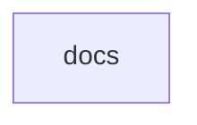

# Chapter 8: Contribution Governance and Documentation Operations

Welcome to **Chapter 8: Contribution Governance and Documentation Operations**. In this part of **MCP Docs Repo Tutorial: Navigating the Archived MCP Documentation Repository**, you will build an intuitive mental model first, then move into concrete implementation details and practical production tradeoffs.


This chapter defines governance controls for teams maintaining internal MCP docs around archived upstream content.

## Learning Goals

- route external documentation contributions to active repositories correctly
- maintain internal docs synchronization with canonical MCP docs
- establish review and versioning policies for docs-derived architecture guidance
- prevent stale archive content from overriding current specification updates

## Source References

- [Archived Docs Contributing Guide](https://github.com/modelcontextprotocol/docs/blob/main/CONTRIBUTING.md)
- [Active MCP Docs Location](https://github.com/modelcontextprotocol/modelcontextprotocol/tree/main/docs)

## Summary

You now have a governance model for documentation operations across archived and active MCP sources.

Return to the [MCP Docs Repo Tutorial index](README.md).

## Source Code Walkthrough

### `docs.json`

The `docs` module in [`docs.json`](https://github.com/modelcontextprotocol/docs/blob/HEAD/docs.json) handles a key part of this chapter's functionality:

```json
{
  "$schema": "https://mintlify.com/docs.json",
  "theme": "willow",
  "name": "Model Context Protocol",
  "colors": {
    "primary": "#09090b",
    "light": "#FAFAFA",
    "dark": "#09090b"
  },
  "favicon": "/favicon.svg",
  "navigation": {
    "tabs": [
      {
        "tab": "Documentation",
        "groups": [
          {
            "group": "Get Started",
            "pages": [
              "introduction",
              {
                "group": "Quickstart",
                "pages": [
                  "quickstart/server",
                  "quickstart/client",
                  "quickstart/user"
                ]
              },
              "examples",
              "clients"
            ]
          },
          {
            "group": "Tutorials",
            "pages": [
              "tutorials/building-mcp-with-llms",
```

This module is important because it defines how MCP Docs Repo Tutorial: Navigating the Archived MCP Documentation Repository implements the patterns covered in this chapter.


## How These Components Connect


