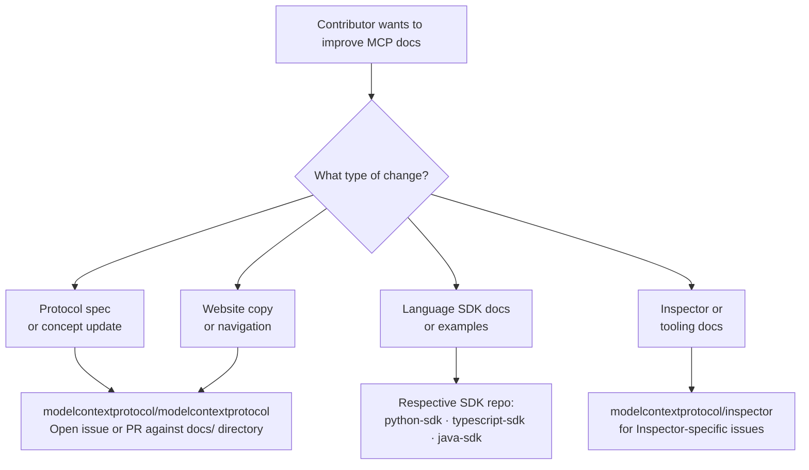
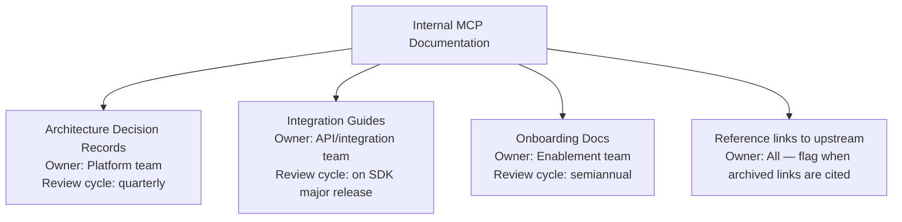
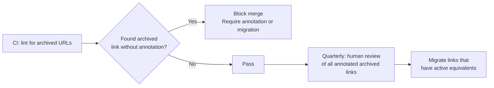
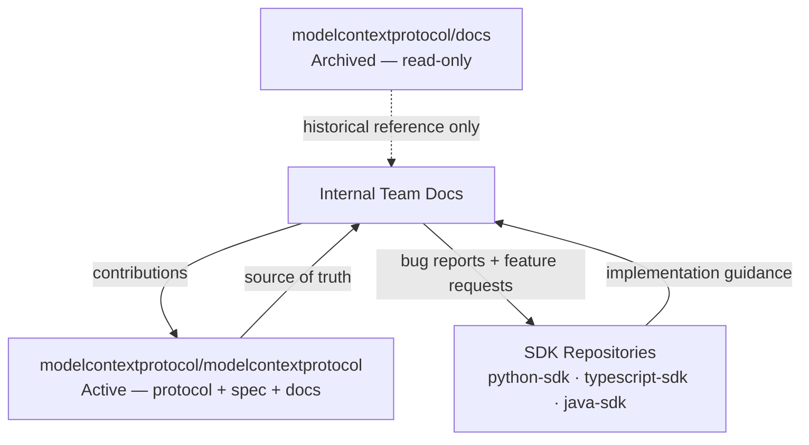

# Chapter 8: Contribution Governance and Documentation Operations

This final chapter defines governance controls for teams maintaining internal MCP documentation around an archived upstream source — and explains where external contributions to MCP documentation should actually go.

## Learning Goals

- Route external documentation contributions to the correct active repositories
- Maintain internal docs synchronization with canonical MCP documentation
- Establish review and versioning policies for docs-derived architecture guidance
- Prevent stale archive content from overriding current specification updates

## Where Contributions Should Go

The `modelcontextprotocol/docs` repository is **read-only**. It does not accept issues or pull requests. All documentation contributions to the MCP project must target the active repositories:

## Internal Docs Governance Model

For teams building on MCP who maintain internal documentation derived from or referencing MCP sources:

### Ownership Structure

### Synchronization Policy

Internal documentation that references MCP concepts should follow a synchronization cadence:

| Trigger | Action |
|:--------|:-------|
| New MCP SDK major version | Review and update all import path references |
| Protocol specification change | Update architecture docs and concept glossary |
| New official transport (e.g., StreamableHTTP) | Update transport choice guidance |
| New client added to ecosystem matrix | Review capability targeting assumptions |
| Archive notice on any MCP repo | Flag all internal links to that repo for migration |

### Preventing Stale Content Propagation

The most common failure mode is copying content from an archived source into internal documentation without marking it as requiring verification. Mitigation practices:

1. **Link annotations**: Any link to `github.com/modelcontextprotocol/docs` in internal docs must be annotated with `[archived]` and the date last verified
2. **Deprecation lint**: Add a CI check that flags archived GitHub URLs in documentation files
3. **Canonical link policy**: Prefer links to `modelcontextprotocol.io` (live site) over GitHub source links where possible; the live site always reflects the current active state
4. **Scheduled review**: Quarterly audit of all MCP-referencing documentation against the active monorepo

## Archived Contributing Guide (`development/contributing.mdx`)

The archived CONTRIBUTING.md and the `development/contributing.mdx` page describe the original documentation contribution process for the Mintlify site. Now that the site is migrated, this content is historical.

Key governance elements preserved in the archived contributing guide:
- Page format conventions (MDX + Mintlify component syntax)
- Frontmatter requirements (title, description)
- Image and asset naming conventions
- Review process expectations

These conventions are still useful as a baseline for teams building their own documentation infrastructure using Mintlify or similar platforms.

## Documentation Operations Checklist

For teams operating on MCP at scale:

### Initial Setup
- [ ] Identify which internal docs reference the `modelcontextprotocol/docs` archive
- [ ] Annotate every archived link with `[archived — verify against modelcontextprotocol.io]`
- [ ] Establish ownership assignments for each internal doc category
- [ ] Set up quarterly review calendar entries

### Ongoing Operations
- [ ] Monitor `modelcontextprotocol/modelcontextprotocol` releases for spec changes
- [ ] Subscribe to SDK release feeds (Python SDK, TypeScript SDK)
- [ ] Track MCP Inspector releases for tooling doc updates
- [ ] Review client ecosystem matrix every six months

### Migration Completion Criteria
- [ ] Zero unverified links to `github.com/modelcontextprotocol/docs` in internal docs
- [ ] All concept references point to active monorepo or live site
- [ ] All SDK import paths match current major version
- [ ] Transport documentation references StreamableHTTP for remote scenarios

## Governance Summary Diagram

## Source References

- [Archived Docs Contributing Guide](https://github.com/modelcontextprotocol/docs/blob/main/CONTRIBUTING.md)
- [Active MCP Docs Location](https://github.com/modelcontextprotocol/modelcontextprotocol/tree/main/docs)
- [MCP Monorepo Contributing Guide](https://github.com/modelcontextprotocol/modelcontextprotocol/blob/main/CONTRIBUTING.md)

## Summary

The archived repository accepts no contributions. All documentation improvements for MCP go to the active monorepo or the respective SDK repositories. Internally, treat archived content as a read-only historical reference with explicit annotations. Establish a synchronization policy driven by protocol and SDK releases, not by time alone. The governance checklist in this chapter gives your team a concrete starting point for managing MCP documentation across its full lifecycle.

Return to the [MCP Docs Repo Tutorial index](README.md).
