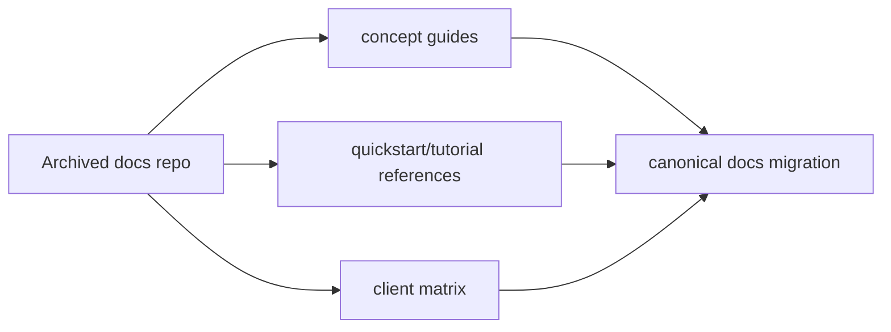

# MCP Docs Repo Tutorial: Navigating the Archived MCP Documentation Repository

> Learn how to use `modelcontextprotocol/docs` as an archived reference, map its conceptual guides, and migrate documentation workflows to the canonical `modelcontextprotocol/modelcontextprotocol` docs location.

## Why This Track Matters

MCP documentation has been reorganized over time. The archived `docs` repository still contains useful conceptual and tutorial material, but active changes now live in the main protocol repository.

This track focuses on:

- understanding archive status and canonical docs migration paths
- extracting enduring concept docs (architecture, tools, resources, transports)
- using quickstart/tutorial content as historical reference
- setting contribution and governance workflows against the active docs source

## Current Snapshot (auto-updated)

- repository: [`modelcontextprotocol/docs`](https://github.com/modelcontextprotocol/docs)
- stars: about **424**
- repository status: **archived**
- recent activity: updated on **February 11, 2026**
- active-docs pointer: repository README redirects to `modelcontextprotocol/modelcontextprotocol/tree/main/docs`
- license: MIT

## Mental Model

## Chapter Guide

| Chapter | Key Question | Outcome |
|:--------|:-------------|:--------|
| [01 - Getting Started and Archive Context](01-getting-started-and-archive-context.md) | What is this repo’s current role in the MCP docs ecosystem? | Clear scope |
| [02 - Repository Layout and Canonical Migration Path](02-repository-layout-and-canonical-migration-path.md) | How should teams navigate archived vs active docs sources? | Better source-of-truth discipline |
| [03 - Quickstart Flows: User, Server, and Client](03-quickstart-flows-user-server-and-client.md) | What practical onboarding flows are still captured here? | Faster onboarding context |
| [04 - Core Concepts: Architecture, Tools, Resources, Prompts](04-core-concepts-architecture-tools-resources-prompts.md) | Which conceptual guides remain useful reference material? | Stronger conceptual model |
| [05 - Advanced Concepts: Transports, Sampling, and Roots](05-advanced-concepts-transports-sampling-and-roots.md) | How do advanced protocol patterns map to implementation work? | Better design decisions |
| [06 - Tooling Docs: Inspector and Debugging](06-tooling-docs-inspector-and-debugging.md) | How do archived tool docs support day-to-day development? | Improved debugging workflows |
| [07 - Tutorial Assets and Client Ecosystem Matrix](07-tutorial-assets-and-client-ecosystem-matrix.md) | How should teams consume ecosystem/client compatibility content? | Better planning signals |
| [08 - Contribution Governance and Documentation Operations](08-contribution-governance-and-documentation-operations.md) | How do teams contribute and maintain docs with the archive/active split? | Sustainable documentation process |

## What You Will Learn

- how to separate historical documentation value from active source-of-truth docs
- how to apply archived concept guides without drifting from current specification
- how to use quickstarts/tutorials/client matrices as compatibility context
- how to set contribution workflows around canonical docs ownership

## Source References

- [Docs Repository README](https://github.com/modelcontextprotocol/docs/blob/main/README.md)
- [Introduction](https://github.com/modelcontextprotocol/docs/blob/main/introduction.mdx)
- [Quickstart: Server](https://github.com/modelcontextprotocol/docs/blob/main/quickstart/server.mdx)
- [Quickstart: Client](https://github.com/modelcontextprotocol/docs/blob/main/quickstart/client.mdx)
- [Quickstart: User](https://github.com/modelcontextprotocol/docs/blob/main/quickstart/user.mdx)
- [Architecture Concepts](https://github.com/modelcontextprotocol/docs/blob/main/docs/concepts/architecture.mdx)
- [Tools Concepts](https://github.com/modelcontextprotocol/docs/blob/main/docs/concepts/tools.mdx)
- [Resources Concepts](https://github.com/modelcontextprotocol/docs/blob/main/docs/concepts/resources.mdx)
- [Prompts Concepts](https://github.com/modelcontextprotocol/docs/blob/main/docs/concepts/prompts.mdx)
- [Sampling Concepts](https://github.com/modelcontextprotocol/docs/blob/main/docs/concepts/sampling.mdx)
- [Transports Concepts](https://github.com/modelcontextprotocol/docs/blob/main/docs/concepts/transports.mdx)
- [Inspector Guide](https://github.com/modelcontextprotocol/docs/blob/main/docs/tools/inspector.mdx)
- [Debugging Guide](https://github.com/modelcontextprotocol/docs/blob/main/docs/tools/debugging.mdx)
- [Client Ecosystem Matrix](https://github.com/modelcontextprotocol/docs/blob/main/clients.mdx)

## Related Tutorials

- [MCP Specification Tutorial](../mcp-specification-tutorial/)
- [MCP Quickstart Resources Tutorial](../mcp-quickstart-resources-tutorial/)
- [MCP Inspector Tutorial](../mcp-inspector-tutorial/)
- [MCP TypeScript SDK Tutorial](../mcp-typescript-sdk-tutorial/)

---

Start with [Chapter 1: Getting Started and Archive Context](01-getting-started-and-archive-context.md).

## Navigation & Backlinks

- [Start Here: Chapter 1: Getting Started and Archive Context](01-getting-started-and-archive-context.md)
- [Back to Main Catalog](../../README.md#-tutorial-catalog)
- [Browse A-Z Tutorial Directory](../../discoverability/tutorial-directory.md)
- [Search by Intent](../../discoverability/query-hub.md)
- [Explore Category Hubs](../../README.md#category-hubs)

## Full Chapter Map

1. [Chapter 1: Getting Started and Archive Context](01-getting-started-and-archive-context.md)
2. [Chapter 2: Repository Layout and Canonical Migration Path](02-repository-layout-and-canonical-migration-path.md)
3. [Chapter 3: Quickstart Flows: User, Server, and Client](03-quickstart-flows-user-server-and-client.md)
4. [Chapter 4: Core Concepts: Architecture, Tools, Resources, Prompts](04-core-concepts-architecture-tools-resources-prompts.md)
5. [Chapter 5: Advanced Concepts: Transports, Sampling, and Roots](05-advanced-concepts-transports-sampling-and-roots.md)
6. [Chapter 6: Tooling Docs: Inspector and Debugging](06-tooling-docs-inspector-and-debugging.md)
7. [Chapter 7: Tutorial Assets and Client Ecosystem Matrix](07-tutorial-assets-and-client-ecosystem-matrix.md)
8. [Chapter 8: Contribution Governance and Documentation Operations](08-contribution-governance-and-documentation-operations.md)

*Generated by [AI Codebase Knowledge Builder](https://github.com/The-Pocket/Tutorial-Codebase-Knowledge)*
