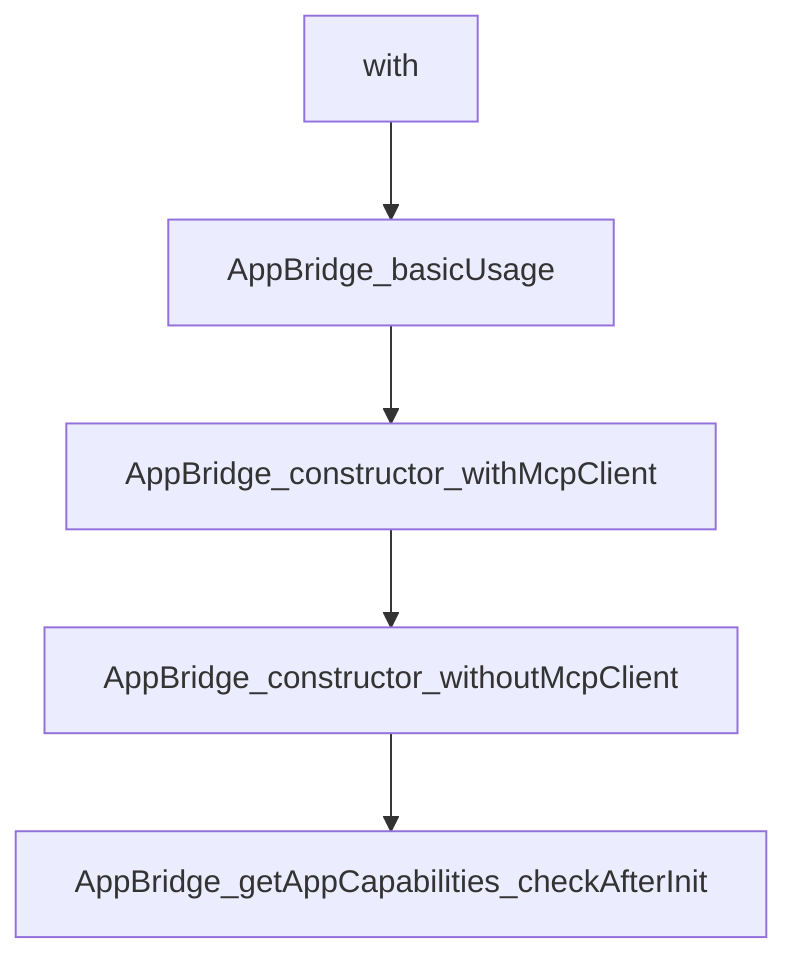

# Chapter 1: Getting Started and Spec Orientation

Welcome to **Chapter 1: Getting Started and Spec Orientation**. In this part of **MCP Ext Apps Tutorial: Building Interactive MCP Apps and Hosts**, you will build an intuitive mental model first, then move into concrete implementation details and practical production tradeoffs.


This chapter introduces MCP Apps scope and the quickest path to first execution.

## Learning Goals

- understand how MCP Apps extends core MCP capabilities
- install the SDK and identify app-side vs host-side packages
- align on stable spec versioning and compatibility expectations
- run a minimal quickstart loop

## Setup Baseline

```bash
npm install -S @modelcontextprotocol/ext-apps
```

Add `@modelcontextprotocol/ext-apps/react` if you are building React-based app UIs.

## Source References

- [Ext Apps README](https://github.com/modelcontextprotocol/ext-apps/blob/main/README.md)
- [MCP Apps Stable Spec](https://github.com/modelcontextprotocol/ext-apps/blob/main/specification/2026-01-26/apps.mdx)
- [Quickstart Guide](https://github.com/modelcontextprotocol/ext-apps/blob/main/docs/quickstart.md)

## Summary

You now have the baseline needed to evaluate and implement MCP Apps flows.

Next: [Chapter 2: MCP Apps Architecture and Lifecycle](02-mcp-apps-architecture-and-lifecycle.md)

## Depth Expansion Playbook

## Source Code Walkthrough

### `src/app-bridge.examples.ts`

The `with` class in [`src/app-bridge.examples.ts`](https://github.com/modelcontextprotocol/ext-apps/blob/HEAD/src/app-bridge.examples.ts) handles a key part of this chapter's functionality:

```ts

/**
 * Example: Basic usage of the AppBridge class with PostMessageTransport.
 */
async function AppBridge_basicUsage(serverTransport: Transport) {
  //#region AppBridge_basicUsage
  // Create MCP client for the server
  const client = new Client({
    name: "MyHost",
    version: "1.0.0",
  });
  await client.connect(serverTransport);

  // Create bridge for the View
  const bridge = new AppBridge(
    client,
    { name: "MyHost", version: "1.0.0" },
    { openLinks: {}, serverTools: {}, logging: {} },
  );

  // Set up iframe and connect
  const iframe = document.getElementById("app") as HTMLIFrameElement;
  const transport = new PostMessageTransport(
    iframe.contentWindow!,
    iframe.contentWindow!,
  );

  bridge.oninitialized = () => {
    console.log("View initialized");
    // Now safe to send tool input
    bridge.sendToolInput({ arguments: { location: "NYC" } });
  };
```

This class is important because it defines how MCP Ext Apps Tutorial: Building Interactive MCP Apps and Hosts implements the patterns covered in this chapter.

### `src/app-bridge.examples.ts`

The `AppBridge_basicUsage` function in [`src/app-bridge.examples.ts`](https://github.com/modelcontextprotocol/ext-apps/blob/HEAD/src/app-bridge.examples.ts) handles a key part of this chapter's functionality:

```ts
 * Example: Basic usage of the AppBridge class with PostMessageTransport.
 */
async function AppBridge_basicUsage(serverTransport: Transport) {
  //#region AppBridge_basicUsage
  // Create MCP client for the server
  const client = new Client({
    name: "MyHost",
    version: "1.0.0",
  });
  await client.connect(serverTransport);

  // Create bridge for the View
  const bridge = new AppBridge(
    client,
    { name: "MyHost", version: "1.0.0" },
    { openLinks: {}, serverTools: {}, logging: {} },
  );

  // Set up iframe and connect
  const iframe = document.getElementById("app") as HTMLIFrameElement;
  const transport = new PostMessageTransport(
    iframe.contentWindow!,
    iframe.contentWindow!,
  );

  bridge.oninitialized = () => {
    console.log("View initialized");
    // Now safe to send tool input
    bridge.sendToolInput({ arguments: { location: "NYC" } });
  };

  await bridge.connect(transport);
```

This function is important because it defines how MCP Ext Apps Tutorial: Building Interactive MCP Apps and Hosts implements the patterns covered in this chapter.

### `src/app-bridge.examples.ts`

The `AppBridge_constructor_withMcpClient` function in [`src/app-bridge.examples.ts`](https://github.com/modelcontextprotocol/ext-apps/blob/HEAD/src/app-bridge.examples.ts) handles a key part of this chapter's functionality:

```ts
 * Example: Creating an AppBridge with an MCP client for automatic forwarding.
 */
function AppBridge_constructor_withMcpClient(mcpClient: Client) {
  //#region AppBridge_constructor_withMcpClient
  const bridge = new AppBridge(
    mcpClient,
    { name: "MyHost", version: "1.0.0" },
    { openLinks: {}, serverTools: {}, logging: {} },
  );
  //#endregion AppBridge_constructor_withMcpClient
}

/**
 * Example: Creating an AppBridge without an MCP client, using manual handlers.
 */
function AppBridge_constructor_withoutMcpClient() {
  //#region AppBridge_constructor_withoutMcpClient
  const bridge = new AppBridge(
    null,
    { name: "MyHost", version: "1.0.0" },
    { openLinks: {}, serverTools: {}, logging: {} },
  );
  bridge.oncalltool = async (params, extra) => {
    // Handle tool calls manually
    return { content: [] };
  };
  //#endregion AppBridge_constructor_withoutMcpClient
}

/**
 * Example: Check View capabilities after initialization.
 */
```

This function is important because it defines how MCP Ext Apps Tutorial: Building Interactive MCP Apps and Hosts implements the patterns covered in this chapter.

### `src/app-bridge.examples.ts`

The `AppBridge_constructor_withoutMcpClient` function in [`src/app-bridge.examples.ts`](https://github.com/modelcontextprotocol/ext-apps/blob/HEAD/src/app-bridge.examples.ts) handles a key part of this chapter's functionality:

```ts
 * Example: Creating an AppBridge without an MCP client, using manual handlers.
 */
function AppBridge_constructor_withoutMcpClient() {
  //#region AppBridge_constructor_withoutMcpClient
  const bridge = new AppBridge(
    null,
    { name: "MyHost", version: "1.0.0" },
    { openLinks: {}, serverTools: {}, logging: {} },
  );
  bridge.oncalltool = async (params, extra) => {
    // Handle tool calls manually
    return { content: [] };
  };
  //#endregion AppBridge_constructor_withoutMcpClient
}

/**
 * Example: Check View capabilities after initialization.
 */
function AppBridge_getAppCapabilities_checkAfterInit(bridge: AppBridge) {
  //#region AppBridge_getAppCapabilities_checkAfterInit
  bridge.oninitialized = () => {
    const caps = bridge.getAppCapabilities();
    if (caps?.tools) {
      console.log("View provides tools");
    }
  };
  //#endregion AppBridge_getAppCapabilities_checkAfterInit
}

/**
 * Example: Log View information after initialization.
```

This function is important because it defines how MCP Ext Apps Tutorial: Building Interactive MCP Apps and Hosts implements the patterns covered in this chapter.


## How These Components Connect


