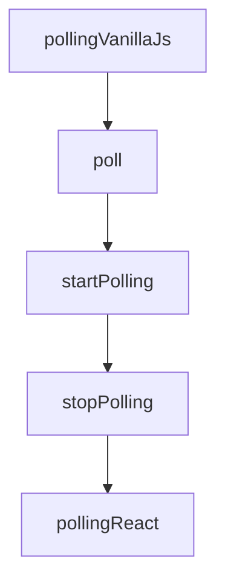

# Chapter 1: Getting Started and Spec Orientation

Welcome to **Chapter 1: Getting Started and Spec Orientation**. In this part of **MCP Ext Apps Tutorial: Building Interactive MCP Apps and Hosts**, you will build an intuitive mental model first, then move into concrete implementation details and practical production tradeoffs.


This chapter introduces MCP Apps scope and the quickest path to first execution.

## Learning Goals

- understand how MCP Apps extends core MCP capabilities
- install the SDK and identify app-side vs host-side packages
- align on stable spec versioning and compatibility expectations
- run a minimal quickstart loop

## Setup Baseline

```bash
npm install -S @modelcontextprotocol/ext-apps
```

Add `@modelcontextprotocol/ext-apps/react` if you are building React-based app UIs.

## Source References

- [Ext Apps README](https://github.com/modelcontextprotocol/ext-apps/blob/main/README.md)
- [MCP Apps Stable Spec](https://github.com/modelcontextprotocol/ext-apps/blob/main/specification/2026-01-26/apps.mdx)
- [Quickstart Guide](https://github.com/modelcontextprotocol/ext-apps/blob/main/docs/quickstart.md)

## Summary

You now have the baseline needed to evaluate and implement MCP Apps flows.

Next: [Chapter 2: MCP Apps Architecture and Lifecycle](02-mcp-apps-architecture-and-lifecycle.md)

## Source Code Walkthrough

### `docs/patterns.tsx`

The `pollingVanillaJs` function in [`docs/patterns.tsx`](https://github.com/modelcontextprotocol/ext-apps/blob/HEAD/docs/patterns.tsx) handles a key part of this chapter's functionality:

```tsx
 * Example: Polling for live data (Vanilla JS)
 */
function pollingVanillaJs(app: App, updateUI: (data: unknown) => void) {
  //#region pollingVanillaJs
  let intervalId: number | null = null;

  async function poll() {
    const result = await app.callServerTool({
      name: "poll-data",
      arguments: {},
    });
    updateUI(result.structuredContent);
  }

  function startPolling() {
    if (intervalId !== null) return;
    poll();
    intervalId = window.setInterval(poll, 2000);
  }

  function stopPolling() {
    if (intervalId === null) return;
    clearInterval(intervalId);
    intervalId = null;
  }

  // Clean up when host tears down the view
  app.onteardown = async () => {
    stopPolling();
    return {};
  };
  //#endregion pollingVanillaJs
```

This function is important because it defines how MCP Ext Apps Tutorial: Building Interactive MCP Apps and Hosts implements the patterns covered in this chapter.

### `docs/patterns.tsx`

The `poll` function in [`docs/patterns.tsx`](https://github.com/modelcontextprotocol/ext-apps/blob/HEAD/docs/patterns.tsx) handles a key part of this chapter's functionality:

```tsx
 * Example: Polling for live data (Vanilla JS)
 */
function pollingVanillaJs(app: App, updateUI: (data: unknown) => void) {
  //#region pollingVanillaJs
  let intervalId: number | null = null;

  async function poll() {
    const result = await app.callServerTool({
      name: "poll-data",
      arguments: {},
    });
    updateUI(result.structuredContent);
  }

  function startPolling() {
    if (intervalId !== null) return;
    poll();
    intervalId = window.setInterval(poll, 2000);
  }

  function stopPolling() {
    if (intervalId === null) return;
    clearInterval(intervalId);
    intervalId = null;
  }

  // Clean up when host tears down the view
  app.onteardown = async () => {
    stopPolling();
    return {};
  };
  //#endregion pollingVanillaJs
```

This function is important because it defines how MCP Ext Apps Tutorial: Building Interactive MCP Apps and Hosts implements the patterns covered in this chapter.

### `docs/patterns.tsx`

The `startPolling` function in [`docs/patterns.tsx`](https://github.com/modelcontextprotocol/ext-apps/blob/HEAD/docs/patterns.tsx) handles a key part of this chapter's functionality:

```tsx
  }

  function startPolling() {
    if (intervalId !== null) return;
    poll();
    intervalId = window.setInterval(poll, 2000);
  }

  function stopPolling() {
    if (intervalId === null) return;
    clearInterval(intervalId);
    intervalId = null;
  }

  // Clean up when host tears down the view
  app.onteardown = async () => {
    stopPolling();
    return {};
  };
  //#endregion pollingVanillaJs
}

/**
 * Example: Polling for live data (React)
 */
function pollingReact(
  app: App | null, // via useApp()
) {
  const [data, setData] = useState<unknown>();

  //#region pollingReact
  useEffect(() => {
```

This function is important because it defines how MCP Ext Apps Tutorial: Building Interactive MCP Apps and Hosts implements the patterns covered in this chapter.

### `docs/patterns.tsx`

The `stopPolling` function in [`docs/patterns.tsx`](https://github.com/modelcontextprotocol/ext-apps/blob/HEAD/docs/patterns.tsx) handles a key part of this chapter's functionality:

```tsx
  }

  function stopPolling() {
    if (intervalId === null) return;
    clearInterval(intervalId);
    intervalId = null;
  }

  // Clean up when host tears down the view
  app.onteardown = async () => {
    stopPolling();
    return {};
  };
  //#endregion pollingVanillaJs
}

/**
 * Example: Polling for live data (React)
 */
function pollingReact(
  app: App | null, // via useApp()
) {
  const [data, setData] = useState<unknown>();

  //#region pollingReact
  useEffect(() => {
    if (!app) return;
    let cancelled = false;

    async function poll() {
      const result = await app!.callServerTool({
        name: "poll-data",
```

This function is important because it defines how MCP Ext Apps Tutorial: Building Interactive MCP Apps and Hosts implements the patterns covered in this chapter.


## How These Components Connect


