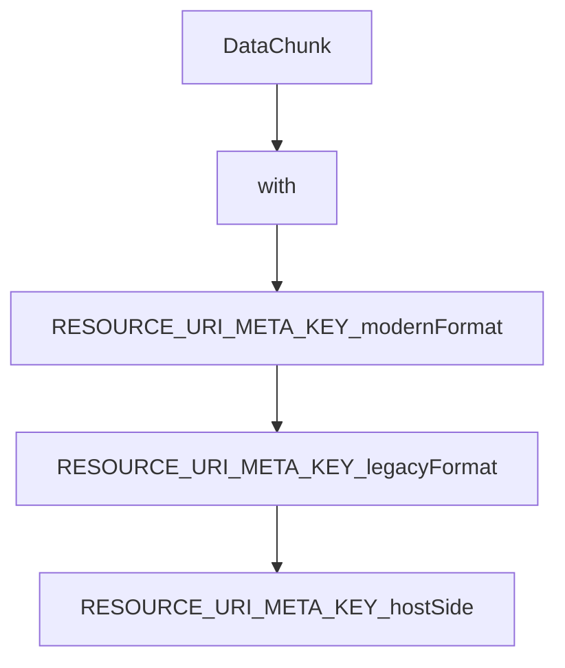

# Chapter 2: MCP Apps Architecture and Lifecycle

Welcome to **Chapter 2: MCP Apps Architecture and Lifecycle**. In this part of **MCP Ext Apps Tutorial: Building Interactive MCP Apps and Hosts**, you will build an intuitive mental model first, then move into concrete implementation details and practical production tradeoffs.


This chapter covers lifecycle stages from tool declaration to host-rendered UI interaction.

## Learning Goals

- map tool metadata to UI resource resolution
- understand host sandbox behavior and iframe lifecycle
- model bidirectional messaging between host and app
- identify lifecycle failure points before implementation

## Lifecycle Stages

1. server tool declares associated `ui://` resource
2. model invokes tool via normal MCP flow
3. host resolves UI resource and renders sandboxed app
4. host passes tool outputs/context into app runtime
5. app may trigger follow-up tool calls through the host bridge

## Source References

- [MCP Apps Overview](https://github.com/modelcontextprotocol/ext-apps/blob/main/docs/overview.md)
- [Ext Apps README - How It Works](https://github.com/modelcontextprotocol/ext-apps/blob/main/README.md#how-it-works)

## Summary

You now have a lifecycle model for MCP Apps interactions across server, host, and UI layers.

Next: [Chapter 3: App SDK: UI Resources and Tool Linkage](03-app-sdk-ui-resources-and-tool-linkage.md)

## Source Code Walkthrough

### `docs/patterns.tsx`

The `DataChunk` interface in [`docs/patterns.tsx`](https://github.com/modelcontextprotocol/ext-apps/blob/HEAD/docs/patterns.tsx) handles a key part of this chapter's functionality:

```tsx
  //#region chunkedDataServer
  // Define the chunk response schema
  const DataChunkSchema = z.object({
    bytes: z.string(), // base64-encoded data
    offset: z.number(),
    byteCount: z.number(),
    totalBytes: z.number(),
    hasMore: z.boolean(),
  });

  const MAX_CHUNK_BYTES = 500 * 1024; // 500KB per chunk

  registerAppTool(
    server,
    "read_data_bytes",
    {
      title: "Read Data Bytes",
      description: "Load binary data in chunks",
      inputSchema: {
        id: z.string().describe("Resource identifier"),
        offset: z.number().min(0).default(0).describe("Byte offset"),
        byteCount: z
          .number()
          .default(MAX_CHUNK_BYTES)
          .describe("Bytes to read"),
      },
      outputSchema: DataChunkSchema,
      // Hidden from model - only callable by the App
      _meta: { ui: { visibility: ["app"] } },
    },
    async ({ id, offset, byteCount }): Promise<CallToolResult> => {
      const data = await loadData(id); // Your data loading logic
```

This interface is important because it defines how MCP Ext Apps Tutorial: Building Interactive MCP Apps and Hosts implements the patterns covered in this chapter.

### `src/app.examples.ts`

The `with` class in [`src/app.examples.ts`](https://github.com/modelcontextprotocol/ext-apps/blob/HEAD/src/app.examples.ts) handles a key part of this chapter's functionality:

```ts

/**
 * Example: Modern format for registering tools with UI (recommended).
 */
function RESOURCE_URI_META_KEY_modernFormat(
  server: McpServer,
  handler: ToolCallback,
) {
  //#region RESOURCE_URI_META_KEY_modernFormat
  // Preferred: Use registerAppTool with nested ui.resourceUri
  registerAppTool(
    server,
    "weather",
    {
      description: "Get weather forecast",
      _meta: {
        ui: { resourceUri: "ui://weather/forecast" },
      },
    },
    handler,
  );
  //#endregion RESOURCE_URI_META_KEY_modernFormat
}

/**
 * Example: Legacy format using RESOURCE_URI_META_KEY (deprecated).
 */
function RESOURCE_URI_META_KEY_legacyFormat(
  server: McpServer,
  handler: ToolCallback,
) {
  //#region RESOURCE_URI_META_KEY_legacyFormat
```

This class is important because it defines how MCP Ext Apps Tutorial: Building Interactive MCP Apps and Hosts implements the patterns covered in this chapter.

### `src/app.examples.ts`

The `RESOURCE_URI_META_KEY_modernFormat` function in [`src/app.examples.ts`](https://github.com/modelcontextprotocol/ext-apps/blob/HEAD/src/app.examples.ts) handles a key part of this chapter's functionality:

```ts
 * Example: Modern format for registering tools with UI (recommended).
 */
function RESOURCE_URI_META_KEY_modernFormat(
  server: McpServer,
  handler: ToolCallback,
) {
  //#region RESOURCE_URI_META_KEY_modernFormat
  // Preferred: Use registerAppTool with nested ui.resourceUri
  registerAppTool(
    server,
    "weather",
    {
      description: "Get weather forecast",
      _meta: {
        ui: { resourceUri: "ui://weather/forecast" },
      },
    },
    handler,
  );
  //#endregion RESOURCE_URI_META_KEY_modernFormat
}

/**
 * Example: Legacy format using RESOURCE_URI_META_KEY (deprecated).
 */
function RESOURCE_URI_META_KEY_legacyFormat(
  server: McpServer,
  handler: ToolCallback,
) {
  //#region RESOURCE_URI_META_KEY_legacyFormat
  // Deprecated: Direct use of RESOURCE_URI_META_KEY
  server.registerTool(
```

This function is important because it defines how MCP Ext Apps Tutorial: Building Interactive MCP Apps and Hosts implements the patterns covered in this chapter.

### `src/app.examples.ts`

The `RESOURCE_URI_META_KEY_legacyFormat` function in [`src/app.examples.ts`](https://github.com/modelcontextprotocol/ext-apps/blob/HEAD/src/app.examples.ts) handles a key part of this chapter's functionality:

```ts
 * Example: Legacy format using RESOURCE_URI_META_KEY (deprecated).
 */
function RESOURCE_URI_META_KEY_legacyFormat(
  server: McpServer,
  handler: ToolCallback,
) {
  //#region RESOURCE_URI_META_KEY_legacyFormat
  // Deprecated: Direct use of RESOURCE_URI_META_KEY
  server.registerTool(
    "weather",
    {
      description: "Get weather forecast",
      _meta: {
        [RESOURCE_URI_META_KEY]: "ui://weather/forecast",
      },
    },
    handler,
  );
  //#endregion RESOURCE_URI_META_KEY_legacyFormat
}

/**
 * Example: How hosts check for RESOURCE_URI_META_KEY metadata (must support both formats).
 */
function RESOURCE_URI_META_KEY_hostSide(tool: Tool) {
  //#region RESOURCE_URI_META_KEY_hostSide
  // Hosts should check both modern and legacy formats
  const meta = tool._meta;
  const uiMeta = meta?.ui as McpUiToolMeta | undefined;
  const legacyUri = meta?.[RESOURCE_URI_META_KEY] as string | undefined;
  const uiUri = uiMeta?.resourceUri ?? legacyUri;
  if (typeof uiUri === "string" && uiUri.startsWith("ui://")) {
```

This function is important because it defines how MCP Ext Apps Tutorial: Building Interactive MCP Apps and Hosts implements the patterns covered in this chapter.


## How These Components Connect


