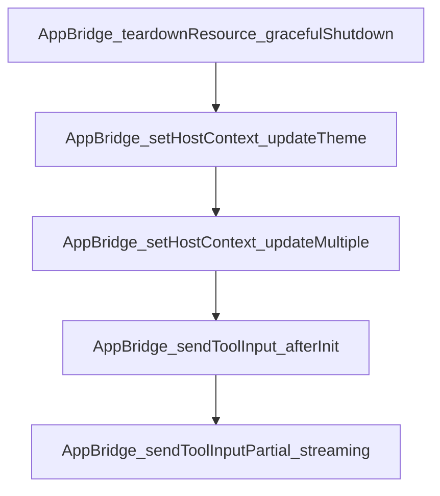

# Chapter 2: MCP Apps Architecture and Lifecycle

Welcome to **Chapter 2: MCP Apps Architecture and Lifecycle**. In this part of **MCP Ext Apps Tutorial: Building Interactive MCP Apps and Hosts**, you will build an intuitive mental model first, then move into concrete implementation details and practical production tradeoffs.


This chapter covers lifecycle stages from tool declaration to host-rendered UI interaction.

## Learning Goals

- map tool metadata to UI resource resolution
- understand host sandbox behavior and iframe lifecycle
- model bidirectional messaging between host and app
- identify lifecycle failure points before implementation

## Lifecycle Stages

1. server tool declares associated `ui://` resource
2. model invokes tool via normal MCP flow
3. host resolves UI resource and renders sandboxed app
4. host passes tool outputs/context into app runtime
5. app may trigger follow-up tool calls through the host bridge

## Source References

- [MCP Apps Overview](https://github.com/modelcontextprotocol/ext-apps/blob/main/docs/overview.md)
- [Ext Apps README - How It Works](https://github.com/modelcontextprotocol/ext-apps/blob/main/README.md#how-it-works)

## Summary

You now have a lifecycle model for MCP Apps interactions across server, host, and UI layers.

Next: [Chapter 3: App SDK: UI Resources and Tool Linkage](03-app-sdk-ui-resources-and-tool-linkage.md)

## Depth Expansion Playbook

## Source Code Walkthrough

### `src/app-bridge.examples.ts`

The `AppBridge_teardownResource_gracefulShutdown` function in [`src/app-bridge.examples.ts`](https://github.com/modelcontextprotocol/ext-apps/blob/HEAD/src/app-bridge.examples.ts) handles a key part of this chapter's functionality:

```ts
 * Example: Gracefully tear down the View before unmounting.
 */
async function AppBridge_teardownResource_gracefulShutdown(
  bridge: AppBridge,
  iframe: HTMLIFrameElement,
) {
  //#region AppBridge_teardownResource_gracefulShutdown
  try {
    await bridge.teardownResource({});
    // View is ready, safe to unmount iframe
    iframe.remove();
  } catch (error) {
    console.error("Teardown failed:", error);
  }
  //#endregion AppBridge_teardownResource_gracefulShutdown
}

/**
 * Example: Update theme when user toggles dark mode.
 */
function AppBridge_setHostContext_updateTheme(bridge: AppBridge) {
  //#region AppBridge_setHostContext_updateTheme
  bridge.setHostContext({ theme: "dark" });
  //#endregion AppBridge_setHostContext_updateTheme
}

/**
 * Example: Update multiple context fields at once.
 */
function AppBridge_setHostContext_updateMultiple(bridge: AppBridge) {
  //#region AppBridge_setHostContext_updateMultiple
  bridge.setHostContext({
```

This function is important because it defines how MCP Ext Apps Tutorial: Building Interactive MCP Apps and Hosts implements the patterns covered in this chapter.

### `src/app-bridge.examples.ts`

The `AppBridge_setHostContext_updateTheme` function in [`src/app-bridge.examples.ts`](https://github.com/modelcontextprotocol/ext-apps/blob/HEAD/src/app-bridge.examples.ts) handles a key part of this chapter's functionality:

```ts
 * Example: Update theme when user toggles dark mode.
 */
function AppBridge_setHostContext_updateTheme(bridge: AppBridge) {
  //#region AppBridge_setHostContext_updateTheme
  bridge.setHostContext({ theme: "dark" });
  //#endregion AppBridge_setHostContext_updateTheme
}

/**
 * Example: Update multiple context fields at once.
 */
function AppBridge_setHostContext_updateMultiple(bridge: AppBridge) {
  //#region AppBridge_setHostContext_updateMultiple
  bridge.setHostContext({
    theme: "dark",
    containerDimensions: { maxHeight: 600, width: 800 },
  });
  //#endregion AppBridge_setHostContext_updateMultiple
}

/**
 * Example: Send tool input after initialization.
 */
function AppBridge_sendToolInput_afterInit(bridge: AppBridge) {
  //#region AppBridge_sendToolInput_afterInit
  bridge.oninitialized = () => {
    bridge.sendToolInput({
      arguments: { location: "New York", units: "metric" },
    });
  };
  //#endregion AppBridge_sendToolInput_afterInit
}
```

This function is important because it defines how MCP Ext Apps Tutorial: Building Interactive MCP Apps and Hosts implements the patterns covered in this chapter.

### `src/app-bridge.examples.ts`

The `AppBridge_setHostContext_updateMultiple` function in [`src/app-bridge.examples.ts`](https://github.com/modelcontextprotocol/ext-apps/blob/HEAD/src/app-bridge.examples.ts) handles a key part of this chapter's functionality:

```ts
 * Example: Update multiple context fields at once.
 */
function AppBridge_setHostContext_updateMultiple(bridge: AppBridge) {
  //#region AppBridge_setHostContext_updateMultiple
  bridge.setHostContext({
    theme: "dark",
    containerDimensions: { maxHeight: 600, width: 800 },
  });
  //#endregion AppBridge_setHostContext_updateMultiple
}

/**
 * Example: Send tool input after initialization.
 */
function AppBridge_sendToolInput_afterInit(bridge: AppBridge) {
  //#region AppBridge_sendToolInput_afterInit
  bridge.oninitialized = () => {
    bridge.sendToolInput({
      arguments: { location: "New York", units: "metric" },
    });
  };
  //#endregion AppBridge_sendToolInput_afterInit
}

/**
 * Example: Stream partial arguments as they arrive.
 */
function AppBridge_sendToolInputPartial_streaming(bridge: AppBridge) {
  //#region AppBridge_sendToolInputPartial_streaming
  // As streaming progresses...
  bridge.sendToolInputPartial({ arguments: { loc: "N" } });
  bridge.sendToolInputPartial({ arguments: { location: "New" } });
```

This function is important because it defines how MCP Ext Apps Tutorial: Building Interactive MCP Apps and Hosts implements the patterns covered in this chapter.

### `src/app-bridge.examples.ts`

The `AppBridge_sendToolInput_afterInit` function in [`src/app-bridge.examples.ts`](https://github.com/modelcontextprotocol/ext-apps/blob/HEAD/src/app-bridge.examples.ts) handles a key part of this chapter's functionality:

```ts
 * Example: Send tool input after initialization.
 */
function AppBridge_sendToolInput_afterInit(bridge: AppBridge) {
  //#region AppBridge_sendToolInput_afterInit
  bridge.oninitialized = () => {
    bridge.sendToolInput({
      arguments: { location: "New York", units: "metric" },
    });
  };
  //#endregion AppBridge_sendToolInput_afterInit
}

/**
 * Example: Stream partial arguments as they arrive.
 */
function AppBridge_sendToolInputPartial_streaming(bridge: AppBridge) {
  //#region AppBridge_sendToolInputPartial_streaming
  // As streaming progresses...
  bridge.sendToolInputPartial({ arguments: { loc: "N" } });
  bridge.sendToolInputPartial({ arguments: { location: "New" } });
  bridge.sendToolInputPartial({ arguments: { location: "New York" } });

  // When complete, send final input
  bridge.sendToolInput({
    arguments: { location: "New York", units: "metric" },
  });
  //#endregion AppBridge_sendToolInputPartial_streaming
}

/**
 * Example: Send tool result after execution.
 */
```

This function is important because it defines how MCP Ext Apps Tutorial: Building Interactive MCP Apps and Hosts implements the patterns covered in this chapter.


## How These Components Connect


