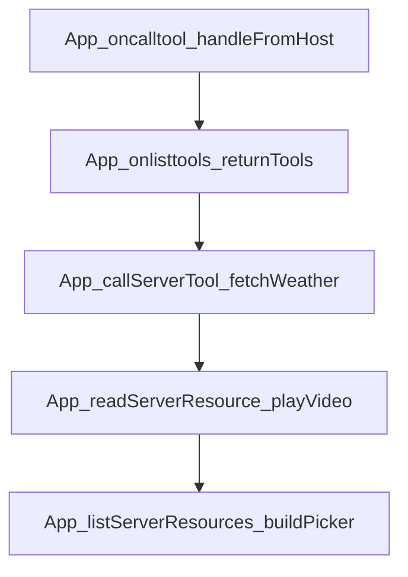

# Chapter 3: App SDK: UI Resources and Tool Linkage

Welcome to **Chapter 3: App SDK: UI Resources and Tool Linkage**. In this part of **MCP Ext Apps Tutorial: Building Interactive MCP Apps and Hosts**, you will build an intuitive mental model first, then move into concrete implementation details and practical production tradeoffs.


This chapter focuses on app-developer workflows for rendering and interacting with tool-driven data.

## Learning Goals

- link tool output to UI resource rendering paths
- structure app state around host-delivered context and events
- use framework integrations (React hooks or vanilla helpers) effectively
- avoid brittle coupling between tool payload shape and UI behavior

## App-Side Checklist

1. register tool metadata with clear UI linkage
2. parse and validate incoming structured tool payloads
3. keep view state resilient across host context changes
4. implement graceful fallback for missing/partial data

## Source References

- [Quickstart Guide](https://github.com/modelcontextprotocol/ext-apps/blob/main/docs/quickstart.md)
- [MCP Apps Patterns](https://github.com/modelcontextprotocol/ext-apps/blob/main/docs/patterns.md)
- [Basic Server React Example](https://github.com/modelcontextprotocol/ext-apps/blob/main/examples/basic-server-react/README.md)

## Summary

You now have an app-side implementation model for tool-linked MCP UI resources.

Next: [Chapter 4: Host Bridge and Context Management](04-host-bridge-and-context-management.md)

## Source Code Walkthrough

### `src/app.examples.ts`

The `App_oncalltool_handleFromHost` function in [`src/app.examples.ts`](https://github.com/modelcontextprotocol/ext-apps/blob/HEAD/src/app.examples.ts) handles a key part of this chapter's functionality:

```ts
 * Example: Handle tool calls from the host.
 */
function App_oncalltool_handleFromHost(app: App) {
  //#region App_oncalltool_handleFromHost
  app.oncalltool = async (params, extra) => {
    if (params.name === "greet") {
      const name = params.arguments?.name ?? "World";
      return { content: [{ type: "text", text: `Hello, ${name}!` }] };
    }
    throw new Error(`Unknown tool: ${params.name}`);
  };
  //#endregion App_oncalltool_handleFromHost
}

/**
 * Example: Return available tools from the onlisttools handler.
 */
function App_onlisttools_returnTools(app: App) {
  //#region App_onlisttools_returnTools
  app.onlisttools = async (params, extra) => {
    return {
      tools: [
        { name: "greet", inputSchema: { type: "object" as const } },
        { name: "calculate", inputSchema: { type: "object" as const } },
        { name: "format", inputSchema: { type: "object" as const } },
      ],
    };
  };
  //#endregion App_onlisttools_returnTools
}

/**
```

This function is important because it defines how MCP Ext Apps Tutorial: Building Interactive MCP Apps and Hosts implements the patterns covered in this chapter.

### `src/app.examples.ts`

The `App_onlisttools_returnTools` function in [`src/app.examples.ts`](https://github.com/modelcontextprotocol/ext-apps/blob/HEAD/src/app.examples.ts) handles a key part of this chapter's functionality:

```ts
 * Example: Return available tools from the onlisttools handler.
 */
function App_onlisttools_returnTools(app: App) {
  //#region App_onlisttools_returnTools
  app.onlisttools = async (params, extra) => {
    return {
      tools: [
        { name: "greet", inputSchema: { type: "object" as const } },
        { name: "calculate", inputSchema: { type: "object" as const } },
        { name: "format", inputSchema: { type: "object" as const } },
      ],
    };
  };
  //#endregion App_onlisttools_returnTools
}

/**
 * Example: Fetch updated weather data using callServerTool.
 */
async function App_callServerTool_fetchWeather(app: App) {
  //#region App_callServerTool_fetchWeather
  try {
    const result = await app.callServerTool({
      name: "get_weather",
      arguments: { location: "Tokyo" },
    });
    if (result.isError) {
      console.error("Tool returned error:", result.content);
    } else {
      console.log(result.content);
    }
  } catch (error) {
```

This function is important because it defines how MCP Ext Apps Tutorial: Building Interactive MCP Apps and Hosts implements the patterns covered in this chapter.

### `src/app.examples.ts`

The `App_callServerTool_fetchWeather` function in [`src/app.examples.ts`](https://github.com/modelcontextprotocol/ext-apps/blob/HEAD/src/app.examples.ts) handles a key part of this chapter's functionality:

```ts
 * Example: Fetch updated weather data using callServerTool.
 */
async function App_callServerTool_fetchWeather(app: App) {
  //#region App_callServerTool_fetchWeather
  try {
    const result = await app.callServerTool({
      name: "get_weather",
      arguments: { location: "Tokyo" },
    });
    if (result.isError) {
      console.error("Tool returned error:", result.content);
    } else {
      console.log(result.content);
    }
  } catch (error) {
    console.error("Tool call failed:", error);
  }
  //#endregion App_callServerTool_fetchWeather
}

/**
 * Example: Read a video resource and play it.
 */
async function App_readServerResource_playVideo(
  app: App,
  videoElement: HTMLVideoElement,
) {
  //#region App_readServerResource_playVideo
  try {
    const result = await app.readServerResource({
      uri: "videos://bunny-1mb",
    });
```

This function is important because it defines how MCP Ext Apps Tutorial: Building Interactive MCP Apps and Hosts implements the patterns covered in this chapter.

### `src/app.examples.ts`

The `App_readServerResource_playVideo` function in [`src/app.examples.ts`](https://github.com/modelcontextprotocol/ext-apps/blob/HEAD/src/app.examples.ts) handles a key part of this chapter's functionality:

```ts
 * Example: Read a video resource and play it.
 */
async function App_readServerResource_playVideo(
  app: App,
  videoElement: HTMLVideoElement,
) {
  //#region App_readServerResource_playVideo
  try {
    const result = await app.readServerResource({
      uri: "videos://bunny-1mb",
    });
    const content = result.contents[0];
    if (content && "blob" in content) {
      const binary = Uint8Array.from(atob(content.blob), (c) =>
        c.charCodeAt(0),
      );
      const url = URL.createObjectURL(
        new Blob([binary], { type: content.mimeType || "video/mp4" }),
      );
      videoElement.src = url;
      videoElement.play();
    }
  } catch (error) {
    console.error("Failed to read resource:", error);
  }
  //#endregion App_readServerResource_playVideo
}

/**
 * Example: Discover available videos and build a picker UI.
 */
async function App_listServerResources_buildPicker(
```

This function is important because it defines how MCP Ext Apps Tutorial: Building Interactive MCP Apps and Hosts implements the patterns covered in this chapter.


## How These Components Connect


