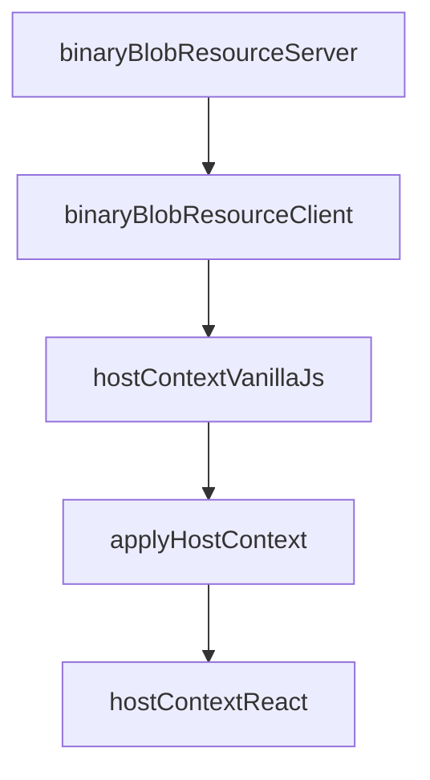

# Chapter 3: App SDK: UI Resources and Tool Linkage

Welcome to **Chapter 3: App SDK: UI Resources and Tool Linkage**. In this part of **MCP Ext Apps Tutorial: Building Interactive MCP Apps and Hosts**, you will build an intuitive mental model first, then move into concrete implementation details and practical production tradeoffs.


This chapter focuses on app-developer workflows for rendering and interacting with tool-driven data.

## Learning Goals

- link tool output to UI resource rendering paths
- structure app state around host-delivered context and events
- use framework integrations (React hooks or vanilla helpers) effectively
- avoid brittle coupling between tool payload shape and UI behavior

## App-Side Checklist

1. register tool metadata with clear UI linkage
2. parse and validate incoming structured tool payloads
3. keep view state resilient across host context changes
4. implement graceful fallback for missing/partial data

## Source References

- [Quickstart Guide](https://github.com/modelcontextprotocol/ext-apps/blob/main/docs/quickstart.md)
- [MCP Apps Patterns](https://github.com/modelcontextprotocol/ext-apps/blob/main/docs/patterns.md)
- [Basic Server React Example](https://github.com/modelcontextprotocol/ext-apps/blob/main/examples/basic-server-react/README.md)

## Summary

You now have an app-side implementation model for tool-linked MCP UI resources.

Next: [Chapter 4: Host Bridge and Context Management](04-host-bridge-and-context-management.md)

## Depth Expansion Playbook

## Source Code Walkthrough

### `docs/patterns.tsx`

The `binaryBlobResourceServer` function in [`docs/patterns.tsx`](https://github.com/modelcontextprotocol/ext-apps/blob/HEAD/docs/patterns.tsx) handles a key part of this chapter's functionality:

```tsx
 * Example: Serving binary blobs via resources (server-side)
 */
function binaryBlobResourceServer(
  server: McpServer,
  getVideoData: (id: string) => Promise<ArrayBuffer>,
) {
  //#region binaryBlobResourceServer
  server.registerResource(
    "Video",
    new ResourceTemplate("video://{id}", { list: undefined }),
    {
      description: "Video data served as base64 blob",
      mimeType: "video/mp4",
    },
    async (uri, { id }): Promise<ReadResourceResult> => {
      // Fetch or load your binary data
      const idString = Array.isArray(id) ? id[0] : id;
      const buffer = await getVideoData(idString);
      const blob = Buffer.from(buffer).toString("base64");

      return { contents: [{ uri: uri.href, mimeType: "video/mp4", blob }] };
    },
  );
  //#endregion binaryBlobResourceServer
}

/**
 * Example: Serving binary blobs via resources (client-side)
 */
async function binaryBlobResourceClient(app: App, videoId: string) {
  //#region binaryBlobResourceClient
  const result = await app.request(
```

This function is important because it defines how MCP Ext Apps Tutorial: Building Interactive MCP Apps and Hosts implements the patterns covered in this chapter.

### `docs/patterns.tsx`

The `binaryBlobResourceClient` function in [`docs/patterns.tsx`](https://github.com/modelcontextprotocol/ext-apps/blob/HEAD/docs/patterns.tsx) handles a key part of this chapter's functionality:

```tsx
 * Example: Serving binary blobs via resources (client-side)
 */
async function binaryBlobResourceClient(app: App, videoId: string) {
  //#region binaryBlobResourceClient
  const result = await app.request(
    { method: "resources/read", params: { uri: `video://${videoId}` } },
    ReadResourceResultSchema,
  );

  const content = result.contents[0];
  if (!content || !("blob" in content)) {
    throw new Error("Resource did not contain blob data");
  }

  const videoEl = document.querySelector("video")!;
  videoEl.src = `data:${content.mimeType!};base64,${content.blob}`;
  //#endregion binaryBlobResourceClient
}

/**
 * Example: Adapting to host context (theme, CSS variables, fonts, safe areas)
 */
function hostContextVanillaJs(app: App, mainEl: HTMLElement) {
  //#region hostContextVanillaJs
  function applyHostContext(ctx: McpUiHostContext) {
    if (ctx.theme) {
      applyDocumentTheme(ctx.theme);
    }
    if (ctx.styles?.variables) {
      applyHostStyleVariables(ctx.styles.variables);
    }
    if (ctx.styles?.css?.fonts) {
```

This function is important because it defines how MCP Ext Apps Tutorial: Building Interactive MCP Apps and Hosts implements the patterns covered in this chapter.

### `docs/patterns.tsx`

The `hostContextVanillaJs` function in [`docs/patterns.tsx`](https://github.com/modelcontextprotocol/ext-apps/blob/HEAD/docs/patterns.tsx) handles a key part of this chapter's functionality:

```tsx
 * Example: Adapting to host context (theme, CSS variables, fonts, safe areas)
 */
function hostContextVanillaJs(app: App, mainEl: HTMLElement) {
  //#region hostContextVanillaJs
  function applyHostContext(ctx: McpUiHostContext) {
    if (ctx.theme) {
      applyDocumentTheme(ctx.theme);
    }
    if (ctx.styles?.variables) {
      applyHostStyleVariables(ctx.styles.variables);
    }
    if (ctx.styles?.css?.fonts) {
      applyHostFonts(ctx.styles.css.fonts);
    }
    if (ctx.safeAreaInsets) {
      mainEl.style.paddingTop = `${ctx.safeAreaInsets.top}px`;
      mainEl.style.paddingRight = `${ctx.safeAreaInsets.right}px`;
      mainEl.style.paddingBottom = `${ctx.safeAreaInsets.bottom}px`;
      mainEl.style.paddingLeft = `${ctx.safeAreaInsets.left}px`;
    }
  }

  // Apply when host context changes
  app.onhostcontextchanged = applyHostContext;

  // Apply initial context after connecting
  app.connect().then(() => {
    const ctx = app.getHostContext();
    if (ctx) {
      applyHostContext(ctx);
    }
  });
```

This function is important because it defines how MCP Ext Apps Tutorial: Building Interactive MCP Apps and Hosts implements the patterns covered in this chapter.

### `docs/patterns.tsx`

The `applyHostContext` function in [`docs/patterns.tsx`](https://github.com/modelcontextprotocol/ext-apps/blob/HEAD/docs/patterns.tsx) handles a key part of this chapter's functionality:

```tsx
function hostContextVanillaJs(app: App, mainEl: HTMLElement) {
  //#region hostContextVanillaJs
  function applyHostContext(ctx: McpUiHostContext) {
    if (ctx.theme) {
      applyDocumentTheme(ctx.theme);
    }
    if (ctx.styles?.variables) {
      applyHostStyleVariables(ctx.styles.variables);
    }
    if (ctx.styles?.css?.fonts) {
      applyHostFonts(ctx.styles.css.fonts);
    }
    if (ctx.safeAreaInsets) {
      mainEl.style.paddingTop = `${ctx.safeAreaInsets.top}px`;
      mainEl.style.paddingRight = `${ctx.safeAreaInsets.right}px`;
      mainEl.style.paddingBottom = `${ctx.safeAreaInsets.bottom}px`;
      mainEl.style.paddingLeft = `${ctx.safeAreaInsets.left}px`;
    }
  }

  // Apply when host context changes
  app.onhostcontextchanged = applyHostContext;

  // Apply initial context after connecting
  app.connect().then(() => {
    const ctx = app.getHostContext();
    if (ctx) {
      applyHostContext(ctx);
    }
  });
  //#endregion hostContextVanillaJs
}
```

This function is important because it defines how MCP Ext Apps Tutorial: Building Interactive MCP Apps and Hosts implements the patterns covered in this chapter.


## How These Components Connect


