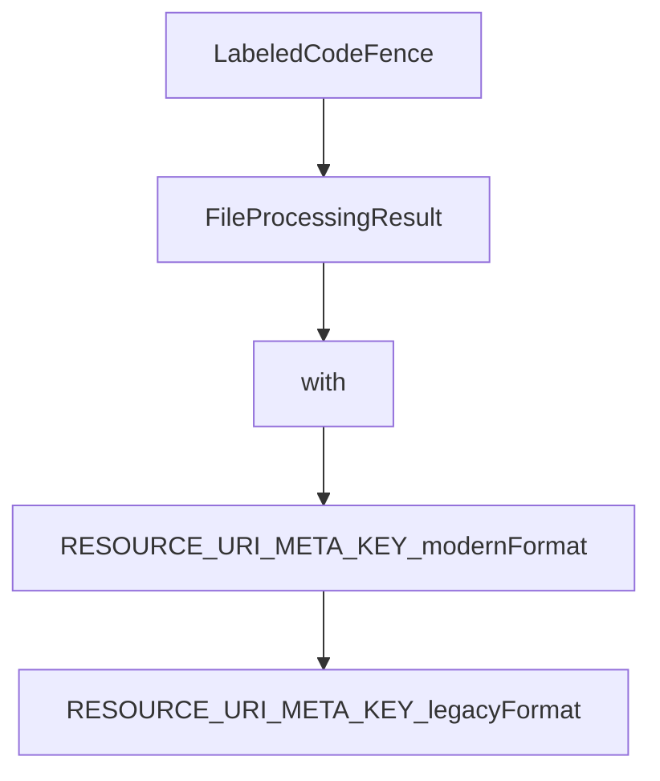

# Chapter 4: Host Bridge and Context Management

Welcome to **Chapter 4: Host Bridge and Context Management**. In this part of **MCP Ext Apps Tutorial: Building Interactive MCP Apps and Hosts**, you will build an intuitive mental model first, then move into concrete implementation details and practical production tradeoffs.


This chapter explains host responsibilities for embedding and governing MCP Apps safely.

## Learning Goals

- understand host-side bridge package responsibilities
- manage context injection, messaging, and sandbox boundaries
- apply host-level UI/runtime constraints intentionally
- reduce security risk from over-broad host-app interfaces

## Host Responsibilities

| Responsibility | Why It Matters |
|:---------------|:---------------|
| resource resolution | maps tool-declared UI resources to renderable views |
| sandbox enforcement | isolates app execution and protects host environment |
| message brokering | enables controlled app-tool-host communication |
| context governance | limits exposed host/user data surface |

## Source References

- [Ext Apps README - For Host Developers](https://github.com/modelcontextprotocol/ext-apps/blob/main/README.md#for-host-developers)
- [Basic Host Example](https://github.com/modelcontextprotocol/ext-apps/blob/main/examples/basic-host/README.md)
- [MCP Apps Overview - Host Context/Security](https://github.com/modelcontextprotocol/ext-apps/blob/main/docs/overview.md)

## Summary

You now have a host-bridge model for secure MCP Apps embedding.

Next: [Chapter 5: Patterns, Security, and Performance](05-patterns-security-and-performance.md)

## Depth Expansion Playbook

## Source Code Walkthrough

### `scripts/sync-snippets.ts`

The `LabeledCodeFence` interface in [`scripts/sync-snippets.ts`](https://github.com/modelcontextprotocol/ext-apps/blob/HEAD/scripts/sync-snippets.ts) handles a key part of this chapter's functionality:

```ts
 * Represents a labeled code fence found in a source file.
 */
interface LabeledCodeFence {
  /** Optional display filename (e.g., "my-app.ts") */
  displayName?: string;
  /** Relative path to the example file (e.g., "./app.examples.ts") */
  examplePath: string;
  /** Region name (e.g., "App_basicUsage"), or undefined for whole file */
  regionName?: string;
  /** Language from the code fence (e.g., "ts", "json", "yaml") */
  language: string;
  /** Character index of the opening fence line start */
  openingFenceStart: number;
  /** Character index after the opening fence line (after newline) */
  openingFenceEnd: number;
  /** Character index of the closing fence line start */
  closingFenceStart: number;
  /** The JSDoc line prefix extracted from context (e.g., " * ") */
  linePrefix: string;
}

/**
 * Cache for example file regions to avoid re-reading files.
 * Key: `${absoluteExamplePath}#${regionName}` (empty regionName for whole file)
 * Value: extracted code string
 */
type RegionCache = Map<string, string>;

/**
 * Processing result for a source file.
 */
interface FileProcessingResult {
```

This interface is important because it defines how MCP Ext Apps Tutorial: Building Interactive MCP Apps and Hosts implements the patterns covered in this chapter.

### `scripts/sync-snippets.ts`

The `FileProcessingResult` interface in [`scripts/sync-snippets.ts`](https://github.com/modelcontextprotocol/ext-apps/blob/HEAD/scripts/sync-snippets.ts) handles a key part of this chapter's functionality:

```ts
 * Processing result for a source file.
 */
interface FileProcessingResult {
  filePath: string;
  modified: boolean;
  snippetsProcessed: number;
  errors: string[];
}

// JSDoc patterns - for code fences inside JSDoc comments with " * " prefix
// Matches: <prefix>```<lang> [displayName] source="<path>" or source="<path>#<region>"
// Example: " * ```ts my-app.ts source="./app.examples.ts#App_basicUsage""
// Example: " * ```ts source="./app.examples.ts#App_basicUsage""
// Example: " * ```ts source="./complete-example.ts"" (whole file)
const JSDOC_LABELED_FENCE_PATTERN =
  /^(\s*\*\s*)```(\w+)(?:\s+(\S+))?\s+source="([^"#]+)(?:#([^"]+))?"/;
const JSDOC_CLOSING_FENCE_PATTERN = /^(\s*\*\s*)```\s*$/;

// Markdown patterns - for plain code fences in markdown files (no prefix)
// Matches: ```<lang> [displayName] source="<path>" or source="<path>#<region>"
// Example: ```tsx source="./patterns.tsx#chunkedDataServer"
// Example: ```tsx source="./complete-example.tsx" (whole file)
const MARKDOWN_LABELED_FENCE_PATTERN =
  /^```(\w+)(?:\s+(\S+))?\s+source="([^"#]+)(?:#([^"]+))?"/;
const MARKDOWN_CLOSING_FENCE_PATTERN = /^```\s*$/;

/**
 * Find all labeled code fences in a source file.
 * @param content The file content
 * @param filePath The file path (for error messages)
 * @param mode The processing mode (jsdoc or markdown)
 * @returns Array of labeled code fence references
```

This interface is important because it defines how MCP Ext Apps Tutorial: Building Interactive MCP Apps and Hosts implements the patterns covered in this chapter.

### `src/app.examples.ts`

The `with` class in [`src/app.examples.ts`](https://github.com/modelcontextprotocol/ext-apps/blob/HEAD/src/app.examples.ts) handles a key part of this chapter's functionality:

```ts

/**
 * Example: Modern format for registering tools with UI (recommended).
 */
function RESOURCE_URI_META_KEY_modernFormat(
  server: McpServer,
  handler: ToolCallback,
) {
  //#region RESOURCE_URI_META_KEY_modernFormat
  // Preferred: Use registerAppTool with nested ui.resourceUri
  registerAppTool(
    server,
    "weather",
    {
      description: "Get weather forecast",
      _meta: {
        ui: { resourceUri: "ui://weather/forecast" },
      },
    },
    handler,
  );
  //#endregion RESOURCE_URI_META_KEY_modernFormat
}

/**
 * Example: Legacy format using RESOURCE_URI_META_KEY (deprecated).
 */
function RESOURCE_URI_META_KEY_legacyFormat(
  server: McpServer,
  handler: ToolCallback,
) {
  //#region RESOURCE_URI_META_KEY_legacyFormat
```

This class is important because it defines how MCP Ext Apps Tutorial: Building Interactive MCP Apps and Hosts implements the patterns covered in this chapter.

### `src/app.examples.ts`

The `RESOURCE_URI_META_KEY_modernFormat` function in [`src/app.examples.ts`](https://github.com/modelcontextprotocol/ext-apps/blob/HEAD/src/app.examples.ts) handles a key part of this chapter's functionality:

```ts
 * Example: Modern format for registering tools with UI (recommended).
 */
function RESOURCE_URI_META_KEY_modernFormat(
  server: McpServer,
  handler: ToolCallback,
) {
  //#region RESOURCE_URI_META_KEY_modernFormat
  // Preferred: Use registerAppTool with nested ui.resourceUri
  registerAppTool(
    server,
    "weather",
    {
      description: "Get weather forecast",
      _meta: {
        ui: { resourceUri: "ui://weather/forecast" },
      },
    },
    handler,
  );
  //#endregion RESOURCE_URI_META_KEY_modernFormat
}

/**
 * Example: Legacy format using RESOURCE_URI_META_KEY (deprecated).
 */
function RESOURCE_URI_META_KEY_legacyFormat(
  server: McpServer,
  handler: ToolCallback,
) {
  //#region RESOURCE_URI_META_KEY_legacyFormat
  // Deprecated: Direct use of RESOURCE_URI_META_KEY
  server.registerTool(
```

This function is important because it defines how MCP Ext Apps Tutorial: Building Interactive MCP Apps and Hosts implements the patterns covered in this chapter.


## How These Components Connect


