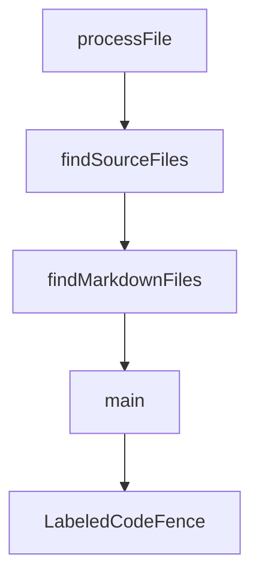

# Chapter 4: Host Bridge and Context Management

Welcome to **Chapter 4: Host Bridge and Context Management**. In this part of **MCP Ext Apps Tutorial: Building Interactive MCP Apps and Hosts**, you will build an intuitive mental model first, then move into concrete implementation details and practical production tradeoffs.


This chapter explains host responsibilities for embedding and governing MCP Apps safely.

## Learning Goals

- understand host-side bridge package responsibilities
- manage context injection, messaging, and sandbox boundaries
- apply host-level UI/runtime constraints intentionally
- reduce security risk from over-broad host-app interfaces

## Host Responsibilities

| Responsibility | Why It Matters |
|:---------------|:---------------|
| resource resolution | maps tool-declared UI resources to renderable views |
| sandbox enforcement | isolates app execution and protects host environment |
| message brokering | enables controlled app-tool-host communication |
| context governance | limits exposed host/user data surface |

## Source References

- [Ext Apps README - For Host Developers](https://github.com/modelcontextprotocol/ext-apps/blob/main/README.md#for-host-developers)
- [Basic Host Example](https://github.com/modelcontextprotocol/ext-apps/blob/main/examples/basic-host/README.md)
- [MCP Apps Overview - Host Context/Security](https://github.com/modelcontextprotocol/ext-apps/blob/main/docs/overview.md)

## Summary

You now have a host-bridge model for secure MCP Apps embedding.

Next: [Chapter 5: Patterns, Security, and Performance](05-patterns-security-and-performance.md)

## Source Code Walkthrough

### `scripts/sync-snippets.ts`

The `processFile` function in [`scripts/sync-snippets.ts`](https://github.com/modelcontextprotocol/ext-apps/blob/HEAD/scripts/sync-snippets.ts) handles a key part of this chapter's functionality:

```ts
 * @returns The processing result
 */
function processFile(
  filePath: string,
  cache: RegionCache,
  mode: FileMode,
): FileProcessingResult {
  const result: FileProcessingResult = {
    filePath,
    modified: false,
    snippetsProcessed: 0,
    errors: [],
  };

  let content: string;
  try {
    content = readFileSync(filePath, "utf-8");
  } catch (err) {
    result.errors.push(`Failed to read file: ${err}`);
    return result;
  }

  let fences: LabeledCodeFence[];
  try {
    fences = findLabeledCodeFences(content, filePath, mode);
  } catch (err) {
    result.errors.push(err instanceof Error ? err.message : String(err));
    return result;
  }

  if (fences.length === 0) {
    return result;
```

This function is important because it defines how MCP Ext Apps Tutorial: Building Interactive MCP Apps and Hosts implements the patterns covered in this chapter.

### `scripts/sync-snippets.ts`

The `findSourceFiles` function in [`scripts/sync-snippets.ts`](https://github.com/modelcontextprotocol/ext-apps/blob/HEAD/scripts/sync-snippets.ts) handles a key part of this chapter's functionality:

```ts
 * @returns Array of absolute file paths
 */
function findSourceFiles(dir: string): string[] {
  const files: string[] = [];
  const entries = readdirSync(dir, { withFileTypes: true, recursive: true });

  for (const entry of entries) {
    if (!entry.isFile()) continue;

    const name = entry.name;

    // Only process .ts and .tsx files
    if (!name.endsWith(".ts") && !name.endsWith(".tsx")) continue;

    // Exclude example files, test files
    if (name.endsWith(".examples.ts") || name.endsWith(".examples.tsx"))
      continue;
    if (name.endsWith(".test.ts")) continue;

    // Get the relative path from the parent directory
    const parentPath = entry.parentPath;

    // Exclude generated directory
    if (parentPath.includes("/generated") || parentPath.includes("\\generated"))
      continue;

    const fullPath = join(parentPath, name);
    files.push(fullPath);
  }

  return files;
}
```

This function is important because it defines how MCP Ext Apps Tutorial: Building Interactive MCP Apps and Hosts implements the patterns covered in this chapter.

### `scripts/sync-snippets.ts`

The `findMarkdownFiles` function in [`scripts/sync-snippets.ts`](https://github.com/modelcontextprotocol/ext-apps/blob/HEAD/scripts/sync-snippets.ts) handles a key part of this chapter's functionality:

```ts
 * @returns Array of absolute file paths
 */
function findMarkdownFiles(dir: string): string[] {
  const files: string[] = [];
  const entries = readdirSync(dir, { withFileTypes: true, recursive: true });

  for (const entry of entries) {
    if (!entry.isFile()) continue;

    // Only process .md files
    if (!entry.name.endsWith(".md")) continue;

    const fullPath = join(entry.parentPath, entry.name);
    files.push(fullPath);
  }

  return files;
}

async function main() {
  console.log("🔧 Syncing code snippets from example files...\n");

  const cache: RegionCache = new Map();
  const results: FileProcessingResult[] = [];

  // Process TypeScript source files (JSDoc mode)
  const sourceFiles = findSourceFiles(SRC_DIR);
  for (const filePath of sourceFiles) {
    const result = processFile(filePath, cache, "jsdoc");
    results.push(result);
  }

```

This function is important because it defines how MCP Ext Apps Tutorial: Building Interactive MCP Apps and Hosts implements the patterns covered in this chapter.

### `scripts/sync-snippets.ts`

The `main` function in [`scripts/sync-snippets.ts`](https://github.com/modelcontextprotocol/ext-apps/blob/HEAD/scripts/sync-snippets.ts) handles a key part of this chapter's functionality:

```ts
}

async function main() {
  console.log("🔧 Syncing code snippets from example files...\n");

  const cache: RegionCache = new Map();
  const results: FileProcessingResult[] = [];

  // Process TypeScript source files (JSDoc mode)
  const sourceFiles = findSourceFiles(SRC_DIR);
  for (const filePath of sourceFiles) {
    const result = processFile(filePath, cache, "jsdoc");
    results.push(result);
  }

  // Process markdown documentation files
  const markdownFiles = findMarkdownFiles(DOCS_DIR);
  for (const filePath of markdownFiles) {
    const result = processFile(filePath, cache, "markdown");
    results.push(result);
  }

  // Report results
  const modified = results.filter((r) => r.modified);
  const errors = results.flatMap((r) => r.errors);

  if (modified.length > 0) {
    console.log(`✅ Modified ${modified.length} file(s):`);
    for (const r of modified) {
      console.log(`   ${r.filePath} (${r.snippetsProcessed} snippet(s))`);
    }
  } else {
```

This function is important because it defines how MCP Ext Apps Tutorial: Building Interactive MCP Apps and Hosts implements the patterns covered in this chapter.


## How These Components Connect


