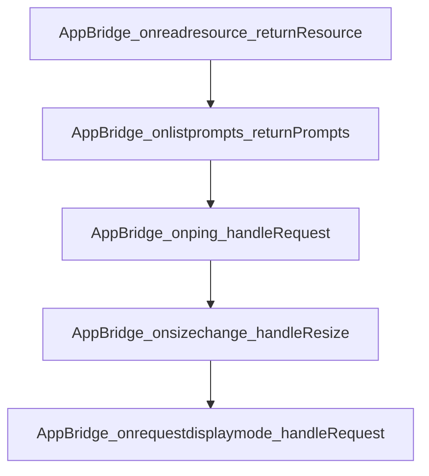

# Chapter 5: Patterns, Security, and Performance

Welcome to **Chapter 5: Patterns, Security, and Performance**. In this part of **MCP Ext Apps Tutorial: Building Interactive MCP Apps and Hosts**, you will build an intuitive mental model first, then move into concrete implementation details and practical production tradeoffs.


This chapter consolidates practical patterns for robust MCP Apps UX and operations.

## Learning Goals

- apply recommended patterns for large data, latency, and error handling
- configure CSP/CORS and theming safely across hosts
- implement progressive enhancement without sacrificing reliability
- prevent common performance bottlenecks in embedded app views

## Pattern Areas

| Area | Pattern Focus |
|:-----|:--------------|
| data flow | chunked tool calls and structured follow-up messages |
| UX | progressive rendering and latency reduction tactics |
| security | CSP/CORS boundaries and safe resource delivery |
| runtime | pausing offscreen-heavy views and state persistence |

## Source References

- [MCP Apps Patterns](https://github.com/modelcontextprotocol/ext-apps/blob/main/docs/patterns.md)
- [MCP Apps Overview - Security](https://github.com/modelcontextprotocol/ext-apps/blob/main/docs/overview.md#security)

## Summary

You now have a practical pattern library for secure, performant MCP Apps.

Next: [Chapter 6: Testing, Local Hosts, and Integration Workflows](06-testing-local-hosts-and-integration-workflows.md)

## Source Code Walkthrough

### `src/app-bridge.examples.ts`

The `AppBridge_onreadresource_returnResource` function in [`src/app-bridge.examples.ts`](https://github.com/modelcontextprotocol/ext-apps/blob/HEAD/src/app-bridge.examples.ts) handles a key part of this chapter's functionality:

```ts
 * Example: Forward read resource requests to the MCP server.
 */
function AppBridge_onreadresource_returnResource(
  bridge: AppBridge,
  mcpClient: Client,
) {
  //#region AppBridge_onreadresource_returnResource
  bridge.onreadresource = async (params, extra) => {
    return mcpClient.request(
      { method: "resources/read", params },
      ReadResourceResultSchema,
      { signal: extra.signal },
    );
  };
  //#endregion AppBridge_onreadresource_returnResource
}

/**
 * Example: Forward list prompts requests to the MCP server.
 */
function AppBridge_onlistprompts_returnPrompts(
  bridge: AppBridge,
  mcpClient: Client,
) {
  //#region AppBridge_onlistprompts_returnPrompts
  bridge.onlistprompts = async (params, extra) => {
    return mcpClient.request(
      { method: "prompts/list", params },
      ListPromptsResultSchema,
      { signal: extra.signal },
    );
  };
```

This function is important because it defines how MCP Ext Apps Tutorial: Building Interactive MCP Apps and Hosts implements the patterns covered in this chapter.

### `src/app-bridge.examples.ts`

The `AppBridge_onlistprompts_returnPrompts` function in [`src/app-bridge.examples.ts`](https://github.com/modelcontextprotocol/ext-apps/blob/HEAD/src/app-bridge.examples.ts) handles a key part of this chapter's functionality:

```ts
 * Example: Forward list prompts requests to the MCP server.
 */
function AppBridge_onlistprompts_returnPrompts(
  bridge: AppBridge,
  mcpClient: Client,
) {
  //#region AppBridge_onlistprompts_returnPrompts
  bridge.onlistprompts = async (params, extra) => {
    return mcpClient.request(
      { method: "prompts/list", params },
      ListPromptsResultSchema,
      { signal: extra.signal },
    );
  };
  //#endregion AppBridge_onlistprompts_returnPrompts
}

/**
 * Example: Handle ping requests from the View.
 */
function AppBridge_onping_handleRequest(bridge: AppBridge) {
  //#region AppBridge_onping_handleRequest
  bridge.onping = (params, extra) => {
    console.log("Received ping from view");
  };
  //#endregion AppBridge_onping_handleRequest
}

/**
 * Example: Handle size change notifications from the View.
 */
function AppBridge_onsizechange_handleResize(
```

This function is important because it defines how MCP Ext Apps Tutorial: Building Interactive MCP Apps and Hosts implements the patterns covered in this chapter.

### `src/app-bridge.examples.ts`

The `AppBridge_onping_handleRequest` function in [`src/app-bridge.examples.ts`](https://github.com/modelcontextprotocol/ext-apps/blob/HEAD/src/app-bridge.examples.ts) handles a key part of this chapter's functionality:

```ts
 * Example: Handle ping requests from the View.
 */
function AppBridge_onping_handleRequest(bridge: AppBridge) {
  //#region AppBridge_onping_handleRequest
  bridge.onping = (params, extra) => {
    console.log("Received ping from view");
  };
  //#endregion AppBridge_onping_handleRequest
}

/**
 * Example: Handle size change notifications from the View.
 */
function AppBridge_onsizechange_handleResize(
  bridge: AppBridge,
  iframe: HTMLIFrameElement,
) {
  //#region AppBridge_onsizechange_handleResize
  bridge.onsizechange = ({ width, height }) => {
    if (width != null) {
      iframe.style.width = `${width}px`;
    }
    if (height != null) {
      iframe.style.height = `${height}px`;
    }
  };
  //#endregion AppBridge_onsizechange_handleResize
}

/**
 * Example: Handle display mode requests from the View.
 */
```

This function is important because it defines how MCP Ext Apps Tutorial: Building Interactive MCP Apps and Hosts implements the patterns covered in this chapter.

### `src/app-bridge.examples.ts`

The `AppBridge_onsizechange_handleResize` function in [`src/app-bridge.examples.ts`](https://github.com/modelcontextprotocol/ext-apps/blob/HEAD/src/app-bridge.examples.ts) handles a key part of this chapter's functionality:

```ts
 * Example: Handle size change notifications from the View.
 */
function AppBridge_onsizechange_handleResize(
  bridge: AppBridge,
  iframe: HTMLIFrameElement,
) {
  //#region AppBridge_onsizechange_handleResize
  bridge.onsizechange = ({ width, height }) => {
    if (width != null) {
      iframe.style.width = `${width}px`;
    }
    if (height != null) {
      iframe.style.height = `${height}px`;
    }
  };
  //#endregion AppBridge_onsizechange_handleResize
}

/**
 * Example: Handle display mode requests from the View.
 */
function AppBridge_onrequestdisplaymode_handleRequest(
  bridge: AppBridge,
  currentDisplayMode: McpUiDisplayMode,
  availableDisplayModes: McpUiDisplayMode[],
) {
  //#region AppBridge_onrequestdisplaymode_handleRequest
  bridge.onrequestdisplaymode = async ({ mode }, extra) => {
    if (availableDisplayModes.includes(mode)) {
      currentDisplayMode = mode;
    }
    return { mode: currentDisplayMode };
```

This function is important because it defines how MCP Ext Apps Tutorial: Building Interactive MCP Apps and Hosts implements the patterns covered in this chapter.


## How These Components Connect


