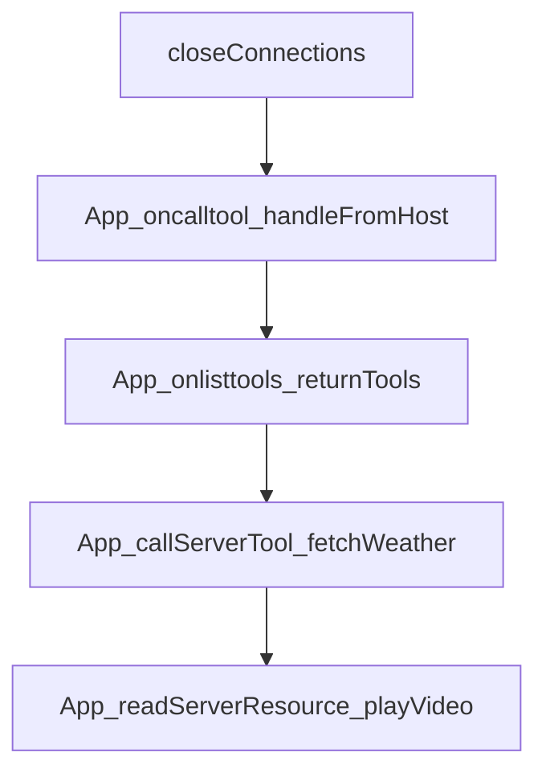

# Chapter 5: Patterns, Security, and Performance

Welcome to **Chapter 5: Patterns, Security, and Performance**. In this part of **MCP Ext Apps Tutorial: Building Interactive MCP Apps and Hosts**, you will build an intuitive mental model first, then move into concrete implementation details and practical production tradeoffs.


This chapter consolidates practical patterns for robust MCP Apps UX and operations.

## Learning Goals

- apply recommended patterns for large data, latency, and error handling
- configure CSP/CORS and theming safely across hosts
- implement progressive enhancement without sacrificing reliability
- prevent common performance bottlenecks in embedded app views

## Pattern Areas

| Area | Pattern Focus |
|:-----|:--------------|
| data flow | chunked tool calls and structured follow-up messages |
| UX | progressive rendering and latency reduction tactics |
| security | CSP/CORS boundaries and safe resource delivery |
| runtime | pausing offscreen-heavy views and state persistence |

## Source References

- [MCP Apps Patterns](https://github.com/modelcontextprotocol/ext-apps/blob/main/docs/patterns.md)
- [MCP Apps Overview - Security](https://github.com/modelcontextprotocol/ext-apps/blob/main/docs/overview.md#security)

## Summary

You now have a practical pattern library for secure, performant MCP Apps.

Next: [Chapter 6: Testing, Local Hosts, and Integration Workflows](06-testing-local-hosts-and-integration-workflows.md)

## Depth Expansion Playbook

## Source Code Walkthrough

### `src/app.examples.ts`

The `closeConnections` function in [`src/app.examples.ts`](https://github.com/modelcontextprotocol/ext-apps/blob/HEAD/src/app.examples.ts) handles a key part of this chapter's functionality:

```ts
  app.onteardown = async () => {
    await saveState();
    closeConnections();
    console.log("App ready for teardown");
    return {};
  };
  //#endregion App_onteardown_performCleanup
}

// Stubs for example
declare function saveState(): Promise<void>;
declare function closeConnections(): void;

/**
 * Example: Handle tool calls from the host.
 */
function App_oncalltool_handleFromHost(app: App) {
  //#region App_oncalltool_handleFromHost
  app.oncalltool = async (params, extra) => {
    if (params.name === "greet") {
      const name = params.arguments?.name ?? "World";
      return { content: [{ type: "text", text: `Hello, ${name}!` }] };
    }
    throw new Error(`Unknown tool: ${params.name}`);
  };
  //#endregion App_oncalltool_handleFromHost
}

/**
 * Example: Return available tools from the onlisttools handler.
 */
function App_onlisttools_returnTools(app: App) {
```

This function is important because it defines how MCP Ext Apps Tutorial: Building Interactive MCP Apps and Hosts implements the patterns covered in this chapter.

### `src/app.examples.ts`

The `App_oncalltool_handleFromHost` function in [`src/app.examples.ts`](https://github.com/modelcontextprotocol/ext-apps/blob/HEAD/src/app.examples.ts) handles a key part of this chapter's functionality:

```ts
 * Example: Handle tool calls from the host.
 */
function App_oncalltool_handleFromHost(app: App) {
  //#region App_oncalltool_handleFromHost
  app.oncalltool = async (params, extra) => {
    if (params.name === "greet") {
      const name = params.arguments?.name ?? "World";
      return { content: [{ type: "text", text: `Hello, ${name}!` }] };
    }
    throw new Error(`Unknown tool: ${params.name}`);
  };
  //#endregion App_oncalltool_handleFromHost
}

/**
 * Example: Return available tools from the onlisttools handler.
 */
function App_onlisttools_returnTools(app: App) {
  //#region App_onlisttools_returnTools
  app.onlisttools = async (params, extra) => {
    return {
      tools: ["greet", "calculate", "format"],
    };
  };
  //#endregion App_onlisttools_returnTools
}

/**
 * Example: Fetch updated weather data using callServerTool.
 */
async function App_callServerTool_fetchWeather(app: App) {
  //#region App_callServerTool_fetchWeather
```

This function is important because it defines how MCP Ext Apps Tutorial: Building Interactive MCP Apps and Hosts implements the patterns covered in this chapter.

### `src/app.examples.ts`

The `App_onlisttools_returnTools` function in [`src/app.examples.ts`](https://github.com/modelcontextprotocol/ext-apps/blob/HEAD/src/app.examples.ts) handles a key part of this chapter's functionality:

```ts
 * Example: Return available tools from the onlisttools handler.
 */
function App_onlisttools_returnTools(app: App) {
  //#region App_onlisttools_returnTools
  app.onlisttools = async (params, extra) => {
    return {
      tools: ["greet", "calculate", "format"],
    };
  };
  //#endregion App_onlisttools_returnTools
}

/**
 * Example: Fetch updated weather data using callServerTool.
 */
async function App_callServerTool_fetchWeather(app: App) {
  //#region App_callServerTool_fetchWeather
  try {
    const result = await app.callServerTool({
      name: "get_weather",
      arguments: { location: "Tokyo" },
    });
    if (result.isError) {
      console.error("Tool returned error:", result.content);
    } else {
      console.log(result.content);
    }
  } catch (error) {
    console.error("Tool call failed:", error);
  }
  //#endregion App_callServerTool_fetchWeather
}
```

This function is important because it defines how MCP Ext Apps Tutorial: Building Interactive MCP Apps and Hosts implements the patterns covered in this chapter.

### `src/app.examples.ts`

The `App_callServerTool_fetchWeather` function in [`src/app.examples.ts`](https://github.com/modelcontextprotocol/ext-apps/blob/HEAD/src/app.examples.ts) handles a key part of this chapter's functionality:

```ts
 * Example: Fetch updated weather data using callServerTool.
 */
async function App_callServerTool_fetchWeather(app: App) {
  //#region App_callServerTool_fetchWeather
  try {
    const result = await app.callServerTool({
      name: "get_weather",
      arguments: { location: "Tokyo" },
    });
    if (result.isError) {
      console.error("Tool returned error:", result.content);
    } else {
      console.log(result.content);
    }
  } catch (error) {
    console.error("Tool call failed:", error);
  }
  //#endregion App_callServerTool_fetchWeather
}

/**
 * Example: Read a video resource and play it.
 */
async function App_readServerResource_playVideo(
  app: App,
  videoElement: HTMLVideoElement,
) {
  //#region App_readServerResource_playVideo
  try {
    const result = await app.readServerResource({
      uri: "videos://bunny-1mb",
    });
```

This function is important because it defines how MCP Ext Apps Tutorial: Building Interactive MCP Apps and Hosts implements the patterns covered in this chapter.


## How These Components Connect


