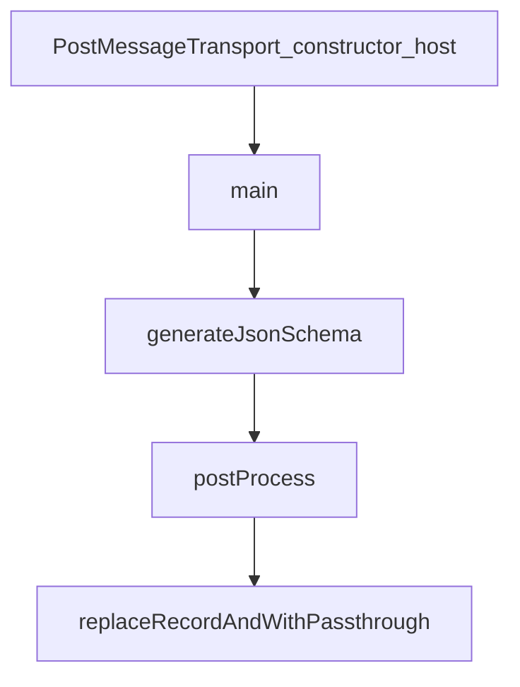

# Chapter 6: Testing, Local Hosts, and Integration Workflows

Welcome to **Chapter 6: Testing, Local Hosts, and Integration Workflows**. In this part of **MCP Ext Apps Tutorial: Building Interactive MCP Apps and Hosts**, you will build an intuitive mental model first, then move into concrete implementation details and practical production tradeoffs.


This chapter defines testing loops for app and host behavior before production rollout.

## Learning Goals

- use `basic-host` and example servers for local validation
- test against compatible MCP clients and remote exposure paths
- verify tool/UI contracts and host bridge events systematically
- catch integration regressions early with repeatable workflows

## Test Workflow

1. run local app/server against `basic-host`
2. validate behavior in MCP Apps-compatible clients
3. expose local server via `cloudflared` when needed for integration tests
4. run integration-server examples for contract-level checks

## Source References

- [Testing MCP Apps](https://github.com/modelcontextprotocol/ext-apps/blob/main/docs/testing-mcp-apps.md)
- [Basic Host Example](https://github.com/modelcontextprotocol/ext-apps/blob/main/examples/basic-host/README.md)
- [Integration Server Example](https://github.com/modelcontextprotocol/ext-apps/blob/main/examples/integration-server/README.md)
- [Quickstart Example](https://github.com/modelcontextprotocol/ext-apps/blob/main/examples/quickstart/README.md)

## Summary

You now have a repeatable validation workflow for MCP Apps integration quality.

Next: [Chapter 7: Agent Skills and OpenAI Apps Migration](07-agent-skills-and-openai-apps-migration.md)

## Depth Expansion Playbook

## Source Code Walkthrough

### `src/message-transport.examples.ts`

The `PostMessageTransport_constructor_host` function in [`src/message-transport.examples.ts`](https://github.com/modelcontextprotocol/ext-apps/blob/HEAD/src/message-transport.examples.ts) handles a key part of this chapter's functionality:

```ts
 * Example: Creating transport for host (constructor only).
 */
function PostMessageTransport_constructor_host() {
  //#region PostMessageTransport_constructor_host
  const iframe = document.getElementById("app-iframe") as HTMLIFrameElement;
  const transport = new PostMessageTransport(
    iframe.contentWindow!,
    iframe.contentWindow!,
  );
  //#endregion PostMessageTransport_constructor_host
}

```

This function is important because it defines how MCP Ext Apps Tutorial: Building Interactive MCP Apps and Hosts implements the patterns covered in this chapter.

### `scripts/generate-schemas.ts`

The `main` function in [`scripts/generate-schemas.ts`](https://github.com/modelcontextprotocol/ext-apps/blob/HEAD/scripts/generate-schemas.ts) handles a key part of this chapter's functionality:

```ts
];

async function main() {
  console.log("🔧 Generating Zod schemas from spec.types.ts...\n");

  const sourceText = readFileSync(SPEC_TYPES_FILE, "utf-8");

  const result = generate({
    sourceText,
    keepComments: true,
    skipParseJSDoc: false,
    // Generate PascalCase schema names: McpUiOpenLinkRequest → McpUiOpenLinkRequestSchema
    getSchemaName: (typeName: string) => `${typeName}Schema`,
  });

  if (result.errors.length > 0) {
    console.error("❌ Generation errors:");
    for (const error of result.errors) {
      console.error(`  - ${error}`);
    }
    process.exit(1);
  }

  if (result.hasCircularDependencies) {
    console.warn("⚠️  Warning: Circular dependencies detected in types");
  }

  let schemasContent = result.getZodSchemasFile("../spec.types.js");
  schemasContent = postProcess(schemasContent);

  writeFileSync(SCHEMA_OUTPUT_FILE, schemasContent, "utf-8");
  console.log(`✅ Written: ${SCHEMA_OUTPUT_FILE}`);
```

This function is important because it defines how MCP Ext Apps Tutorial: Building Interactive MCP Apps and Hosts implements the patterns covered in this chapter.

### `scripts/generate-schemas.ts`

The `generateJsonSchema` function in [`scripts/generate-schemas.ts`](https://github.com/modelcontextprotocol/ext-apps/blob/HEAD/scripts/generate-schemas.ts) handles a key part of this chapter's functionality:

```ts

  // Generate JSON Schema from the Zod schemas
  await generateJsonSchema();

  console.log("\n🎉 Schema generation complete!");
}

/**
 * Generate JSON Schema from the Zod schemas.
 * Uses dynamic import to load the generated schemas after they're written.
 */
async function generateJsonSchema() {
  // Dynamic import of the generated schemas
  // tsx handles TypeScript imports at runtime
  const schemas = await import("../src/generated/schema.js");

  const jsonSchema: {
    $schema: string;
    $id: string;
    title: string;
    description: string;
    $defs: Record<string, unknown>;
  } = {
    $schema: "https://json-schema.org/draft/2020-12/schema",
    $id: "https://modelcontextprotocol.io/ext-apps/schema.json",
    title: "MCP Apps Protocol",
    description: "JSON Schema for MCP Apps UI protocol messages",
    $defs: {},
  };

  // Convert each exported Zod schema to JSON Schema
  for (const [name, schema] of Object.entries(schemas)) {
```

This function is important because it defines how MCP Ext Apps Tutorial: Building Interactive MCP Apps and Hosts implements the patterns covered in this chapter.

### `scripts/generate-schemas.ts`

The `postProcess` function in [`scripts/generate-schemas.ts`](https://github.com/modelcontextprotocol/ext-apps/blob/HEAD/scripts/generate-schemas.ts) handles a key part of this chapter's functionality:

```ts

  let schemasContent = result.getZodSchemasFile("../spec.types.js");
  schemasContent = postProcess(schemasContent);

  writeFileSync(SCHEMA_OUTPUT_FILE, schemasContent, "utf-8");
  console.log(`✅ Written: ${SCHEMA_OUTPUT_FILE}`);

  const testsContent = result.getIntegrationTestFile(
    "../spec.types.js",
    "./schema.js",
  );
  if (testsContent) {
    const processedTests = postProcessTests(testsContent);
    writeFileSync(SCHEMA_TEST_OUTPUT_FILE, processedTests, "utf-8");
    console.log(`✅ Written: ${SCHEMA_TEST_OUTPUT_FILE}`);
  }

  // Generate JSON Schema from the Zod schemas
  await generateJsonSchema();

  console.log("\n🎉 Schema generation complete!");
}

/**
 * Generate JSON Schema from the Zod schemas.
 * Uses dynamic import to load the generated schemas after they're written.
 */
async function generateJsonSchema() {
  // Dynamic import of the generated schemas
  // tsx handles TypeScript imports at runtime
  const schemas = await import("../src/generated/schema.js");

```

This function is important because it defines how MCP Ext Apps Tutorial: Building Interactive MCP Apps and Hosts implements the patterns covered in this chapter.


## How These Components Connect


