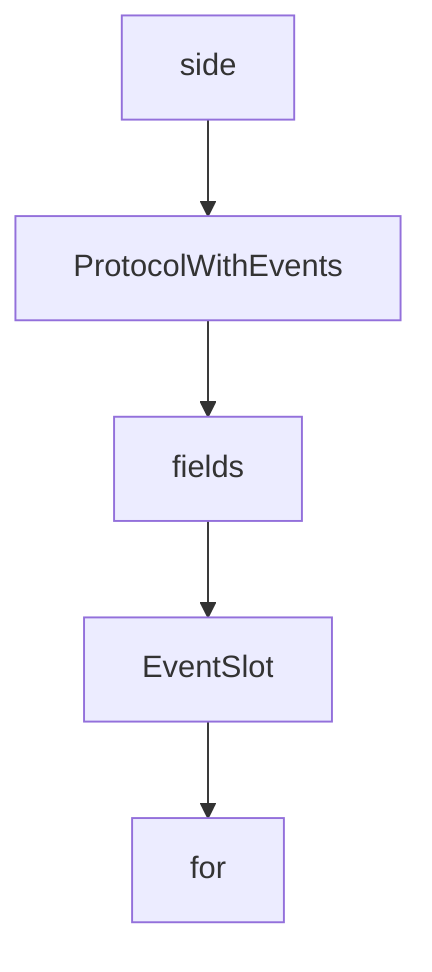

# Chapter 6: Testing, Local Hosts, and Integration Workflows

Welcome to **Chapter 6: Testing, Local Hosts, and Integration Workflows**. In this part of **MCP Ext Apps Tutorial: Building Interactive MCP Apps and Hosts**, you will build an intuitive mental model first, then move into concrete implementation details and practical production tradeoffs.


This chapter defines testing loops for app and host behavior before production rollout.

## Learning Goals

- use `basic-host` and example servers for local validation
- test against compatible MCP clients and remote exposure paths
- verify tool/UI contracts and host bridge events systematically
- catch integration regressions early with repeatable workflows

## Test Workflow

1. run local app/server against `basic-host`
2. validate behavior in MCP Apps-compatible clients
3. expose local server via `cloudflared` when needed for integration tests
4. run integration-server examples for contract-level checks

## Source References

- [Testing MCP Apps](https://github.com/modelcontextprotocol/ext-apps/blob/main/docs/testing-mcp-apps.md)
- [Basic Host Example](https://github.com/modelcontextprotocol/ext-apps/blob/main/examples/basic-host/README.md)
- [Integration Server Example](https://github.com/modelcontextprotocol/ext-apps/blob/main/examples/integration-server/README.md)
- [Quickstart Example](https://github.com/modelcontextprotocol/ext-apps/blob/main/examples/quickstart/README.md)

## Summary

You now have a repeatable validation workflow for MCP Apps integration quality.

Next: [Chapter 7: Agent Skills and OpenAI Apps Migration](07-agent-skills-and-openai-apps-migration.md)

## Source Code Walkthrough

### `src/events.ts`

The `side` class in [`src/events.ts`](https://github.com/modelcontextprotocol/ext-apps/blob/HEAD/src/events.ts) handles a key part of this chapter's functionality:

```ts
 *
 * When a notification arrives for a mapped event:
 * 1. {@link onEventDispatch `onEventDispatch`} (subclass side-effects)
 * 2. The singular `on*` handler (if set)
 * 3. All `addEventListener` listeners in insertion order
 *
 * ### Double-set protection
 *
 * Direct calls to {@link setRequestHandler `setRequestHandler`} /
 * {@link setNotificationHandler `setNotificationHandler`} throw if a handler
 * for the same method has already been registered (through any path), so
 * accidental overwrites surface as errors instead of silent bugs.
 *
 * @typeParam EventMap - Maps event names to the listener's `params` type.
 */
export abstract class ProtocolWithEvents<
  SendRequestT extends Request,
  SendNotificationT extends Notification,
  SendResultT extends Result,
  EventMap extends Record<string, unknown>,
> extends Protocol<SendRequestT, SendNotificationT, SendResultT> {
  private _registeredMethods = new Set<string>();
  private _eventSlots = new Map<keyof EventMap, EventSlot>();

  /**
   * Event name → notification schema. Subclasses populate this so that
   * the event system can lazily register a dispatcher with the correct
   * schema on first use.
   */
  protected abstract readonly eventSchemas: {
    [K in keyof EventMap]: MethodSchema;
  };
```

This class is important because it defines how MCP Ext Apps Tutorial: Building Interactive MCP Apps and Hosts implements the patterns covered in this chapter.

### `src/events.ts`

The `ProtocolWithEvents` class in [`src/events.ts`](https://github.com/modelcontextprotocol/ext-apps/blob/HEAD/src/events.ts) handles a key part of this chapter's functionality:

```ts
 * @typeParam EventMap - Maps event names to the listener's `params` type.
 */
export abstract class ProtocolWithEvents<
  SendRequestT extends Request,
  SendNotificationT extends Notification,
  SendResultT extends Result,
  EventMap extends Record<string, unknown>,
> extends Protocol<SendRequestT, SendNotificationT, SendResultT> {
  private _registeredMethods = new Set<string>();
  private _eventSlots = new Map<keyof EventMap, EventSlot>();

  /**
   * Event name → notification schema. Subclasses populate this so that
   * the event system can lazily register a dispatcher with the correct
   * schema on first use.
   */
  protected abstract readonly eventSchemas: {
    [K in keyof EventMap]: MethodSchema;
  };

  /**
   * Called once per incoming notification, before any handlers or listeners
   * fire. Subclasses may override to perform side effects such as merging
   * notification params into cached state.
   */
  protected onEventDispatch<K extends keyof EventMap>(
    _event: K,
    _params: EventMap[K],
  ): void {}

  // ── Event system (DOM model) ────────────────────────────────────────

```

This class is important because it defines how MCP Ext Apps Tutorial: Building Interactive MCP Apps and Hosts implements the patterns covered in this chapter.

### `src/events.ts`

The `fields` class in [`src/events.ts`](https://github.com/modelcontextprotocol/ext-apps/blob/HEAD/src/events.ts) handles a key part of this chapter's functionality:

```ts
  // ── Handler registration with double-set protection ─────────────────

  // The two overrides below are arrow-function class fields rather than
  // prototype methods so that Protocol's constructor — which registers its
  // own ping/cancelled/progress handlers via `this.setRequestHandler`
  // before our fields initialize — hits the base implementation and skips
  // tracking. Converting these to proper methods would crash with
  // `_registeredMethods` undefined during super().

  /**
   * Registers a request handler. Throws if a handler for the same method
   * has already been registered — use the `on*` setter (replace semantics)
   * or `addEventListener` (multi-listener) for notification events.
   *
   * @throws {Error} if a handler for this method is already registered.
   */
  override setRequestHandler: Protocol<
    SendRequestT,
    SendNotificationT,
    SendResultT
  >["setRequestHandler"] = (schema, handler) => {
    this._assertMethodNotRegistered(schema, "setRequestHandler");
    super.setRequestHandler(schema, handler);
  };

  /**
   * Registers a notification handler. Throws if a handler for the same
   * method has already been registered — use the `on*` setter (replace
   * semantics) or `addEventListener` (multi-listener) for mapped events.
   *
   * @throws {Error} if a handler for this method is already registered.
   */
```

This class is important because it defines how MCP Ext Apps Tutorial: Building Interactive MCP Apps and Hosts implements the patterns covered in this chapter.

### `src/events.ts`

The `EventSlot` interface in [`src/events.ts`](https://github.com/modelcontextprotocol/ext-apps/blob/HEAD/src/events.ts) handles a key part of this chapter's functionality:

```ts
 * where `el.onclick` and `el.addEventListener("click", …)` coexist.
 */
interface EventSlot<T = unknown> {
  onHandler?: ((params: T) => void) | undefined;
  listeners: ((params: T) => void)[];
}

/**
 * Intermediate base class that adds DOM-style event support on top of the
 * MCP SDK's `Protocol`.
 *
 * The base `Protocol` class stores one handler per method:
 * `setRequestHandler()` and `setNotificationHandler()` replace any existing
 * handler for the same method silently. This class introduces a two-channel
 * event model inspired by the DOM:
 *
 * ### Singular `on*` handler (like `el.onclick`)
 *
 * Subclasses expose `get`/`set` pairs that delegate to
 * {@link setEventHandler `setEventHandler`} /
 * {@link getEventHandler `getEventHandler`}. Assigning replaces the previous
 * handler; assigning `undefined` clears it. `addEventListener` listeners are
 * unaffected.
 *
 * ### Multi-listener (`addEventListener` / `removeEventListener`)
 *
 * Append to a per-event listener array. Listeners fire in insertion order
 * after the singular `on*` handler.
 *
 * ### Dispatch order
 *
 * When a notification arrives for a mapped event:
```

This interface is important because it defines how MCP Ext Apps Tutorial: Building Interactive MCP Apps and Hosts implements the patterns covered in this chapter.


## How These Components Connect


