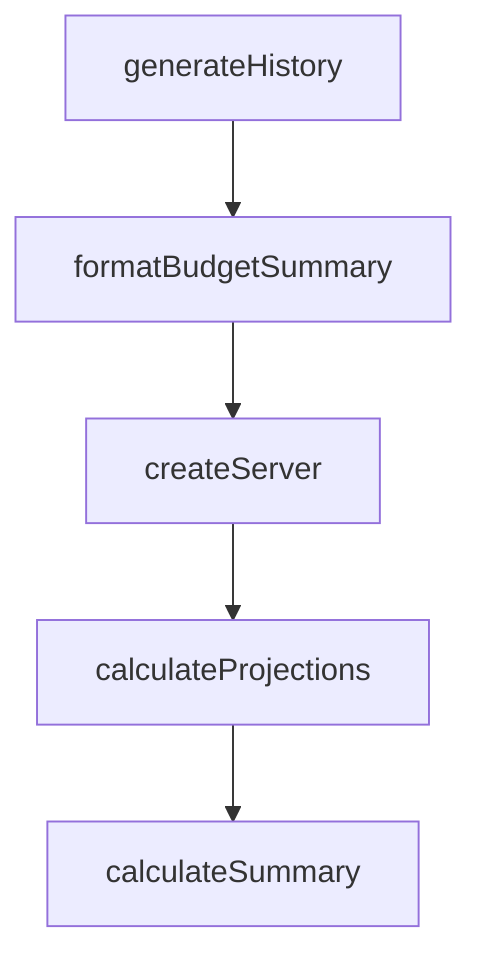

# Chapter 7: Agent Skills and OpenAI Apps Migration

Welcome to **Chapter 7: Agent Skills and OpenAI Apps Migration**. In this part of **MCP Ext Apps Tutorial: Building Interactive MCP Apps and Hosts**, you will build an intuitive mental model first, then move into concrete implementation details and practical production tradeoffs.


This chapter focuses on adoption accelerators and migration planning.

## Learning Goals

- install and use agent skills to scaffold MCP Apps workflows
- map OpenAI Apps concepts to MCP Apps equivalents
- identify unsupported areas and migration caveats early
- plan phased migration for existing app ecosystems

## Migration Checklist

1. compare server-side metadata and method mappings
2. port client-side context and tool call patterns
3. audit unsupported features and design fallback behavior
4. validate side-by-side behavior before full cutover

## Source References

- [Agent Skills Guide](https://github.com/modelcontextprotocol/ext-apps/blob/main/docs/agent-skills.md)
- [Migration from OpenAI Apps](https://github.com/modelcontextprotocol/ext-apps/blob/main/docs/migrate_from_openai_apps.md)
- [Ext Apps README - Install Agent Skills](https://github.com/modelcontextprotocol/ext-apps/blob/main/README.md#install-agent-skills)

## Summary

You now have a migration-aware adoption strategy for MCP Apps.

Next: [Chapter 8: Release Strategy and Production Operations](08-release-strategy-and-production-operations.md)

## Depth Expansion Playbook

## Source Code Walkthrough

### `examples/budget-allocator-server/server.ts`

The `generateHistory` function in [`examples/budget-allocator-server/server.ts`](https://github.com/modelcontextprotocol/ext-apps/blob/HEAD/examples/budget-allocator-server/server.ts) handles a key part of this chapter's functionality:

```ts
 * Generate 24 months of historical allocation data with realistic trends
 */
function generateHistory(
  categories: BudgetCategoryInternal[],
): HistoricalMonth[] {
  const months: HistoricalMonth[] = [];
  const now = new Date();
  const random = seededRandom(42); // Fixed seed for reproducibility

  for (let i = 23; i >= 0; i--) {
    const date = new Date(now);
    date.setMonth(date.getMonth() - i);
    const monthStr = `${date.getFullYear()}-${String(date.getMonth() + 1).padStart(2, "0")}`;

    const rawAllocations: Record<string, number> = {};

    for (const cat of categories) {
      // Start from default, apply trend over time, add noise
      const monthsFromStart = 23 - i;
      const trend = monthsFromStart * cat.trendPerMonth;
      const noise = (random() - 0.5) * 3; // +/- 1.5%
      rawAllocations[cat.id] = Math.max(
        0,
        Math.min(100, cat.defaultPercent + trend + noise),
      );
    }

    // Normalize to 100%
    const total = Object.values(rawAllocations).reduce((a, b) => a + b, 0);
    const allocations: Record<string, number> = {};
    for (const id of Object.keys(rawAllocations)) {
      allocations[id] = Math.round((rawAllocations[id] / total) * 1000) / 10;
```

This function is important because it defines how MCP Ext Apps Tutorial: Building Interactive MCP Apps and Hosts implements the patterns covered in this chapter.

### `examples/budget-allocator-server/server.ts`

The `formatBudgetSummary` function in [`examples/budget-allocator-server/server.ts`](https://github.com/modelcontextprotocol/ext-apps/blob/HEAD/examples/budget-allocator-server/server.ts) handles a key part of this chapter's functionality:

```ts
// ---------------------------------------------------------------------------

function formatBudgetSummary(data: BudgetDataResponse): string {
  const lines: string[] = [
    "Budget Allocator Configuration",
    "==============================",
    "",
    `Default Budget: ${data.config.currencySymbol}${data.config.defaultBudget.toLocaleString()}`,
    `Available Presets: ${data.config.presetBudgets.map((b) => `${data.config.currencySymbol}${b.toLocaleString()}`).join(", ")}`,
    "",
    "Categories:",
    ...data.config.categories.map(
      (c) => `  - ${c.name}: ${c.defaultPercent}% default`,
    ),
    "",
    `Historical Data: ${data.analytics.history.length} months`,
    `Benchmark Stages: ${data.analytics.stages.join(", ")}`,
    `Default Stage: ${data.analytics.defaultStage}`,
  ];
  return lines.join("\n");
}

// ---------------------------------------------------------------------------
// MCP Server Setup
// ---------------------------------------------------------------------------

const resourceUri = "ui://budget-allocator/mcp-app.html";

/**
 * Creates a new MCP server instance with tools and resources registered.
 * Each HTTP session needs its own server instance because McpServer only supports one transport.
 */
```

This function is important because it defines how MCP Ext Apps Tutorial: Building Interactive MCP Apps and Hosts implements the patterns covered in this chapter.

### `examples/budget-allocator-server/server.ts`

The `createServer` function in [`examples/budget-allocator-server/server.ts`](https://github.com/modelcontextprotocol/ext-apps/blob/HEAD/examples/budget-allocator-server/server.ts) handles a key part of this chapter's functionality:

```ts
 * Each HTTP session needs its own server instance because McpServer only supports one transport.
 */
export function createServer(): McpServer {
  const server = new McpServer({
    name: "Budget Allocator Server",
    version: "1.0.0",
  });

  registerAppTool(
    server,
    "get-budget-data",
    {
      title: "Get Budget Data",
      description:
        "Returns budget configuration with 24 months of historical allocations and industry benchmarks by company stage",
      inputSchema: {},
      outputSchema: BudgetDataResponseSchema,
      _meta: { ui: { resourceUri } },
    },
    async (): Promise<CallToolResult> => {
      const response: BudgetDataResponse = {
        config: {
          categories: CATEGORIES.map(({ id, name, color, defaultPercent }) => ({
            id,
            name,
            color,
            defaultPercent,
          })),
          presetBudgets: [50000, 100000, 250000, 500000],
          defaultBudget: 100000,
          currency: "USD",
          currencySymbol: "$",
```

This function is important because it defines how MCP Ext Apps Tutorial: Building Interactive MCP Apps and Hosts implements the patterns covered in this chapter.

### `examples/scenario-modeler-server/server.ts`

The `calculateProjections` function in [`examples/scenario-modeler-server/server.ts`](https://github.com/modelcontextprotocol/ext-apps/blob/HEAD/examples/scenario-modeler-server/server.ts) handles a key part of this chapter's functionality:

```ts
// ============================================================================

function calculateProjections(inputs: ScenarioInputs): MonthlyProjection[] {
  const {
    startingMRR,
    monthlyGrowthRate,
    monthlyChurnRate,
    grossMargin,
    fixedCosts,
  } = inputs;

  const netGrowthRate = (monthlyGrowthRate - monthlyChurnRate) / 100;
  const projections: MonthlyProjection[] = [];
  let cumulativeRevenue = 0;

  for (let month = 1; month <= 12; month++) {
    const mrr = startingMRR * Math.pow(1 + netGrowthRate, month);
    const grossProfit = mrr * (grossMargin / 100);
    const netProfit = grossProfit - fixedCosts;
    cumulativeRevenue += mrr;

    projections.push({
      month,
      mrr,
      grossProfit,
      netProfit,
      cumulativeRevenue,
    });
  }

  return projections;
}
```

This function is important because it defines how MCP Ext Apps Tutorial: Building Interactive MCP Apps and Hosts implements the patterns covered in this chapter.


## How These Components Connect


