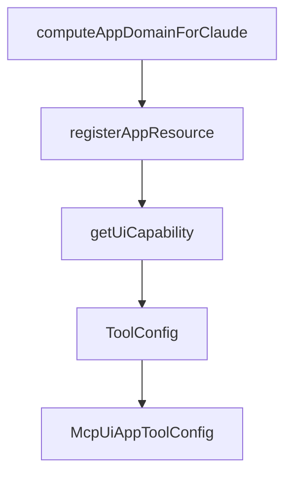

# Chapter 7: Agent Skills and OpenAI Apps Migration

Welcome to **Chapter 7: Agent Skills and OpenAI Apps Migration**. In this part of **MCP Ext Apps Tutorial: Building Interactive MCP Apps and Hosts**, you will build an intuitive mental model first, then move into concrete implementation details and practical production tradeoffs.


This chapter focuses on adoption accelerators and migration planning.

## Learning Goals

- install and use agent skills to scaffold MCP Apps workflows
- map OpenAI Apps concepts to MCP Apps equivalents
- identify unsupported areas and migration caveats early
- plan phased migration for existing app ecosystems

## Migration Checklist

1. compare server-side metadata and method mappings
2. port client-side context and tool call patterns
3. audit unsupported features and design fallback behavior
4. validate side-by-side behavior before full cutover

## Source References

- [Agent Skills Guide](https://github.com/modelcontextprotocol/ext-apps/blob/main/docs/agent-skills.md)
- [Migration from OpenAI Apps](https://github.com/modelcontextprotocol/ext-apps/blob/main/docs/migrate_from_openai_apps.md)
- [Ext Apps README - Install Agent Skills](https://github.com/modelcontextprotocol/ext-apps/blob/main/README.md#install-agent-skills)

## Summary

You now have a migration-aware adoption strategy for MCP Apps.

Next: [Chapter 8: Release Strategy and Production Operations](08-release-strategy-and-production-operations.md)

## Source Code Walkthrough

### `src/server/index.ts`

The `computeAppDomainForClaude` function in [`src/server/index.ts`](https://github.com/modelcontextprotocol/ext-apps/blob/HEAD/src/server/index.ts) handles a key part of this chapter's functionality:

```ts
 * ```ts source="./index.examples.ts#registerAppResource_withDomain"
 * // Computes a stable origin from an MCP server URL for hosting in Claude.
 * function computeAppDomainForClaude(mcpServerUrl: string): string {
 *   const hash = crypto
 *     .createHash("sha256")
 *     .update(mcpServerUrl)
 *     .digest("hex")
 *     .slice(0, 32);
 *   return `${hash}.claudemcpcontent.com`;
 * }
 *
 * const APP_DOMAIN = computeAppDomainForClaude("https://example.com/mcp");
 *
 * registerAppResource(
 *   server,
 *   "Company Dashboard",
 *   "ui://dashboard/view.html",
 *   {
 *     description: "Internal dashboard with company data",
 *   },
 *   async () => ({
 *     contents: [
 *       {
 *         uri: "ui://dashboard/view.html",
 *         mimeType: RESOURCE_MIME_TYPE,
 *         text: dashboardHtml,
 *         _meta: {
 *           ui: {
 *             // CSP: tell browser the app is allowed to make requests
 *             csp: {
 *               connectDomains: ["https://api.example.com"],
 *             },
```

This function is important because it defines how MCP Ext Apps Tutorial: Building Interactive MCP Apps and Hosts implements the patterns covered in this chapter.

### `src/server/index.ts`

The `registerAppResource` function in [`src/server/index.ts`](https://github.com/modelcontextprotocol/ext-apps/blob/HEAD/src/server/index.ts) handles a key part of this chapter's functionality:

```ts
 *
 * // Register the HTML resource the tool references
 * registerAppResource(
 *   server,
 *   "Weather View",
 *   "ui://weather/view.html",
 *   {},
 *   readCallback,
 * );
 * ```
 */

import {
  RESOURCE_URI_META_KEY,
  RESOURCE_MIME_TYPE,
  McpUiResourceCsp,
  McpUiResourceMeta,
  McpUiToolMeta,
  McpUiClientCapabilities,
} from "../app.js";
import type {
  BaseToolCallback,
  McpServer,
  RegisteredTool,
  ResourceMetadata,
  ToolCallback,
  ReadResourceCallback as _ReadResourceCallback,
  RegisteredResource,
} from "@modelcontextprotocol/sdk/server/mcp.js";
import type {
  AnySchema,
  ZodRawShapeCompat,
```

This function is important because it defines how MCP Ext Apps Tutorial: Building Interactive MCP Apps and Hosts implements the patterns covered in this chapter.

### `src/server/index.ts`

The `getUiCapability` function in [`src/server/index.ts`](https://github.com/modelcontextprotocol/ext-apps/blob/HEAD/src/server/index.ts) handles a key part of this chapter's functionality:

```ts
 *
 * @example Check for MCP Apps support in server initialization
 * ```ts source="./index.examples.ts#getUiCapability_checkSupport"
 * server.server.oninitialized = () => {
 *   const clientCapabilities = server.server.getClientCapabilities();
 *   const uiCap = getUiCapability(clientCapabilities);
 *
 *   if (uiCap?.mimeTypes?.includes(RESOURCE_MIME_TYPE)) {
 *     // App-enhanced tool
 *     registerAppTool(
 *       server,
 *       "weather",
 *       {
 *         description: "Get weather information with interactive dashboard",
 *         _meta: { ui: { resourceUri: "ui://weather/dashboard" } },
 *       },
 *       weatherHandler,
 *     );
 *   } else {
 *     // Text-only fallback
 *     server.registerTool(
 *       "weather",
 *       {
 *         description: "Get weather information",
 *       },
 *       textWeatherHandler,
 *     );
 *   }
 * };
 * ```
 */
export function getUiCapability(
```

This function is important because it defines how MCP Ext Apps Tutorial: Building Interactive MCP Apps and Hosts implements the patterns covered in this chapter.

### `src/server/index.ts`

The `ToolConfig` interface in [`src/server/index.ts`](https://github.com/modelcontextprotocol/ext-apps/blob/HEAD/src/server/index.ts) handles a key part of this chapter's functionality:

```ts
/**
 * Base tool configuration matching the standard MCP server tool options.
 * Extended by {@link McpUiAppToolConfig `McpUiAppToolConfig`} to add UI metadata requirements.
 */
export interface ToolConfig {
  title?: string;
  description?: string;
  inputSchema?: ZodRawShapeCompat | AnySchema;
  outputSchema?: ZodRawShapeCompat | AnySchema;
  annotations?: ToolAnnotations;
  _meta?: Record<string, unknown>;
}

/**
 * Configuration for tools that render an interactive UI.
 *
 * Extends {@link ToolConfig `ToolConfig`} with a required `_meta` field that specifies UI metadata.
 * The UI resource can be specified in two ways:
 * - `_meta.ui.resourceUri` (preferred)
 * - `_meta["ui/resourceUri"]` (deprecated, for backward compatibility)
 *
 * @see {@link registerAppTool `registerAppTool`} for the recommended way to register app tools
 */
export interface McpUiAppToolConfig extends ToolConfig {
  _meta: {
    [key: string]: unknown;
  } & (
    | {
        ui: McpUiToolMeta;
      }
    | {
        /**
```

This interface is important because it defines how MCP Ext Apps Tutorial: Building Interactive MCP Apps and Hosts implements the patterns covered in this chapter.


## How These Components Connect


