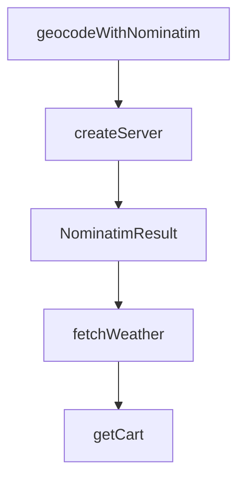

# Chapter 8: Release Strategy and Production Operations

Welcome to **Chapter 8: Release Strategy and Production Operations**. In this part of **MCP Ext Apps Tutorial: Building Interactive MCP Apps and Hosts**, you will build an intuitive mental model first, then move into concrete implementation details and practical production tradeoffs.


This chapter defines long-term operating practices for MCP Apps-based systems.

## Learning Goals

- align SDK releases with specification version controls
- manage app/host compatibility testing across updates
- set production safeguards for security, rendering, and message flow
- reduce breakage risk during spec or host behavior evolution

## Operations Controls

| Area | Baseline Control |
|:-----|:-----------------|
| spec compatibility | pin against stable spec revision and verify host support |
| release rollout | stage SDK updates with integration test gates |
| security posture | enforce sandbox, CSP, and context minimization |
| observability | capture host bridge errors and tool/UI mismatch metrics |

## Source References

- [Ext Apps Releases](https://github.com/modelcontextprotocol/ext-apps/releases)
- [Ext Apps README](https://github.com/modelcontextprotocol/ext-apps/blob/main/README.md)
- [MCP Apps Stable Spec](https://github.com/modelcontextprotocol/ext-apps/blob/main/specification/2026-01-26/apps.mdx)

## Summary

You now have a production operations framework for MCP Apps across app and host stacks.

Return to the [MCP Ext Apps Tutorial index](README.md).

## Depth Expansion Playbook

## Source Code Walkthrough

### `examples/map-server/server.ts`

The `geocodeWithNominatim` function in [`examples/map-server/server.ts`](https://github.com/modelcontextprotocol/ext-apps/blob/HEAD/examples/map-server/server.ts) handles a key part of this chapter's functionality:

```ts
 * Query Nominatim geocoding API with rate limiting
 */
async function geocodeWithNominatim(query: string): Promise<NominatimResult[]> {
  // Respect rate limit
  const now = Date.now();
  const timeSinceLastRequest = now - lastNominatimRequest;
  if (timeSinceLastRequest < NOMINATIM_RATE_LIMIT_MS) {
    await new Promise((resolve) =>
      setTimeout(resolve, NOMINATIM_RATE_LIMIT_MS - timeSinceLastRequest),
    );
  }
  lastNominatimRequest = Date.now();

  const params = new URLSearchParams({
    q: query,
    format: "json",
    limit: "5",
  });

  const response = await fetch(
    `https://nominatim.openstreetmap.org/search?${params}`,
    {
      headers: {
        "User-Agent":
          "MCP-CesiumMap-Example/1.0 (https://github.com/modelcontextprotocol)",
      },
    },
  );

  if (!response.ok) {
    throw new Error(
      `Nominatim API error: ${response.status} ${response.statusText}`,
```

This function is important because it defines how MCP Ext Apps Tutorial: Building Interactive MCP Apps and Hosts implements the patterns covered in this chapter.

### `examples/map-server/server.ts`

The `createServer` function in [`examples/map-server/server.ts`](https://github.com/modelcontextprotocol/ext-apps/blob/HEAD/examples/map-server/server.ts) handles a key part of this chapter's functionality:

```ts
 * Each HTTP session needs its own server instance because McpServer only supports one transport.
 */
export function createServer(): McpServer {
  const server = new McpServer({
    name: "CesiumJS Map Server",
    version: "1.0.0",
  });

  // CSP configuration for external tile sources
  const cspMeta = {
    ui: {
      csp: {
        // Allow fetching tiles from OSM (tiles + geocoding) and Cesium assets
        connectDomains: [
          "https://*.openstreetmap.org", // OSM tiles + Nominatim geocoding
          "https://cesium.com",
          "https://*.cesium.com",
        ],
        // Allow loading tile images, scripts, and Cesium CDN resources
        resourceDomains: [
          "https://*.openstreetmap.org", // OSM map tiles (covers tile.openstreetmap.org)
          "https://cesium.com",
          "https://*.cesium.com",
        ],
      },
    },
  };

  // Register the CesiumJS map resource with CSP for external tile sources
  registerAppResource(
    server,
    resourceUri,
```

This function is important because it defines how MCP Ext Apps Tutorial: Building Interactive MCP Apps and Hosts implements the patterns covered in this chapter.

### `examples/map-server/server.ts`

The `NominatimResult` interface in [`examples/map-server/server.ts`](https://github.com/modelcontextprotocol/ext-apps/blob/HEAD/examples/map-server/server.ts) handles a key part of this chapter's functionality:

```ts

// Nominatim API response type
interface NominatimResult {
  place_id: number;
  licence: string;
  osm_type: string;
  osm_id: number;
  lat: string;
  lon: string;
  display_name: string;
  boundingbox: [string, string, string, string]; // [south, north, west, east]
  class: string;
  type: string;
  importance: number;
}

// Rate limiting for Nominatim (1 request per second per their usage policy)
let lastNominatimRequest = 0;
const NOMINATIM_RATE_LIMIT_MS = 1100; // 1.1 seconds to be safe

/**
 * Query Nominatim geocoding API with rate limiting
 */
async function geocodeWithNominatim(query: string): Promise<NominatimResult[]> {
  // Respect rate limit
  const now = Date.now();
  const timeSinceLastRequest = now - lastNominatimRequest;
  if (timeSinceLastRequest < NOMINATIM_RATE_LIMIT_MS) {
    await new Promise((resolve) =>
      setTimeout(resolve, NOMINATIM_RATE_LIMIT_MS - timeSinceLastRequest),
    );
  }
```

This interface is important because it defines how MCP Ext Apps Tutorial: Building Interactive MCP Apps and Hosts implements the patterns covered in this chapter.

### `src/server/index.examples.ts`

The `fetchWeather` function in [`src/server/index.examples.ts`](https://github.com/modelcontextprotocol/ext-apps/blob/HEAD/src/server/index.examples.ts) handles a key part of this chapter's functionality:

```ts

// Stubs for external functions used in examples
declare function fetchWeather(
  location: string,
): Promise<{ temp: number; conditions: string }>;
declare function getCart(): Promise<{ items: unknown[]; total: number }>;
declare function updateCartItem(
  itemId: string,
  quantity: number,
): Promise<{ items: unknown[]; total: number }>;

/**
 * Example: Module overview showing basic registration of tools and resources.
 */
function index_overview(
  server: McpServer,
  toolCallback: ToolCallback,
  readCallback: ReadResourceCallback,
) {
  //#region index_overview
  // Register a tool that displays a view
  registerAppTool(
    server,
    "weather",
    {
      description: "Get weather forecast",
      _meta: { ui: { resourceUri: "ui://weather/view.html" } },
    },
    toolCallback,
  );

  // Register the HTML resource the tool references
```

This function is important because it defines how MCP Ext Apps Tutorial: Building Interactive MCP Apps and Hosts implements the patterns covered in this chapter.


## How These Components Connect


