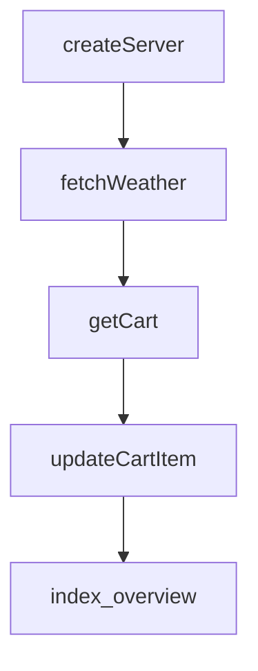

# Chapter 8: Release Strategy and Production Operations

Welcome to **Chapter 8: Release Strategy and Production Operations**. In this part of **MCP Ext Apps Tutorial: Building Interactive MCP Apps and Hosts**, you will build an intuitive mental model first, then move into concrete implementation details and practical production tradeoffs.


This chapter defines long-term operating practices for MCP Apps-based systems.

## Learning Goals

- align SDK releases with specification version controls
- manage app/host compatibility testing across updates
- set production safeguards for security, rendering, and message flow
- reduce breakage risk during spec or host behavior evolution

## Operations Controls

| Area | Baseline Control |
|:-----|:-----------------|
| spec compatibility | pin against stable spec revision and verify host support |
| release rollout | stage SDK updates with integration test gates |
| security posture | enforce sandbox, CSP, and context minimization |
| observability | capture host bridge errors and tool/UI mismatch metrics |

## Source References

- [Ext Apps Releases](https://github.com/modelcontextprotocol/ext-apps/releases)
- [Ext Apps README](https://github.com/modelcontextprotocol/ext-apps/blob/main/README.md)
- [MCP Apps Stable Spec](https://github.com/modelcontextprotocol/ext-apps/blob/main/specification/2026-01-26/apps.mdx)

## Summary

You now have a production operations framework for MCP Apps across app and host stacks.

Return to the [MCP Ext Apps Tutorial index](README.md).

## Source Code Walkthrough

### `examples/budget-allocator-server/server.ts`

The `createServer` function in [`examples/budget-allocator-server/server.ts`](https://github.com/modelcontextprotocol/ext-apps/blob/HEAD/examples/budget-allocator-server/server.ts) handles a key part of this chapter's functionality:

```ts
 * Each HTTP session needs its own server instance because McpServer only supports one transport.
 */
export function createServer(): McpServer {
  const server = new McpServer({
    name: "Budget Allocator Server",
    version: "1.0.0",
  });

  registerAppTool(
    server,
    "get-budget-data",
    {
      title: "Get Budget Data",
      description:
        "Returns budget configuration with 24 months of historical allocations and industry benchmarks by company stage",
      inputSchema: {},
      outputSchema: BudgetDataResponseSchema,
      _meta: { ui: { resourceUri } },
    },
    async (): Promise<CallToolResult> => {
      const response: BudgetDataResponse = {
        config: {
          categories: CATEGORIES.map(({ id, name, color, defaultPercent }) => ({
            id,
            name,
            color,
            defaultPercent,
          })),
          presetBudgets: [50000, 100000, 250000, 500000],
          defaultBudget: 100000,
          currency: "USD",
          currencySymbol: "$",
```

This function is important because it defines how MCP Ext Apps Tutorial: Building Interactive MCP Apps and Hosts implements the patterns covered in this chapter.

### `src/server/index.examples.ts`

The `fetchWeather` function in [`src/server/index.examples.ts`](https://github.com/modelcontextprotocol/ext-apps/blob/HEAD/src/server/index.examples.ts) handles a key part of this chapter's functionality:

```ts

// Stubs for external functions used in examples
declare function fetchWeather(
  location: string,
): Promise<{ temp: number; conditions: string }>;
declare function getCart(): Promise<{ items: unknown[]; total: number }>;
declare function updateCartItem(
  itemId: string,
  quantity: number,
): Promise<{ items: unknown[]; total: number }>;

/**
 * Example: Module overview showing basic registration of tools and resources.
 */
function index_overview(
  server: McpServer,
  toolCallback: ToolCallback,
  readCallback: ReadResourceCallback,
) {
  //#region index_overview
  // Register a tool that displays a view
  registerAppTool(
    server,
    "weather",
    {
      description: "Get weather forecast",
      _meta: { ui: { resourceUri: "ui://weather/view.html" } },
    },
    toolCallback,
  );

  // Register the HTML resource the tool references
```

This function is important because it defines how MCP Ext Apps Tutorial: Building Interactive MCP Apps and Hosts implements the patterns covered in this chapter.

### `src/server/index.examples.ts`

The `getCart` function in [`src/server/index.examples.ts`](https://github.com/modelcontextprotocol/ext-apps/blob/HEAD/src/server/index.examples.ts) handles a key part of this chapter's functionality:

```ts
  location: string,
): Promise<{ temp: number; conditions: string }>;
declare function getCart(): Promise<{ items: unknown[]; total: number }>;
declare function updateCartItem(
  itemId: string,
  quantity: number,
): Promise<{ items: unknown[]; total: number }>;

/**
 * Example: Module overview showing basic registration of tools and resources.
 */
function index_overview(
  server: McpServer,
  toolCallback: ToolCallback,
  readCallback: ReadResourceCallback,
) {
  //#region index_overview
  // Register a tool that displays a view
  registerAppTool(
    server,
    "weather",
    {
      description: "Get weather forecast",
      _meta: { ui: { resourceUri: "ui://weather/view.html" } },
    },
    toolCallback,
  );

  // Register the HTML resource the tool references
  registerAppResource(
    server,
    "Weather View",
```

This function is important because it defines how MCP Ext Apps Tutorial: Building Interactive MCP Apps and Hosts implements the patterns covered in this chapter.

### `src/server/index.examples.ts`

The `updateCartItem` function in [`src/server/index.examples.ts`](https://github.com/modelcontextprotocol/ext-apps/blob/HEAD/src/server/index.examples.ts) handles a key part of this chapter's functionality:

```ts
): Promise<{ temp: number; conditions: string }>;
declare function getCart(): Promise<{ items: unknown[]; total: number }>;
declare function updateCartItem(
  itemId: string,
  quantity: number,
): Promise<{ items: unknown[]; total: number }>;

/**
 * Example: Module overview showing basic registration of tools and resources.
 */
function index_overview(
  server: McpServer,
  toolCallback: ToolCallback,
  readCallback: ReadResourceCallback,
) {
  //#region index_overview
  // Register a tool that displays a view
  registerAppTool(
    server,
    "weather",
    {
      description: "Get weather forecast",
      _meta: { ui: { resourceUri: "ui://weather/view.html" } },
    },
    toolCallback,
  );

  // Register the HTML resource the tool references
  registerAppResource(
    server,
    "Weather View",
    "ui://weather/view.html",
```

This function is important because it defines how MCP Ext Apps Tutorial: Building Interactive MCP Apps and Hosts implements the patterns covered in this chapter.


## How These Components Connect


