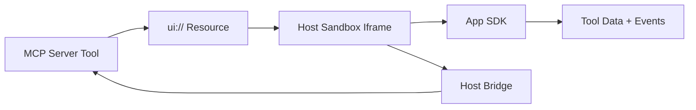

# MCP Ext Apps Tutorial: Building Interactive MCP Apps and Hosts

> Learn how to use `modelcontextprotocol/ext-apps` to build interactive MCP Apps, wire host bridges, secure UI resources, and run reliable testing and migration workflows.

## Why This Track Matters

Standard MCP tools work well for text and structured payloads, but many workflows need embedded UI. MCP Apps extend the protocol so servers can return interactive, sandboxed interfaces linked directly to tool executions.

This track focuses on:

- understanding the stable MCP Apps spec and lifecycle model
- building app-side UIs with `@modelcontextprotocol/ext-apps`
- implementing host-side bridges and context handling safely
- testing and migrating from OpenAI Apps-style integrations

## Current Snapshot (auto-updated)

- repository: [`modelcontextprotocol/ext-apps`](https://github.com/modelcontextprotocol/ext-apps)
- stars: about **1.46k**
- latest release: [`v1.0.1`](https://github.com/modelcontextprotocol/ext-apps/releases/tag/v1.0.1) (**January 26, 2026**)
- recent activity: updated on **February 12, 2026**
- stable spec: [`2026-01-26`](https://github.com/modelcontextprotocol/ext-apps/blob/main/specification/2026-01-26/apps.mdx)
- package baseline: `npm install -S @modelcontextprotocol/ext-apps`
- ecosystem note: repo provides app/host SDKs and reference examples, but no fully supported production host implementation

## Mental Model

## Chapter Guide

| Chapter | Key Question | Outcome |
|:--------|:-------------|:--------|
| [01 - Getting Started and Spec Orientation](01-getting-started-and-spec-orientation.md) | What does MCP Apps add to core MCP, and how do I start? | Fast onboarding |
| [02 - MCP Apps Architecture and Lifecycle](02-mcp-apps-architecture-and-lifecycle.md) | How do tools, UI resources, and host flows interact over time? | Clear system model |
| [03 - App SDK: UI Resources and Tool Linkage](03-app-sdk-ui-resources-and-tool-linkage.md) | How do app developers bind UI to tool metadata and responses? | Better app design |
| [04 - Host Bridge and Context Management](04-host-bridge-and-context-management.md) | How should hosts embed, message, and constrain MCP Apps? | Safer host implementations |
| [05 - Patterns, Security, and Performance](05-patterns-security-and-performance.md) | Which patterns improve UX while preserving safety? | Production-grade patterns |
| [06 - Testing, Local Hosts, and Integration Workflows](06-testing-local-hosts-and-integration-workflows.md) | How do I validate MCP Apps behavior before deployment? | Higher reliability |
| [07 - Agent Skills and OpenAI Apps Migration](07-agent-skills-and-openai-apps-migration.md) | How do teams accelerate setup and migrate existing app stacks? | Faster adoption |
| [08 - Release Strategy and Production Operations](08-release-strategy-and-production-operations.md) | How do I operate MCP Apps systems long term? | Durable operations |

## What You Will Learn

- how MCP Apps extends MCP with UI resource contracts and host/app bridging
- how to implement app-side rendering and interaction flows with SDK hooks
- how to apply security/CSP/context constraints for safer UI execution
- how to validate and evolve MCP Apps deployments with migration-aware practices

## Source References

- [Ext Apps README](https://github.com/modelcontextprotocol/ext-apps/blob/main/README.md)
- [MCP Apps Overview](https://github.com/modelcontextprotocol/ext-apps/blob/main/docs/overview.md)
- [Build Your First MCP App](https://github.com/modelcontextprotocol/ext-apps/blob/main/docs/quickstart.md)
- [MCP Apps Patterns](https://github.com/modelcontextprotocol/ext-apps/blob/main/docs/patterns.md)
- [Testing MCP Apps](https://github.com/modelcontextprotocol/ext-apps/blob/main/docs/testing-mcp-apps.md)
- [Agent Skills Guide](https://github.com/modelcontextprotocol/ext-apps/blob/main/docs/agent-skills.md)
- [Migration from OpenAI Apps](https://github.com/modelcontextprotocol/ext-apps/blob/main/docs/migrate_from_openai_apps.md)
- [Quickstart Example](https://github.com/modelcontextprotocol/ext-apps/blob/main/examples/quickstart/README.md)
- [Basic Host Example](https://github.com/modelcontextprotocol/ext-apps/blob/main/examples/basic-host/README.md)
- [Integration Server Example](https://github.com/modelcontextprotocol/ext-apps/blob/main/examples/integration-server/README.md)

## Related Tutorials

- [MCP Specification Tutorial](../mcp-specification-tutorial/)
- [MCP TypeScript SDK Tutorial](../mcp-typescript-sdk-tutorial/)
- [MCP Servers Tutorial](../mcp-servers-tutorial/)
- [MCP Use Tutorial](../mcp-use-tutorial/)

---

Start with [Chapter 1: Getting Started and Spec Orientation](01-getting-started-and-spec-orientation.md).

## Navigation & Backlinks

- [Start Here: Chapter 1: Getting Started and Spec Orientation](01-getting-started-and-spec-orientation.md)
- [Back to Main Catalog](../../README.md#-tutorial-catalog)
- [Browse A-Z Tutorial Directory](../../discoverability/tutorial-directory.md)
- [Search by Intent](../../discoverability/query-hub.md)
- [Explore Category Hubs](../../README.md#category-hubs)

## Full Chapter Map

1. [Chapter 1: Getting Started and Spec Orientation](01-getting-started-and-spec-orientation.md)
2. [Chapter 2: MCP Apps Architecture and Lifecycle](02-mcp-apps-architecture-and-lifecycle.md)
3. [Chapter 3: App SDK: UI Resources and Tool Linkage](03-app-sdk-ui-resources-and-tool-linkage.md)
4. [Chapter 4: Host Bridge and Context Management](04-host-bridge-and-context-management.md)
5. [Chapter 5: Patterns, Security, and Performance](05-patterns-security-and-performance.md)
6. [Chapter 6: Testing, Local Hosts, and Integration Workflows](06-testing-local-hosts-and-integration-workflows.md)
7. [Chapter 7: Agent Skills and OpenAI Apps Migration](07-agent-skills-and-openai-apps-migration.md)
8. [Chapter 8: Release Strategy and Production Operations](08-release-strategy-and-production-operations.md)

*Generated by [AI Codebase Knowledge Builder](https://github.com/The-Pocket/Tutorial-Codebase-Knowledge)*
