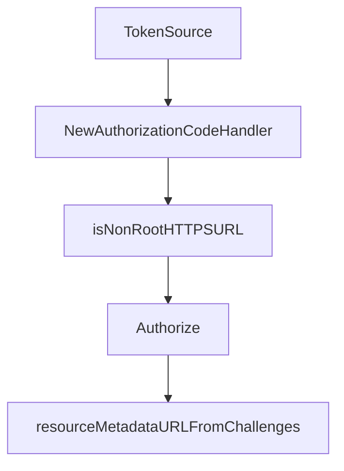

# Chapter 1: Getting Started and SDK Package Map

Welcome to **Chapter 1: Getting Started and SDK Package Map**. In this part of **MCP Go SDK Tutorial: Building Robust MCP Clients and Servers in Go**, you will build an intuitive mental model first, then move into concrete implementation details and practical production tradeoffs.


This chapter sets a reliable baseline for starting MCP in Go.

## Learning Goals

- identify the core SDK packages and their roles
- bootstrap minimal client and server programs
- align Go versioning and module policy with SDK expectations
- avoid over-importing packages before architecture is clear

## Package Map

| Package | Purpose |
|:--------|:--------|
| `github.com/modelcontextprotocol/go-sdk/mcp` | primary client/server/session API |
| `github.com/modelcontextprotocol/go-sdk/jsonrpc` | lower-level transport/message plumbing |
| `github.com/modelcontextprotocol/go-sdk/auth` | bearer token middleware and helpers |
| `github.com/modelcontextprotocol/go-sdk/oauthex` | OAuth extensions (resource metadata helpers) |

## First-Run Baseline

```bash
go mod init example.com/mcp-app
go get github.com/modelcontextprotocol/go-sdk/mcp
```

Then build one minimal server over stdio and one minimal client over `CommandTransport` before adding HTTP complexity.

## Source References

- [Go SDK README](https://github.com/modelcontextprotocol/go-sdk/blob/main/README.md)
- [Features Index](https://github.com/modelcontextprotocol/go-sdk/blob/main/docs/README.md)
- [pkg.go.dev - mcp](https://pkg.go.dev/github.com/modelcontextprotocol/go-sdk/mcp)

## Summary

You now have a clean package and module baseline for Go MCP development.

Next: [Chapter 2: Client/Server Lifecycle and Session Management](02-client-server-lifecycle-and-session-management.md)

## Source Code Walkthrough

### `auth/authorization_code.go`

The `TokenSource` function in [`auth/authorization_code.go`](https://github.com/modelcontextprotocol/go-sdk/blob/HEAD/auth/authorization_code.go) handles a key part of this chapter's functionality:

```go

	// tokenSource is the token source to use for authorization.
	tokenSource oauth2.TokenSource
}

var _ OAuthHandler = (*AuthorizationCodeHandler)(nil)

func (h *AuthorizationCodeHandler) TokenSource(ctx context.Context) (oauth2.TokenSource, error) {
	return h.tokenSource, nil
}

// NewAuthorizationCodeHandler creates a new AuthorizationCodeHandler.
// It performs validation of the configuration and returns an error if it is invalid.
// The passed config is consumed by the handler and should not be modified after.
func NewAuthorizationCodeHandler(config *AuthorizationCodeHandlerConfig) (*AuthorizationCodeHandler, error) {
	if config == nil {
		return nil, errors.New("config must be provided")
	}
	if config.ClientIDMetadataDocumentConfig == nil &&
		config.PreregisteredClient == nil &&
		config.DynamicClientRegistrationConfig == nil {
		return nil, errors.New("at least one client registration configuration must be provided")
	}
	if config.AuthorizationCodeFetcher == nil {
		return nil, errors.New("AuthorizationCodeFetcher is required")
	}
	if config.ClientIDMetadataDocumentConfig != nil && !isNonRootHTTPSURL(config.ClientIDMetadataDocumentConfig.URL) {
		return nil, fmt.Errorf("client ID metadata document URL must be a non-root HTTPS URL")
	}
	if config.PreregisteredClient != nil {
		if err := config.PreregisteredClient.Validate(); err != nil {
			return nil, fmt.Errorf("invalid PreregisteredClient configuration: %w", err)
```

This function is important because it defines how MCP Go SDK Tutorial: Building Robust MCP Clients and Servers in Go implements the patterns covered in this chapter.

### `auth/authorization_code.go`

The `NewAuthorizationCodeHandler` function in [`auth/authorization_code.go`](https://github.com/modelcontextprotocol/go-sdk/blob/HEAD/auth/authorization_code.go) handles a key part of this chapter's functionality:

```go
}

// NewAuthorizationCodeHandler creates a new AuthorizationCodeHandler.
// It performs validation of the configuration and returns an error if it is invalid.
// The passed config is consumed by the handler and should not be modified after.
func NewAuthorizationCodeHandler(config *AuthorizationCodeHandlerConfig) (*AuthorizationCodeHandler, error) {
	if config == nil {
		return nil, errors.New("config must be provided")
	}
	if config.ClientIDMetadataDocumentConfig == nil &&
		config.PreregisteredClient == nil &&
		config.DynamicClientRegistrationConfig == nil {
		return nil, errors.New("at least one client registration configuration must be provided")
	}
	if config.AuthorizationCodeFetcher == nil {
		return nil, errors.New("AuthorizationCodeFetcher is required")
	}
	if config.ClientIDMetadataDocumentConfig != nil && !isNonRootHTTPSURL(config.ClientIDMetadataDocumentConfig.URL) {
		return nil, fmt.Errorf("client ID metadata document URL must be a non-root HTTPS URL")
	}
	if config.PreregisteredClient != nil {
		if err := config.PreregisteredClient.Validate(); err != nil {
			return nil, fmt.Errorf("invalid PreregisteredClient configuration: %w", err)
		}
	}
	dCfg := config.DynamicClientRegistrationConfig
	if dCfg != nil {
		if dCfg.Metadata == nil {
			return nil, errors.New("dynamic client registration requires non-nil Metadata")
		}
		if len(dCfg.Metadata.RedirectURIs) == 0 {
			return nil, errors.New("Metadata.RedirectURIs is required for dynamic client registration")
```

This function is important because it defines how MCP Go SDK Tutorial: Building Robust MCP Clients and Servers in Go implements the patterns covered in this chapter.

### `auth/authorization_code.go`

The `isNonRootHTTPSURL` function in [`auth/authorization_code.go`](https://github.com/modelcontextprotocol/go-sdk/blob/HEAD/auth/authorization_code.go) handles a key part of this chapter's functionality:

```go
		return nil, errors.New("AuthorizationCodeFetcher is required")
	}
	if config.ClientIDMetadataDocumentConfig != nil && !isNonRootHTTPSURL(config.ClientIDMetadataDocumentConfig.URL) {
		return nil, fmt.Errorf("client ID metadata document URL must be a non-root HTTPS URL")
	}
	if config.PreregisteredClient != nil {
		if err := config.PreregisteredClient.Validate(); err != nil {
			return nil, fmt.Errorf("invalid PreregisteredClient configuration: %w", err)
		}
	}
	dCfg := config.DynamicClientRegistrationConfig
	if dCfg != nil {
		if dCfg.Metadata == nil {
			return nil, errors.New("dynamic client registration requires non-nil Metadata")
		}
		if len(dCfg.Metadata.RedirectURIs) == 0 {
			return nil, errors.New("Metadata.RedirectURIs is required for dynamic client registration")
		}
		if config.RedirectURL == "" {
			config.RedirectURL = dCfg.Metadata.RedirectURIs[0]
		} else if !slices.Contains(dCfg.Metadata.RedirectURIs, config.RedirectURL) {
			return nil, fmt.Errorf("RedirectURL %q is not in the list of allowed redirect URIs for dynamic client registration", config.RedirectURL)
		}
	}
	if config.RedirectURL == "" {
		// If the RedirectURL was supposed to be set by the dynamic client registration,
		// it should have been set by now. Otherwise, it is required.
		return nil, errors.New("RedirectURL is required")
	}
	if config.Client == nil {
		config.Client = http.DefaultClient
	}
```

This function is important because it defines how MCP Go SDK Tutorial: Building Robust MCP Clients and Servers in Go implements the patterns covered in this chapter.

### `auth/authorization_code.go`

The `Authorize` function in [`auth/authorization_code.go`](https://github.com/modelcontextprotocol/go-sdk/blob/HEAD/auth/authorization_code.go) handles a key part of this chapter's functionality:

```go
}

// Authorize performs the authorization flow.
// It is designed to perform the whole Authorization Code Grant flow.
// On success, [AuthorizationCodeHandler.TokenSource] will return a token source with the fetched token.
func (h *AuthorizationCodeHandler) Authorize(ctx context.Context, req *http.Request, resp *http.Response) error {
	defer resp.Body.Close()
	defer io.Copy(io.Discard, resp.Body)

	wwwChallenges, err := oauthex.ParseWWWAuthenticate(resp.Header[http.CanonicalHeaderKey("WWW-Authenticate")])
	if err != nil {
		return fmt.Errorf("failed to parse WWW-Authenticate header: %v", err)
	}

	if resp.StatusCode == http.StatusForbidden && errorFromChallenges(wwwChallenges) != "insufficient_scope" {
		// We only want to perform step-up authorization for insufficient_scope errors.
		// Returning nil, so that the call is retried immediately and the response
		// is handled appropriately by the connection.
		// Step-up authorization is defined at
		// https://modelcontextprotocol.io/specification/2025-11-25/basic/authorization#step-up-authorization-flow
		return nil
	}

	prm, err := h.getProtectedResourceMetadata(ctx, wwwChallenges, req.URL.String())
	if err != nil {
		return err
	}

	asm, err := GetAuthServerMetadata(ctx, prm.AuthorizationServers[0], h.config.Client)
	if err != nil {
		return fmt.Errorf("failed to get authorization server metadata: %w", err)
	}
```

This function is important because it defines how MCP Go SDK Tutorial: Building Robust MCP Clients and Servers in Go implements the patterns covered in this chapter.


## How These Components Connect


