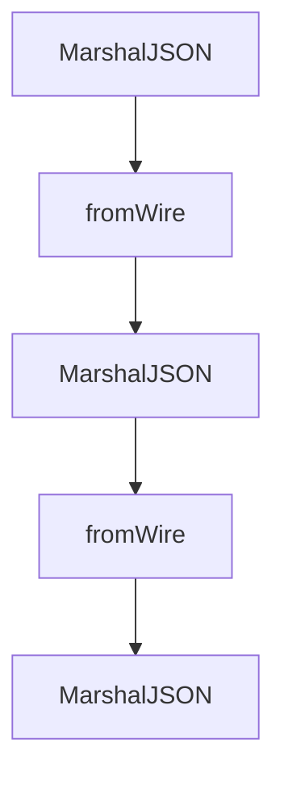

# Chapter 1: Getting Started and SDK Package Map

Welcome to **Chapter 1: Getting Started and SDK Package Map**. In this part of **MCP Go SDK Tutorial: Building Robust MCP Clients and Servers in Go**, you will build an intuitive mental model first, then move into concrete implementation details and practical production tradeoffs.


This chapter sets a reliable baseline for starting MCP in Go.

## Learning Goals

- identify the core SDK packages and their roles
- bootstrap minimal client and server programs
- align Go versioning and module policy with SDK expectations
- avoid over-importing packages before architecture is clear

## Package Map

| Package | Purpose |
|:--------|:--------|
| `github.com/modelcontextprotocol/go-sdk/mcp` | primary client/server/session API |
| `github.com/modelcontextprotocol/go-sdk/jsonrpc` | lower-level transport/message plumbing |
| `github.com/modelcontextprotocol/go-sdk/auth` | bearer token middleware and helpers |
| `github.com/modelcontextprotocol/go-sdk/oauthex` | OAuth extensions (resource metadata helpers) |

## First-Run Baseline

```bash
go mod init example.com/mcp-app
go get github.com/modelcontextprotocol/go-sdk/mcp
```

Then build one minimal server over stdio and one minimal client over `CommandTransport` before adding HTTP complexity.

## Source References

- [Go SDK README](https://github.com/modelcontextprotocol/go-sdk/blob/main/README.md)
- [Features Index](https://github.com/modelcontextprotocol/go-sdk/blob/main/docs/README.md)
- [pkg.go.dev - mcp](https://pkg.go.dev/github.com/modelcontextprotocol/go-sdk/mcp)

## Summary

You now have a clean package and module baseline for Go MCP development.

Next: [Chapter 2: Client/Server Lifecycle and Session Management](02-client-server-lifecycle-and-session-management.md)

## Depth Expansion Playbook

## Source Code Walkthrough

### `mcp/content.go`

The `MarshalJSON` function in [`mcp/content.go`](https://github.com/modelcontextprotocol/go-sdk/blob/HEAD/mcp/content.go) handles a key part of this chapter's functionality:

```go

// TODO(findleyr): update JSON marshalling of all content types to preserve required fields.
// (See [TextContent.MarshalJSON], which handles this for text content).

package mcp

import (
	"encoding/json"
	"fmt"

	internaljson "github.com/modelcontextprotocol/go-sdk/internal/json"
)

// A Content is a [TextContent], [ImageContent], [AudioContent],
// [ResourceLink], [EmbeddedResource], [ToolUseContent], or [ToolResultContent].
//
// Note: [ToolUseContent] and [ToolResultContent] are only valid in sampling
// message contexts (CreateMessageParams/CreateMessageResult).
type Content interface {
	MarshalJSON() ([]byte, error)
	fromWire(*wireContent)
}

// TextContent is a textual content.
type TextContent struct {
	Text        string
	Meta        Meta
	Annotations *Annotations
}

func (c *TextContent) MarshalJSON() ([]byte, error) {
	// Custom wire format to ensure the required "text" field is always included, even when empty.
```

This function is important because it defines how MCP Go SDK Tutorial: Building Robust MCP Clients and Servers in Go implements the patterns covered in this chapter.

### `mcp/content.go`

The `fromWire` function in [`mcp/content.go`](https://github.com/modelcontextprotocol/go-sdk/blob/HEAD/mcp/content.go) handles a key part of this chapter's functionality:

```go
type Content interface {
	MarshalJSON() ([]byte, error)
	fromWire(*wireContent)
}

// TextContent is a textual content.
type TextContent struct {
	Text        string
	Meta        Meta
	Annotations *Annotations
}

func (c *TextContent) MarshalJSON() ([]byte, error) {
	// Custom wire format to ensure the required "text" field is always included, even when empty.
	wire := struct {
		Type        string       `json:"type"`
		Text        string       `json:"text"`
		Meta        Meta         `json:"_meta,omitempty"`
		Annotations *Annotations `json:"annotations,omitempty"`
	}{
		Type:        "text",
		Text:        c.Text,
		Meta:        c.Meta,
		Annotations: c.Annotations,
	}
	return json.Marshal(wire)
}

func (c *TextContent) fromWire(wire *wireContent) {
	c.Text = wire.Text
	c.Meta = wire.Meta
	c.Annotations = wire.Annotations
```

This function is important because it defines how MCP Go SDK Tutorial: Building Robust MCP Clients and Servers in Go implements the patterns covered in this chapter.

### `mcp/content.go`

The `MarshalJSON` function in [`mcp/content.go`](https://github.com/modelcontextprotocol/go-sdk/blob/HEAD/mcp/content.go) handles a key part of this chapter's functionality:

```go

// TODO(findleyr): update JSON marshalling of all content types to preserve required fields.
// (See [TextContent.MarshalJSON], which handles this for text content).

package mcp

import (
	"encoding/json"
	"fmt"

	internaljson "github.com/modelcontextprotocol/go-sdk/internal/json"
)

// A Content is a [TextContent], [ImageContent], [AudioContent],
// [ResourceLink], [EmbeddedResource], [ToolUseContent], or [ToolResultContent].
//
// Note: [ToolUseContent] and [ToolResultContent] are only valid in sampling
// message contexts (CreateMessageParams/CreateMessageResult).
type Content interface {
	MarshalJSON() ([]byte, error)
	fromWire(*wireContent)
}

// TextContent is a textual content.
type TextContent struct {
	Text        string
	Meta        Meta
	Annotations *Annotations
}

func (c *TextContent) MarshalJSON() ([]byte, error) {
	// Custom wire format to ensure the required "text" field is always included, even when empty.
```

This function is important because it defines how MCP Go SDK Tutorial: Building Robust MCP Clients and Servers in Go implements the patterns covered in this chapter.

### `mcp/content.go`

The `fromWire` function in [`mcp/content.go`](https://github.com/modelcontextprotocol/go-sdk/blob/HEAD/mcp/content.go) handles a key part of this chapter's functionality:

```go
type Content interface {
	MarshalJSON() ([]byte, error)
	fromWire(*wireContent)
}

// TextContent is a textual content.
type TextContent struct {
	Text        string
	Meta        Meta
	Annotations *Annotations
}

func (c *TextContent) MarshalJSON() ([]byte, error) {
	// Custom wire format to ensure the required "text" field is always included, even when empty.
	wire := struct {
		Type        string       `json:"type"`
		Text        string       `json:"text"`
		Meta        Meta         `json:"_meta,omitempty"`
		Annotations *Annotations `json:"annotations,omitempty"`
	}{
		Type:        "text",
		Text:        c.Text,
		Meta:        c.Meta,
		Annotations: c.Annotations,
	}
	return json.Marshal(wire)
}

func (c *TextContent) fromWire(wire *wireContent) {
	c.Text = wire.Text
	c.Meta = wire.Meta
	c.Annotations = wire.Annotations
```

This function is important because it defines how MCP Go SDK Tutorial: Building Robust MCP Clients and Servers in Go implements the patterns covered in this chapter.


## How These Components Connect


