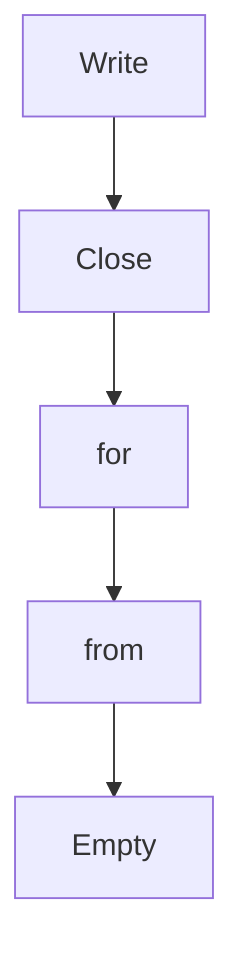

# Chapter 2: Client/Server Lifecycle and Session Management

Welcome to **Chapter 2: Client/Server Lifecycle and Session Management**. In this part of **MCP Go SDK Tutorial: Building Robust MCP Clients and Servers in Go**, you will build an intuitive mental model first, then move into concrete implementation details and practical production tradeoffs.


Session lifecycle discipline is the difference between stable and flaky MCP behavior.

## Learning Goals

- understand the `Client` and `Server` as logical multi-peer entities
- use `ClientSession` and `ServerSession` lifecycles correctly
- align initialization timing with feature handler readiness
- close and wait on sessions to prevent goroutine leaks

## Session Flow Highlights

- `Client.Connect` initializes the session and returns a `ClientSession`
- `Server.Connect` creates a `ServerSession`; initialization completes after client `initialized`
- requests should be gated until initialization is complete
- always call `Close` and, where relevant, `Wait` in shutdown paths

## Operational Checklist

1. connect server transport before connecting client in in-memory tests
2. instrument initialization handlers to verify negotiated capability state
3. ensure shutdown path handles both local close and peer disconnect
4. test reconnect behavior under transport interruptions

## Source References

- [Protocol Lifecycle](https://github.com/modelcontextprotocol/go-sdk/blob/main/docs/protocol.md#lifecycle)
- [mcp.Client](https://pkg.go.dev/github.com/modelcontextprotocol/go-sdk/mcp#Client)
- [mcp.Server](https://pkg.go.dev/github.com/modelcontextprotocol/go-sdk/mcp#Server)

## Summary

You now have lifecycle patterns that reduce race conditions and hanging sessions.

Next: [Chapter 3: Transports: stdio, Streamable HTTP, and Custom Flows](03-transports-stdio-streamable-http-and-custom-flows.md)

## Depth Expansion Playbook

## Source Code Walkthrough

### `mcp/sse.go`

The `Write` function in [`mcp/sse.go`](https://github.com/modelcontextprotocol/go-sdk/blob/HEAD/mcp/sse.go) handles a key part of this chapter's functionality:

```go
// Therefore, the each new GET request hands off its responsewriter to an
// [SSEServerTransport] type that abstracts the transport as follows:
//  - Write writes a new event to the responseWriter, or fails if the GET has
//  exited.
//  - Read reads off a message queue that is pushed to via POST requests.
//  - Close causes the hanging GET to exit.

// SSEHandler is an http.Handler that serves SSE-based MCP sessions as defined by
// the [2024-11-05 version] of the MCP spec.
//
// [2024-11-05 version]: https://modelcontextprotocol.io/specification/2024-11-05/basic/transports
type SSEHandler struct {
	getServer    func(request *http.Request) *Server
	opts         SSEOptions
	onConnection func(*ServerSession) // for testing; must not block

	mu       sync.Mutex
	sessions map[string]*SSEServerTransport
}

// SSEOptions specifies options for an [SSEHandler].
// for now, it is empty, but may be extended in future.
// https://github.com/modelcontextprotocol/go-sdk/issues/507
type SSEOptions struct{}

// NewSSEHandler returns a new [SSEHandler] that creates and manages MCP
// sessions created via incoming HTTP requests.
//
// Sessions are created when the client issues a GET request to the server,
// which must accept text/event-stream responses (server-sent events).
// For each such request, a new [SSEServerTransport] is created with a distinct
// messages endpoint, and connected to the server returned by getServer.
```

This function is important because it defines how MCP Go SDK Tutorial: Building Robust MCP Clients and Servers in Go implements the patterns covered in this chapter.

### `mcp/sse.go`

The `Close` function in [`mcp/sse.go`](https://github.com/modelcontextprotocol/go-sdk/blob/HEAD/mcp/sse.go) handles a key part of this chapter's functionality:

```go
//  exited.
//  - Read reads off a message queue that is pushed to via POST requests.
//  - Close causes the hanging GET to exit.

// SSEHandler is an http.Handler that serves SSE-based MCP sessions as defined by
// the [2024-11-05 version] of the MCP spec.
//
// [2024-11-05 version]: https://modelcontextprotocol.io/specification/2024-11-05/basic/transports
type SSEHandler struct {
	getServer    func(request *http.Request) *Server
	opts         SSEOptions
	onConnection func(*ServerSession) // for testing; must not block

	mu       sync.Mutex
	sessions map[string]*SSEServerTransport
}

// SSEOptions specifies options for an [SSEHandler].
// for now, it is empty, but may be extended in future.
// https://github.com/modelcontextprotocol/go-sdk/issues/507
type SSEOptions struct{}

// NewSSEHandler returns a new [SSEHandler] that creates and manages MCP
// sessions created via incoming HTTP requests.
//
// Sessions are created when the client issues a GET request to the server,
// which must accept text/event-stream responses (server-sent events).
// For each such request, a new [SSEServerTransport] is created with a distinct
// messages endpoint, and connected to the server returned by getServer.
// The SSEHandler also handles requests to the message endpoints, by
// delegating them to the relevant server transport.
//
```

This function is important because it defines how MCP Go SDK Tutorial: Building Robust MCP Clients and Servers in Go implements the patterns covered in this chapter.

### `mcp/sse.go`

The `for` interface in [`mcp/sse.go`](https://github.com/modelcontextprotocol/go-sdk/blob/HEAD/mcp/sse.go) handles a key part of this chapter's functionality:

```go
)

// This file implements support for SSE (HTTP with server-sent events)
// transport server and client.
// https://modelcontextprotocol.io/specification/2024-11-05/basic/transports
//
// The transport is simple, at least relative to the new streamable transport
// introduced in the 2025-03-26 version of the spec. In short:
//
//  1. Sessions are initiated via a hanging GET request, which streams
//     server->client messages as SSE 'message' events.
//  2. The first event in the SSE stream must be an 'endpoint' event that
//     informs the client of the session endpoint.
//  3. The client POSTs client->server messages to the session endpoint.
//
// Therefore, the each new GET request hands off its responsewriter to an
// [SSEServerTransport] type that abstracts the transport as follows:
//  - Write writes a new event to the responseWriter, or fails if the GET has
//  exited.
//  - Read reads off a message queue that is pushed to via POST requests.
//  - Close causes the hanging GET to exit.

// SSEHandler is an http.Handler that serves SSE-based MCP sessions as defined by
// the [2024-11-05 version] of the MCP spec.
//
// [2024-11-05 version]: https://modelcontextprotocol.io/specification/2024-11-05/basic/transports
type SSEHandler struct {
	getServer    func(request *http.Request) *Server
	opts         SSEOptions
	onConnection func(*ServerSession) // for testing; must not block

	mu       sync.Mutex
```

This interface is important because it defines how MCP Go SDK Tutorial: Building Robust MCP Clients and Servers in Go implements the patterns covered in this chapter.

### `mcp/sse.go`

The `from` interface in [`mcp/sse.go`](https://github.com/modelcontextprotocol/go-sdk/blob/HEAD/mcp/sse.go) handles a key part of this chapter's functionality:

```go
// When connected, it returns the following [Connection] implementation:
//   - Writes are SSE 'message' events to the GET response.
//   - Reads are received from POSTs to the session endpoint, via
//     [SSEServerTransport.ServeHTTP].
//   - Close terminates the hanging GET.
//
// The transport is itself an [http.Handler]. It is the caller's responsibility
// to ensure that the resulting transport serves HTTP requests on the given
// session endpoint.
//
// Each SSEServerTransport may be connected (via [Server.Connect]) at most
// once, since [SSEServerTransport.ServeHTTP] serves messages to the connected
// session.
//
// Most callers should instead use an [SSEHandler], which transparently handles
// the delegation to SSEServerTransports.
type SSEServerTransport struct {
	// Endpoint is the endpoint for this session, where the client can POST
	// messages.
	Endpoint string

	// Response is the hanging response body to the incoming GET request.
	Response http.ResponseWriter

	// incoming is the queue of incoming messages.
	// It is never closed, and by convention, incoming is non-nil if and only if
	// the transport is connected.
	incoming chan jsonrpc.Message

	// We must guard both pushes to the incoming queue and writes to the response
	// writer, because incoming POST requests are arbitrarily concurrent and we
	// need to ensure we don't write push to the queue, or write to the
```

This interface is important because it defines how MCP Go SDK Tutorial: Building Robust MCP Clients and Servers in Go implements the patterns covered in this chapter.


## How These Components Connect


