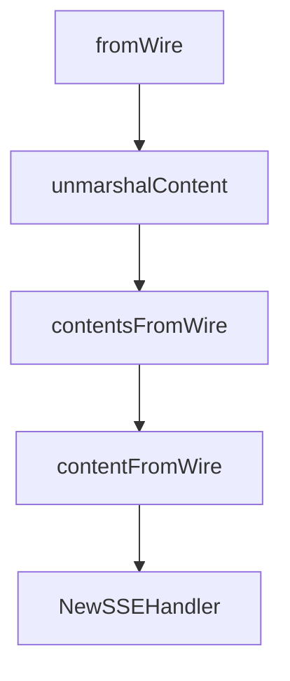

# Chapter 2: Client/Server Lifecycle and Session Management

Welcome to **Chapter 2: Client/Server Lifecycle and Session Management**. In this part of **MCP Go SDK Tutorial: Building Robust MCP Clients and Servers in Go**, you will build an intuitive mental model first, then move into concrete implementation details and practical production tradeoffs.


Session lifecycle discipline is the difference between stable and flaky MCP behavior.

## Learning Goals

- understand the `Client` and `Server` as logical multi-peer entities
- use `ClientSession` and `ServerSession` lifecycles correctly
- align initialization timing with feature handler readiness
- close and wait on sessions to prevent goroutine leaks

## Session Flow Highlights

- `Client.Connect` initializes the session and returns a `ClientSession`
- `Server.Connect` creates a `ServerSession`; initialization completes after client `initialized`
- requests should be gated until initialization is complete
- always call `Close` and, where relevant, `Wait` in shutdown paths

## Operational Checklist

1. connect server transport before connecting client in in-memory tests
2. instrument initialization handlers to verify negotiated capability state
3. ensure shutdown path handles both local close and peer disconnect
4. test reconnect behavior under transport interruptions

## Source References

- [Protocol Lifecycle](https://github.com/modelcontextprotocol/go-sdk/blob/main/docs/protocol.md#lifecycle)
- [mcp.Client](https://pkg.go.dev/github.com/modelcontextprotocol/go-sdk/mcp#Client)
- [mcp.Server](https://pkg.go.dev/github.com/modelcontextprotocol/go-sdk/mcp#Server)

## Summary

You now have lifecycle patterns that reduce race conditions and hanging sessions.

Next: [Chapter 3: Transports: stdio, Streamable HTTP, and Custom Flows](03-transports-stdio-streamable-http-and-custom-flows.md)

## Source Code Walkthrough

### `mcp/content.go`

The `fromWire` function in [`mcp/content.go`](https://github.com/modelcontextprotocol/go-sdk/blob/HEAD/mcp/content.go) handles a key part of this chapter's functionality:

```go
type Content interface {
	MarshalJSON() ([]byte, error)
	fromWire(*wireContent)
}

// TextContent is a textual content.
type TextContent struct {
	Text        string
	Meta        Meta
	Annotations *Annotations
}

func (c *TextContent) MarshalJSON() ([]byte, error) {
	// Custom wire format to ensure the required "text" field is always included, even when empty.
	wire := struct {
		Type        string       `json:"type"`
		Text        string       `json:"text"`
		Meta        Meta         `json:"_meta,omitempty"`
		Annotations *Annotations `json:"annotations,omitempty"`
	}{
		Type:        "text",
		Text:        c.Text,
		Meta:        c.Meta,
		Annotations: c.Annotations,
	}
	return json.Marshal(wire)
}

func (c *TextContent) fromWire(wire *wireContent) {
	c.Text = wire.Text
	c.Meta = wire.Meta
	c.Annotations = wire.Annotations
```

This function is important because it defines how MCP Go SDK Tutorial: Building Robust MCP Clients and Servers in Go implements the patterns covered in this chapter.

### `mcp/content.go`

The `unmarshalContent` function in [`mcp/content.go`](https://github.com/modelcontextprotocol/go-sdk/blob/HEAD/mcp/content.go) handles a key part of this chapter's functionality:

```go
}

// unmarshalContent unmarshals JSON that is either a single content object or
// an array of content objects. A single object is wrapped in a one-element slice.
func unmarshalContent(raw json.RawMessage, allow map[string]bool) ([]Content, error) {
	if len(raw) == 0 || string(raw) == "null" {
		return nil, fmt.Errorf("nil content")
	}
	// Try array first, then fall back to single object.
	var wires []*wireContent
	if err := internaljson.Unmarshal(raw, &wires); err == nil {
		return contentsFromWire(wires, allow)
	}
	var wire wireContent
	if err := internaljson.Unmarshal(raw, &wire); err != nil {
		return nil, err
	}
	c, err := contentFromWire(&wire, allow)
	if err != nil {
		return nil, err
	}
	return []Content{c}, nil
}

func contentsFromWire(wires []*wireContent, allow map[string]bool) ([]Content, error) {
	blocks := make([]Content, 0, len(wires))
	for _, wire := range wires {
		block, err := contentFromWire(wire, allow)
		if err != nil {
			return nil, err
		}
		blocks = append(blocks, block)
```

This function is important because it defines how MCP Go SDK Tutorial: Building Robust MCP Clients and Servers in Go implements the patterns covered in this chapter.

### `mcp/content.go`

The `contentsFromWire` function in [`mcp/content.go`](https://github.com/modelcontextprotocol/go-sdk/blob/HEAD/mcp/content.go) handles a key part of this chapter's functionality:

```go
	var wires []*wireContent
	if err := internaljson.Unmarshal(raw, &wires); err == nil {
		return contentsFromWire(wires, allow)
	}
	var wire wireContent
	if err := internaljson.Unmarshal(raw, &wire); err != nil {
		return nil, err
	}
	c, err := contentFromWire(&wire, allow)
	if err != nil {
		return nil, err
	}
	return []Content{c}, nil
}

func contentsFromWire(wires []*wireContent, allow map[string]bool) ([]Content, error) {
	blocks := make([]Content, 0, len(wires))
	for _, wire := range wires {
		block, err := contentFromWire(wire, allow)
		if err != nil {
			return nil, err
		}
		blocks = append(blocks, block)
	}
	return blocks, nil
}

func contentFromWire(wire *wireContent, allow map[string]bool) (Content, error) {
	if wire == nil {
		return nil, fmt.Errorf("nil content")
	}
	if allow != nil && !allow[wire.Type] {
```

This function is important because it defines how MCP Go SDK Tutorial: Building Robust MCP Clients and Servers in Go implements the patterns covered in this chapter.

### `mcp/content.go`

The `contentFromWire` function in [`mcp/content.go`](https://github.com/modelcontextprotocol/go-sdk/blob/HEAD/mcp/content.go) handles a key part of this chapter's functionality:

```go
	c.IsError = wire.IsError
	c.Meta = wire.Meta
	// Content is handled separately in contentFromWire due to nested content
}

// ResourceContents contains the contents of a specific resource or
// sub-resource.
type ResourceContents struct {
	URI      string `json:"uri"`
	MIMEType string `json:"mimeType,omitempty"`
	Text     string `json:"text,omitempty"`
	Blob     []byte `json:"blob,omitzero"`
	Meta     Meta   `json:"_meta,omitempty"`
}

// wireContent is the wire format for content.
// It represents the protocol types TextContent, ImageContent, AudioContent,
// ResourceLink, EmbeddedResource, ToolUseContent, and ToolResultContent.
// The Type field distinguishes them. In the protocol, each type has a constant
// value for the field.
type wireContent struct {
	Type              string            `json:"type"`
	Text              string            `json:"text,omitempty"`              // TextContent
	MIMEType          string            `json:"mimeType,omitempty"`          // ImageContent, AudioContent, ResourceLink
	Data              []byte            `json:"data,omitempty"`              // ImageContent, AudioContent
	Resource          *ResourceContents `json:"resource,omitempty"`          // EmbeddedResource
	URI               string            `json:"uri,omitempty"`               // ResourceLink
	Name              string            `json:"name,omitempty"`              // ResourceLink, ToolUseContent
	Title             string            `json:"title,omitempty"`             // ResourceLink
	Description       string            `json:"description,omitempty"`       // ResourceLink
	Size              *int64            `json:"size,omitempty"`              // ResourceLink
	Meta              Meta              `json:"_meta,omitempty"`             // all types
```

This function is important because it defines how MCP Go SDK Tutorial: Building Robust MCP Clients and Servers in Go implements the patterns covered in this chapter.


## How These Components Connect


