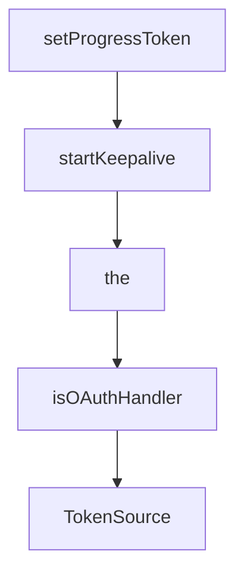

# Chapter 3: Transports: stdio, Streamable HTTP, and Custom Flows

Welcome to **Chapter 3: Transports: stdio, Streamable HTTP, and Custom Flows**. In this part of **MCP Go SDK Tutorial: Building Robust MCP Clients and Servers in Go**, you will build an intuitive mental model first, then move into concrete implementation details and practical production tradeoffs.


Transport selection should follow deployment shape and threat model, not convenience.

## Learning Goals

- choose stdio vs streamable HTTP deliberately
- handle resumability/redelivery and stateless mode tradeoffs
- understand custom transport extension points
- apply concurrency expectations when handling calls and notifications

## Transport Patterns

| Pattern | When to Use | Watchouts |
|:--------|:------------|:----------|
| `CommandTransport` + `StdioTransport` | local process orchestration | subprocess lifecycle + stdout purity |
| `StreamableHTTPHandler` + `StreamableClientTransport` | remote/shared deployments | session ID handling, origin checks, reconnection semantics |
| custom `Transport` | bespoke runtime channels | strict JSON-RPC framing and lifecycle compatibility |

## Streamable Notes

- resumability requires an event store (`EventStore`)
- stateless mode exists but cannot support server-initiated request/response semantics the same way as stateful sessions
- concurrency guarantees are limited; design handlers for async request overlap

## Source References

- [Protocol Transports](https://github.com/modelcontextprotocol/go-sdk/blob/main/docs/protocol.md#transports)
- [Streamable HTTP Example](https://github.com/modelcontextprotocol/go-sdk/blob/main/examples/http/README.md)
- [Custom Transport Example](https://github.com/modelcontextprotocol/go-sdk/tree/main/examples/server/custom-transport)

## Summary

You now have a transport strategy that is aligned with Go SDK behavior and operational constraints.

Next: [Chapter 4: Building Tools, Resources, and Prompts in Go](04-building-tools-resources-and-prompts-in-go.md)

## Depth Expansion Playbook

## Source Code Walkthrough

### `mcp/shared.go`

The `setProgressToken` function in [`mcp/shared.go`](https://github.com/modelcontextprotocol/go-sdk/blob/HEAD/mcp/shared.go) handles a key part of this chapter's functionality:

```go
}

func setProgressToken(p Params, pt any) {
	switch pt.(type) {
	// Support int32 and int64 for atomic.IntNN.
	case int, int32, int64, string:
	default:
		panic(fmt.Sprintf("progress token %v is of type %[1]T, not int or string", pt))
	}
	m := p.GetMeta()
	if m == nil {
		m = map[string]any{}
		p.SetMeta(m)
	}
	m[progressTokenKey] = pt
}

// A Request is a method request with parameters and additional information, such as the session.
// Request is implemented by [*ClientRequest] and [*ServerRequest].
type Request interface {
	isRequest()
	GetSession() Session
	GetParams() Params
	// GetExtra returns the Extra field for ServerRequests, and nil for ClientRequests.
	GetExtra() *RequestExtra
}

// A ClientRequest is a request to a client.
type ClientRequest[P Params] struct {
	Session *ClientSession
	Params  P
}
```

This function is important because it defines how MCP Go SDK Tutorial: Building Robust MCP Clients and Servers in Go implements the patterns covered in this chapter.

### `mcp/shared.go`

The `startKeepalive` function in [`mcp/shared.go`](https://github.com/modelcontextprotocol/go-sdk/blob/HEAD/mcp/shared.go) handles a key part of this chapter's functionality:

```go
}

// startKeepalive starts the keepalive mechanism for a session.
// It assigns the cancel function to the provided cancelPtr and starts a goroutine
// that sends ping messages at the specified interval.
func startKeepalive(session keepaliveSession, interval time.Duration, cancelPtr *context.CancelFunc) {
	ctx, cancel := context.WithCancel(context.Background())
	// Assign cancel function before starting goroutine to avoid race condition.
	// We cannot return it because the caller may need to cancel during the
	// window between goroutine scheduling and function return.
	*cancelPtr = cancel

	go func() {
		ticker := time.NewTicker(interval)
		defer ticker.Stop()

		for {
			select {
			case <-ctx.Done():
				return
			case <-ticker.C:
				pingCtx, pingCancel := context.WithTimeout(context.Background(), interval/2)
				err := session.Ping(pingCtx, nil)
				pingCancel()
				if err != nil {
					// Ping failed, close the session
					_ = session.Close()
					return
				}
			}
		}
	}()
```

This function is important because it defines how MCP Go SDK Tutorial: Building Robust MCP Clients and Servers in Go implements the patterns covered in this chapter.

### `mcp/shared.go`

The `the` interface in [`mcp/shared.go`](https://github.com/modelcontextprotocol/go-sdk/blob/HEAD/mcp/shared.go) handles a key part of this chapter's functionality:

```go
// Copyright 2025 The Go MCP SDK Authors. All rights reserved.
// Use of this source code is governed by an MIT-style
// license that can be found in the LICENSE file.

// This file contains code shared between client and server, including
// method handler and middleware definitions.
//
// Much of this is here so that we can factor out commonalities using
// generics. If this becomes unwieldy, it can perhaps be simplified with
// reflection.

package mcp

import (
	"context"
	"encoding/json"
	"fmt"
	"log/slog"
	"net/http"
	"reflect"
	"slices"
	"strings"
	"time"

	"github.com/modelcontextprotocol/go-sdk/auth"
	internaljson "github.com/modelcontextprotocol/go-sdk/internal/json"
	"github.com/modelcontextprotocol/go-sdk/internal/jsonrpc2"
	"github.com/modelcontextprotocol/go-sdk/jsonrpc"
)

const (
	// latestProtocolVersion is the latest protocol version that this version of
```

This interface is important because it defines how MCP Go SDK Tutorial: Building Robust MCP Clients and Servers in Go implements the patterns covered in this chapter.

### `auth/authorization_code.go`

The `isOAuthHandler` function in [`auth/authorization_code.go`](https://github.com/modelcontextprotocol/go-sdk/blob/HEAD/auth/authorization_code.go) handles a key part of this chapter's functionality:

```go
var _ OAuthHandler = (*AuthorizationCodeHandler)(nil)

func (h *AuthorizationCodeHandler) isOAuthHandler() {}

func (h *AuthorizationCodeHandler) TokenSource(ctx context.Context) (oauth2.TokenSource, error) {
	return h.tokenSource, nil
}

// NewAuthorizationCodeHandler creates a new AuthorizationCodeHandler.
// It performs validation of the configuration and returns an error if it is invalid.
// The passed config is consumed by the handler and should not be modified after.
func NewAuthorizationCodeHandler(config *AuthorizationCodeHandlerConfig) (*AuthorizationCodeHandler, error) {
	if config == nil {
		return nil, errors.New("config must be provided")
	}
	if config.ClientIDMetadataDocumentConfig == nil &&
		config.PreregisteredClientConfig == nil &&
		config.DynamicClientRegistrationConfig == nil {
		return nil, errors.New("at least one client registration configuration must be provided")
	}
	if config.AuthorizationCodeFetcher == nil {
		return nil, errors.New("AuthorizationCodeFetcher is required")
	}
	if config.ClientIDMetadataDocumentConfig != nil && !isNonRootHTTPSURL(config.ClientIDMetadataDocumentConfig.URL) {
		return nil, fmt.Errorf("client ID metadata document URL must be a non-root HTTPS URL")
	}
	preCfg := config.PreregisteredClientConfig
	if preCfg != nil {
		if preCfg.ClientSecretAuthConfig == nil {
			return nil, errors.New("ClientSecretAuthConfig is required for pre-registered client")
		}
		if preCfg.ClientSecretAuthConfig.ClientID == "" || preCfg.ClientSecretAuthConfig.ClientSecret == "" {
```

This function is important because it defines how MCP Go SDK Tutorial: Building Robust MCP Clients and Servers in Go implements the patterns covered in this chapter.


## How These Components Connect


