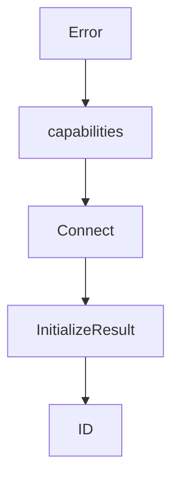

# Chapter 3: Transports: stdio, Streamable HTTP, and Custom Flows

Welcome to **Chapter 3: Transports: stdio, Streamable HTTP, and Custom Flows**. In this part of **MCP Go SDK Tutorial: Building Robust MCP Clients and Servers in Go**, you will build an intuitive mental model first, then move into concrete implementation details and practical production tradeoffs.


Transport selection should follow deployment shape and threat model, not convenience.

## Learning Goals

- choose stdio vs streamable HTTP deliberately
- handle resumability/redelivery and stateless mode tradeoffs
- understand custom transport extension points
- apply concurrency expectations when handling calls and notifications

## Transport Patterns

| Pattern | When to Use | Watchouts |
|:--------|:------------|:----------|
| `CommandTransport` + `StdioTransport` | local process orchestration | subprocess lifecycle + stdout purity |
| `StreamableHTTPHandler` + `StreamableClientTransport` | remote/shared deployments | session ID handling, origin checks, reconnection semantics |
| custom `Transport` | bespoke runtime channels | strict JSON-RPC framing and lifecycle compatibility |

## Streamable Notes

- resumability requires an event store (`EventStore`)
- stateless mode exists but cannot support server-initiated request/response semantics the same way as stateful sessions
- concurrency guarantees are limited; design handlers for async request overlap

## Source References

- [Protocol Transports](https://github.com/modelcontextprotocol/go-sdk/blob/main/docs/protocol.md#transports)
- [Streamable HTTP Example](https://github.com/modelcontextprotocol/go-sdk/blob/main/examples/http/README.md)
- [Custom Transport Example](https://github.com/modelcontextprotocol/go-sdk/tree/main/examples/server/custom-transport)

## Summary

You now have a transport strategy that is aligned with Go SDK behavior and operational constraints.

Next: [Chapter 4: Building Tools, Resources, and Prompts in Go](04-building-tools-resources-and-prompts-in-go.md)

## Source Code Walkthrough

### `mcp/client.go`

The `Error` function in [`mcp/client.go`](https://github.com/modelcontextprotocol/go-sdk/blob/HEAD/mcp/client.go) handles a key part of this chapter's functionality:

```go

// TODO: Consider exporting this type and its field.
type unsupportedProtocolVersionError struct {
	version string
}

func (e unsupportedProtocolVersionError) Error() string {
	return fmt.Sprintf("unsupported protocol version: %q", e.version)
}

// ClientSessionOptions is reserved for future use.
type ClientSessionOptions struct {
	// protocolVersion overrides the protocol version sent in the initialize
	// request, for testing. If empty, latestProtocolVersion is used.
	protocolVersion string
}

func (c *Client) capabilities(protocolVersion string) *ClientCapabilities {
	// Start with user-provided capabilities as defaults, or use SDK defaults.
	var caps *ClientCapabilities
	if c.opts.Capabilities != nil {
		// Deep copy the user-provided capabilities to avoid mutation.
		caps = c.opts.Capabilities.clone()
	} else {
		// SDK defaults: roots with listChanged.
		// (this was the default behavior at v1.0.0, and so cannot be changed)
		caps = &ClientCapabilities{
			RootsV2: &RootCapabilities{
				ListChanged: true,
			},
		}
	}
```

This function is important because it defines how MCP Go SDK Tutorial: Building Robust MCP Clients and Servers in Go implements the patterns covered in this chapter.

### `mcp/client.go`

The `capabilities` function in [`mcp/client.go`](https://github.com/modelcontextprotocol/go-sdk/blob/HEAD/mcp/client.go) handles a key part of this chapter's functionality:

```go
	// overrides the inferred capability.
	ElicitationHandler func(context.Context, *ElicitRequest) (*ElicitResult, error)
	// Capabilities optionally configures the client's default capabilities,
	// before any capabilities are inferred from other configuration.
	//
	// If Capabilities is nil, the default client capabilities are
	// {"roots":{"listChanged":true}}, for historical reasons. Setting
	// Capabilities to a non-nil value overrides this default. As a special case,
	// to work around #607, Capabilities.Roots is ignored: set
	// Capabilities.RootsV2 to configure the roots capability. This allows the
	// "roots" capability to be disabled entirely.
	//
	// For example:
	//   - To disable the "roots" capability, use &ClientCapabilities{}
	//   - To configure "roots", but disable "listChanged" notifications, use
	//     &ClientCapabilities{RootsV2:&RootCapabilities{}}.
	//
	// # Interaction with capability inference
	//
	// Sampling and elicitation capabilities are automatically added when their
	// corresponding handlers are set, with the default value described at
	// [ClientOptions.CreateMessageHandler] and
	// [ClientOptions.ElicitationHandler]. If the Sampling or Elicitation fields
	// are set in the Capabilities field, their values override the inferred
	// value.
	//
	// For example, to advertise sampling with tools and context support:
	//
	//	Capabilities: &ClientCapabilities{
	//	    Sampling: &SamplingCapabilities{
	//	        Tools:   &SamplingToolsCapabilities{},
	//	        Context: &SamplingContextCapabilities{},
```

This function is important because it defines how MCP Go SDK Tutorial: Building Robust MCP Clients and Servers in Go implements the patterns covered in this chapter.

### `mcp/client.go`

The `Connect` function in [`mcp/client.go`](https://github.com/modelcontextprotocol/go-sdk/blob/HEAD/mcp/client.go) handles a key part of this chapter's functionality:

```go

// A Client is an MCP client, which may be connected to an MCP server
// using the [Client.Connect] method.
type Client struct {
	impl                    *Implementation
	opts                    ClientOptions
	mu                      sync.Mutex
	roots                   *featureSet[*Root]
	sessions                []*ClientSession
	sendingMethodHandler_   MethodHandler
	receivingMethodHandler_ MethodHandler
}

// NewClient creates a new [Client].
//
// Use [Client.Connect] to connect it to an MCP server.
//
// The first argument must not be nil.
//
// If non-nil, the provided options configure the Client.
func NewClient(impl *Implementation, options *ClientOptions) *Client {
	if impl == nil {
		panic("nil Implementation")
	}
	var opts ClientOptions
	if options != nil {
		opts = *options
	}
	options = nil // prevent reuse

	if opts.CreateMessageHandler != nil && opts.CreateMessageWithToolsHandler != nil {
		panic("cannot set both CreateMessageHandler and CreateMessageWithToolsHandler; use CreateMessageWithToolsHandler for tool support, or CreateMessageHandler for basic sampling")
```

This function is important because it defines how MCP Go SDK Tutorial: Building Robust MCP Clients and Servers in Go implements the patterns covered in this chapter.

### `mcp/client.go`

The `InitializeResult` function in [`mcp/client.go`](https://github.com/modelcontextprotocol/go-sdk/blob/HEAD/mcp/client.go) handles a key part of this chapter's functionality:

```go
	}
	req := &InitializeRequest{Session: cs, Params: params}
	res, err := handleSend[*InitializeResult](ctx, methodInitialize, req)
	if err != nil {
		_ = cs.Close()
		return nil, err
	}
	if !slices.Contains(supportedProtocolVersions, res.ProtocolVersion) {
		return nil, unsupportedProtocolVersionError{res.ProtocolVersion}
	}
	cs.state.InitializeResult = res
	if hc, ok := cs.mcpConn.(clientConnection); ok {
		hc.sessionUpdated(cs.state)
	}
	req2 := &initializedClientRequest{Session: cs, Params: &InitializedParams{}}
	if err := handleNotify(ctx, notificationInitialized, req2); err != nil {
		_ = cs.Close()
		return nil, err
	}

	if c.opts.KeepAlive > 0 {
		cs.startKeepalive(c.opts.KeepAlive)
	}

	return cs, nil
}

// A ClientSession is a logical connection with an MCP server. Its
// methods can be used to send requests or notifications to the server. Create
// a session by calling [Client.Connect].
//
// Call [ClientSession.Close] to close the connection, or await server
```

This function is important because it defines how MCP Go SDK Tutorial: Building Robust MCP Clients and Servers in Go implements the patterns covered in this chapter.


## How These Components Connect


