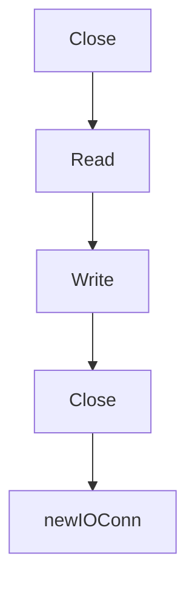

# Chapter 4: Building Tools, Resources, and Prompts in Go

Welcome to **Chapter 4: Building Tools, Resources, and Prompts in Go**. In this part of **MCP Go SDK Tutorial: Building Robust MCP Clients and Servers in Go**, you will build an intuitive mental model first, then move into concrete implementation details and practical production tradeoffs.


This chapter shows how to structure server capability handlers with stable contracts.

## Learning Goals

- add tools/resources/prompts with schema-aware handlers
- implement handler behavior that is easy for clients to reason about
- support list-changed notifications and pagination intentionally
- separate tool execution errors from protocol errors

## Server Capability Build Order

1. create `mcp.NewServer` with explicit implementation metadata
2. add one primitive at a time (`AddTool`, `AddResource`, `AddPrompt`)
3. validate input/output schemas at the handler boundary
4. add completion/logging handlers only when needed

## Handler Quality Rules

- keep tool names and descriptions unambiguous
- return structured output when possible
- ensure resource URI patterns are deterministic
- only advertise capabilities that are truly implemented

## Source References

- [Server Features](https://github.com/modelcontextprotocol/go-sdk/blob/main/docs/server.md)
- [Sequential Thinking Server Example](https://github.com/modelcontextprotocol/go-sdk/blob/main/examples/server/sequentialthinking/README.md)
- [pkg.go.dev - Server AddTool](https://pkg.go.dev/github.com/modelcontextprotocol/go-sdk/mcp#AddTool)

## Summary

You now have a repeatable way to build server primitives that stay understandable and robust under client load.

Next: [Chapter 5: Client Capabilities: Roots, Sampling, and Elicitation](05-client-capabilities-roots-sampling-and-elicitation.md)

## Depth Expansion Playbook

## Source Code Walkthrough

### `mcp/transport.go`

The `Close` function in [`mcp/transport.go`](https://github.com/modelcontextprotocol/go-sdk/blob/HEAD/mcp/transport.go) handles a key part of this chapter's functionality:

```go
)

// ErrConnectionClosed is returned when sending a message to a connection that
// is closed or in the process of closing.
var ErrConnectionClosed = errors.New("connection closed")

// ErrSessionMissing is returned when the session is known to not be present on
// the server.
var ErrSessionMissing = errors.New("session not found")

// A Transport is used to create a bidirectional connection between MCP client
// and server.
//
// Transports should be used for at most one call to [Server.Connect] or
// [Client.Connect].
type Transport interface {
	// Connect returns the logical JSON-RPC connection..
	//
	// It is called exactly once by [Server.Connect] or [Client.Connect].
	Connect(ctx context.Context) (Connection, error)
}

// A Connection is a logical bidirectional JSON-RPC connection.
type Connection interface {
	// Read reads the next message to process off the connection.
	//
	// Connections must allow Read to be called concurrently with Close. In
	// particular, calling Close should unblock a Read waiting for input.
	Read(context.Context) (jsonrpc.Message, error)

	// Write writes a new message to the connection.
	//
```

This function is important because it defines how MCP Go SDK Tutorial: Building Robust MCP Clients and Servers in Go implements the patterns covered in this chapter.

### `mcp/transport.go`

The `Read` function in [`mcp/transport.go`](https://github.com/modelcontextprotocol/go-sdk/blob/HEAD/mcp/transport.go) handles a key part of this chapter's functionality:

```go
// A Connection is a logical bidirectional JSON-RPC connection.
type Connection interface {
	// Read reads the next message to process off the connection.
	//
	// Connections must allow Read to be called concurrently with Close. In
	// particular, calling Close should unblock a Read waiting for input.
	Read(context.Context) (jsonrpc.Message, error)

	// Write writes a new message to the connection.
	//
	// Write may be called concurrently, as calls or responses may occur
	// concurrently in user code.
	Write(context.Context, jsonrpc.Message) error

	// Close closes the connection. It is implicitly called whenever a Read or
	// Write fails.
	//
	// Close may be called multiple times, potentially concurrently.
	Close() error

	// TODO(#148): remove SessionID from this interface.
	SessionID() string
}

// A ClientConnection is a [Connection] that is specific to the MCP client.
//
// If client connections implement this interface, they may receive information
// about changes to the client session.
//
// TODO: should this interface be exported?
type clientConnection interface {
	Connection
```

This function is important because it defines how MCP Go SDK Tutorial: Building Robust MCP Clients and Servers in Go implements the patterns covered in this chapter.

### `mcp/transport.go`

The `Write` function in [`mcp/transport.go`](https://github.com/modelcontextprotocol/go-sdk/blob/HEAD/mcp/transport.go) handles a key part of this chapter's functionality:

```go
	Read(context.Context) (jsonrpc.Message, error)

	// Write writes a new message to the connection.
	//
	// Write may be called concurrently, as calls or responses may occur
	// concurrently in user code.
	Write(context.Context, jsonrpc.Message) error

	// Close closes the connection. It is implicitly called whenever a Read or
	// Write fails.
	//
	// Close may be called multiple times, potentially concurrently.
	Close() error

	// TODO(#148): remove SessionID from this interface.
	SessionID() string
}

// A ClientConnection is a [Connection] that is specific to the MCP client.
//
// If client connections implement this interface, they may receive information
// about changes to the client session.
//
// TODO: should this interface be exported?
type clientConnection interface {
	Connection

	// sessionUpdated is called whenever the client session state changes.
	sessionUpdated(clientSessionState)
}

// A serverConnection is a Connection that is specific to the MCP server.
```

This function is important because it defines how MCP Go SDK Tutorial: Building Robust MCP Clients and Servers in Go implements the patterns covered in this chapter.

### `mcp/transport.go`

The `Close` function in [`mcp/transport.go`](https://github.com/modelcontextprotocol/go-sdk/blob/HEAD/mcp/transport.go) handles a key part of this chapter's functionality:

```go
)

// ErrConnectionClosed is returned when sending a message to a connection that
// is closed or in the process of closing.
var ErrConnectionClosed = errors.New("connection closed")

// ErrSessionMissing is returned when the session is known to not be present on
// the server.
var ErrSessionMissing = errors.New("session not found")

// A Transport is used to create a bidirectional connection between MCP client
// and server.
//
// Transports should be used for at most one call to [Server.Connect] or
// [Client.Connect].
type Transport interface {
	// Connect returns the logical JSON-RPC connection..
	//
	// It is called exactly once by [Server.Connect] or [Client.Connect].
	Connect(ctx context.Context) (Connection, error)
}

// A Connection is a logical bidirectional JSON-RPC connection.
type Connection interface {
	// Read reads the next message to process off the connection.
	//
	// Connections must allow Read to be called concurrently with Close. In
	// particular, calling Close should unblock a Read waiting for input.
	Read(context.Context) (jsonrpc.Message, error)

	// Write writes a new message to the connection.
	//
```

This function is important because it defines how MCP Go SDK Tutorial: Building Robust MCP Clients and Servers in Go implements the patterns covered in this chapter.


## How These Components Connect


