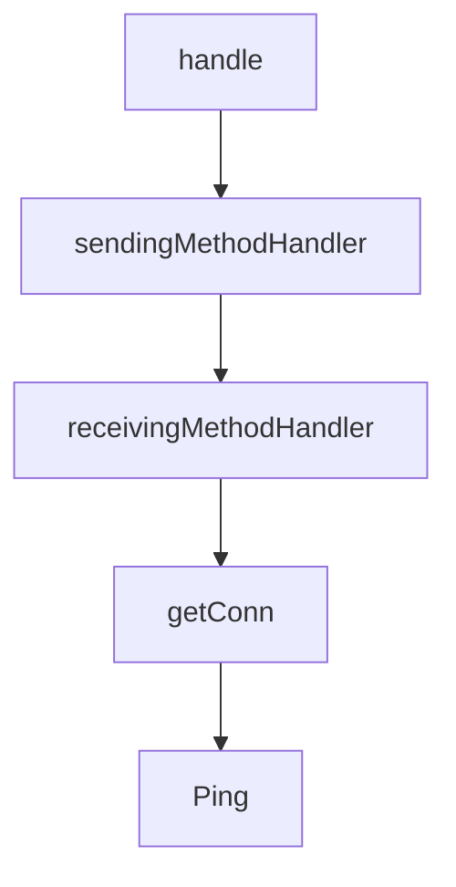

# Chapter 4: Building Tools, Resources, and Prompts in Go

Welcome to **Chapter 4: Building Tools, Resources, and Prompts in Go**. In this part of **MCP Go SDK Tutorial: Building Robust MCP Clients and Servers in Go**, you will build an intuitive mental model first, then move into concrete implementation details and practical production tradeoffs.


This chapter shows how to structure server capability handlers with stable contracts.

## Learning Goals

- add tools/resources/prompts with schema-aware handlers
- implement handler behavior that is easy for clients to reason about
- support list-changed notifications and pagination intentionally
- separate tool execution errors from protocol errors

## Server Capability Build Order

1. create `mcp.NewServer` with explicit implementation metadata
2. add one primitive at a time (`AddTool`, `AddResource`, `AddPrompt`)
3. validate input/output schemas at the handler boundary
4. add completion/logging handlers only when needed

## Handler Quality Rules

- keep tool names and descriptions unambiguous
- return structured output when possible
- ensure resource URI patterns are deterministic
- only advertise capabilities that are truly implemented

## Source References

- [Server Features](https://github.com/modelcontextprotocol/go-sdk/blob/main/docs/server.md)
- [Sequential Thinking Server Example](https://github.com/modelcontextprotocol/go-sdk/blob/main/examples/server/sequentialthinking/README.md)
- [pkg.go.dev - Server AddTool](https://pkg.go.dev/github.com/modelcontextprotocol/go-sdk/mcp#AddTool)

## Summary

You now have a repeatable way to build server primitives that stay understandable and robust under client load.

Next: [Chapter 5: Client Capabilities: Roots, Sampling, and Elicitation](05-client-capabilities-roots-sampling-and-elicitation.md)

## Source Code Walkthrough

### `mcp/client.go`

The `handle` function in [`mcp/client.go`](https://github.com/modelcontextprotocol/go-sdk/blob/HEAD/mcp/client.go) handles a key part of this chapter's functionality:

```go
	// Logger may be set to a non-nil value to enable logging of client activity.
	Logger *slog.Logger
	// CreateMessageHandler handles incoming requests for sampling/createMessage.
	//
	// Setting CreateMessageHandler to a non-nil value automatically causes the
	// client to advertise the sampling capability, with default value
	// &SamplingCapabilities{}. If [ClientOptions.Capabilities] is set and has a
	// non nil value for [ClientCapabilities.Sampling], that value overrides the
	// inferred capability.
	CreateMessageHandler func(context.Context, *CreateMessageRequest) (*CreateMessageResult, error)
	// CreateMessageWithToolsHandler handles incoming sampling/createMessage
	// requests that may involve tool use. It returns
	// [CreateMessageWithToolsResult], which supports array content for parallel
	// tool calls.
	//
	// Setting this handler causes the client to advertise the sampling
	// capability with tools support (sampling.tools). As with
	// [CreateMessageHandler], [ClientOptions.Capabilities].Sampling overrides
	// the inferred capability.
	//
	// It is a panic to set both CreateMessageHandler and
	// CreateMessageWithToolsHandler.
	CreateMessageWithToolsHandler func(context.Context, *CreateMessageWithToolsRequest) (*CreateMessageWithToolsResult, error)
	// ElicitationHandler handles incoming requests for elicitation/create.
	//
	// Setting ElicitationHandler to a non-nil value automatically causes the
	// client to advertise the elicitation capability, with default value
	// &ElicitationCapabilities{}. If [ClientOptions.Capabilities] is set and has
	// a non nil value for [ClientCapabilities.ELicitattion], that value
	// overrides the inferred capability.
	ElicitationHandler func(context.Context, *ElicitRequest) (*ElicitResult, error)
	// Capabilities optionally configures the client's default capabilities,
```

This function is important because it defines how MCP Go SDK Tutorial: Building Robust MCP Clients and Servers in Go implements the patterns covered in this chapter.

### `mcp/client.go`

The `sendingMethodHandler` function in [`mcp/client.go`](https://github.com/modelcontextprotocol/go-sdk/blob/HEAD/mcp/client.go) handles a key part of this chapter's functionality:

```go
	roots                   *featureSet[*Root]
	sessions                []*ClientSession
	sendingMethodHandler_   MethodHandler
	receivingMethodHandler_ MethodHandler
}

// NewClient creates a new [Client].
//
// Use [Client.Connect] to connect it to an MCP server.
//
// The first argument must not be nil.
//
// If non-nil, the provided options configure the Client.
func NewClient(impl *Implementation, options *ClientOptions) *Client {
	if impl == nil {
		panic("nil Implementation")
	}
	var opts ClientOptions
	if options != nil {
		opts = *options
	}
	options = nil // prevent reuse

	if opts.CreateMessageHandler != nil && opts.CreateMessageWithToolsHandler != nil {
		panic("cannot set both CreateMessageHandler and CreateMessageWithToolsHandler; use CreateMessageWithToolsHandler for tool support, or CreateMessageHandler for basic sampling")
	}
	if opts.Logger == nil { // ensure we have a logger
		opts.Logger = ensureLogger(nil)
	}

	return &Client{
		impl:                    impl,
```

This function is important because it defines how MCP Go SDK Tutorial: Building Robust MCP Clients and Servers in Go implements the patterns covered in this chapter.

### `mcp/client.go`

The `receivingMethodHandler` function in [`mcp/client.go`](https://github.com/modelcontextprotocol/go-sdk/blob/HEAD/mcp/client.go) handles a key part of this chapter's functionality:

```go
	sessions                []*ClientSession
	sendingMethodHandler_   MethodHandler
	receivingMethodHandler_ MethodHandler
}

// NewClient creates a new [Client].
//
// Use [Client.Connect] to connect it to an MCP server.
//
// The first argument must not be nil.
//
// If non-nil, the provided options configure the Client.
func NewClient(impl *Implementation, options *ClientOptions) *Client {
	if impl == nil {
		panic("nil Implementation")
	}
	var opts ClientOptions
	if options != nil {
		opts = *options
	}
	options = nil // prevent reuse

	if opts.CreateMessageHandler != nil && opts.CreateMessageWithToolsHandler != nil {
		panic("cannot set both CreateMessageHandler and CreateMessageWithToolsHandler; use CreateMessageWithToolsHandler for tool support, or CreateMessageHandler for basic sampling")
	}
	if opts.Logger == nil { // ensure we have a logger
		opts.Logger = ensureLogger(nil)
	}

	return &Client{
		impl:                    impl,
		opts:                    opts,
```

This function is important because it defines how MCP Go SDK Tutorial: Building Robust MCP Clients and Servers in Go implements the patterns covered in this chapter.

### `mcp/client.go`

The `getConn` function in [`mcp/client.go`](https://github.com/modelcontextprotocol/go-sdk/blob/HEAD/mcp/client.go) handles a key part of this chapter's functionality:

```go
}

// getConn implements [Session.getConn].
func (cs *ClientSession) getConn() *jsonrpc2.Connection { return cs.conn }

func (*ClientSession) ping(context.Context, *PingParams) (*emptyResult, error) {
	return &emptyResult{}, nil
}

// cancel is a placeholder: cancellation is handled the jsonrpc2 package.
//
// It should never be invoked in practice because cancellation is preempted,
// but having its signature here facilitates the construction of methodInfo
// that can be used to validate incoming cancellation notifications.
func (*ClientSession) cancel(context.Context, *CancelledParams) (Result, error) {
	return nil, nil
}

func newClientRequest[P Params](cs *ClientSession, params P) *ClientRequest[P] {
	return &ClientRequest[P]{Session: cs, Params: params}
}

// Ping makes an MCP "ping" request to the server.
func (cs *ClientSession) Ping(ctx context.Context, params *PingParams) error {
	_, err := handleSend[*emptyResult](ctx, methodPing, newClientRequest(cs, orZero[Params](params)))
	return err
}

// ListPrompts lists prompts that are currently available on the server.
func (cs *ClientSession) ListPrompts(ctx context.Context, params *ListPromptsParams) (*ListPromptsResult, error) {
	return handleSend[*ListPromptsResult](ctx, methodListPrompts, newClientRequest(cs, orZero[Params](params)))
}
```

This function is important because it defines how MCP Go SDK Tutorial: Building Robust MCP Clients and Servers in Go implements the patterns covered in this chapter.


## How These Components Connect


