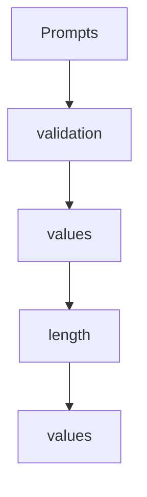

# Chapter 5: Client Capabilities: Roots, Sampling, and Elicitation

Welcome to **Chapter 5: Client Capabilities: Roots, Sampling, and Elicitation**. In this part of **MCP Go SDK Tutorial: Building Robust MCP Clients and Servers in Go**, you will build an intuitive mental model first, then move into concrete implementation details and practical production tradeoffs.


Client capability behavior should be explicit and policy-aware.

## Learning Goals

- configure roots and roots change notifications predictably
- implement sampling and elicitation handlers with strong controls
- manage inferred vs explicit capabilities in `ClientOptions`
- prevent accidental capability over-advertising

## Capability Strategy

- use `Client.AddRoots`/`RemoveRoots` for dynamic boundary updates
- wire `CreateMessageHandler` only when sampling behavior is governed
- wire `ElicitationHandler` and declare form/URL support explicitly
- override defaults by setting `ClientOptions.Capabilities` when needed

## Practical Guardrails

1. treat URL-mode elicitation as higher-risk than form mode
2. validate elicited content against requested schema before use
3. disable unnecessary default capabilities for minimal hosts
4. document capabilities for every deployment profile

## Source References

- [Client Features](https://github.com/modelcontextprotocol/go-sdk/blob/main/docs/client.md)
- [Protocol Security Section](https://github.com/modelcontextprotocol/go-sdk/blob/main/docs/protocol.md#security)
- [pkg.go.dev - ClientOptions](https://pkg.go.dev/github.com/modelcontextprotocol/go-sdk/mcp#ClientOptions)

## Summary

You now have a client capability model that keeps advanced features controlled and observable.

Next: [Chapter 6: Auth, Security, and Runtime Hardening](06-auth-security-and-runtime-hardening.md)

## Source Code Walkthrough

### `mcp/client.go`

The `Prompts` function in [`mcp/client.go`](https://github.com/modelcontextprotocol/go-sdk/blob/HEAD/mcp/client.go) handles a key part of this chapter's functionality:

```go
}

// ListPrompts lists prompts that are currently available on the server.
func (cs *ClientSession) ListPrompts(ctx context.Context, params *ListPromptsParams) (*ListPromptsResult, error) {
	return handleSend[*ListPromptsResult](ctx, methodListPrompts, newClientRequest(cs, orZero[Params](params)))
}

// GetPrompt gets a prompt from the server.
func (cs *ClientSession) GetPrompt(ctx context.Context, params *GetPromptParams) (*GetPromptResult, error) {
	return handleSend[*GetPromptResult](ctx, methodGetPrompt, newClientRequest(cs, orZero[Params](params)))
}

// ListTools lists tools that are currently available on the server.
func (cs *ClientSession) ListTools(ctx context.Context, params *ListToolsParams) (*ListToolsResult, error) {
	return handleSend[*ListToolsResult](ctx, methodListTools, newClientRequest(cs, orZero[Params](params)))
}

// CallTool calls the tool with the given parameters.
//
// The params.Arguments can be any value that marshals into a JSON object.
func (cs *ClientSession) CallTool(ctx context.Context, params *CallToolParams) (*CallToolResult, error) {
	if params == nil {
		params = new(CallToolParams)
	}
	if params.Arguments == nil {
		// Avoid sending nil over the wire.
		params.Arguments = map[string]any{}
	}
	return handleSend[*CallToolResult](ctx, methodCallTool, newClientRequest(cs, orZero[Params](params)))
}

func (cs *ClientSession) SetLoggingLevel(ctx context.Context, params *SetLoggingLevelParams) error {
```

This function is important because it defines how MCP Go SDK Tutorial: Building Robust MCP Clients and Servers in Go implements the patterns covered in this chapter.

### `mcp/client.go`

The `validation` interface in [`mcp/client.go`](https://github.com/modelcontextprotocol/go-sdk/blob/HEAD/mcp/client.go) handles a key part of this chapter's functionality:

```go
			return nil, &jsonrpc.Error{Code: jsonrpc.CodeInvalidParams, Message: "URL must be set for URL elicitation"}
		}
		// No schema validation for URL mode, just pass through to handler.
		return c.opts.ElicitationHandler(ctx, req)
	default:
		return nil, &jsonrpc.Error{Code: jsonrpc.CodeInvalidParams, Message: fmt.Sprintf("unsupported elicitation mode: %q", mode)}
	}
}

// validateElicitSchema validates that the schema conforms to MCP elicitation schema requirements.
// Per the MCP specification, elicitation schemas are limited to flat objects with primitive properties only.
func validateElicitSchema(wireSchema any) (*jsonschema.Schema, error) {
	if wireSchema == nil {
		return nil, nil // nil schema is allowed
	}

	var schema *jsonschema.Schema
	if err := remarshal(wireSchema, &schema); err != nil {
		return nil, err
	}
	if schema == nil {
		return nil, nil
	}

	// The root schema must be of type "object" if specified
	if schema.Type != "" && schema.Type != "object" {
		return nil, fmt.Errorf("elicit schema must be of type 'object', got %q", schema.Type)
	}

	// Check if the schema has properties
	if schema.Properties != nil {
		for propName, propSchema := range schema.Properties {
```

This interface is important because it defines how MCP Go SDK Tutorial: Building Robust MCP Clients and Servers in Go implements the patterns covered in this chapter.

### `mcp/client.go`

The `values` interface in [`mcp/client.go`](https://github.com/modelcontextprotocol/go-sdk/blob/HEAD/mcp/client.go) handles a key part of this chapter's functionality:

```go
	// [ClientOptions.CreateMessageHandler] and
	// [ClientOptions.ElicitationHandler]. If the Sampling or Elicitation fields
	// are set in the Capabilities field, their values override the inferred
	// value.
	//
	// For example, to advertise sampling with tools and context support:
	//
	//	Capabilities: &ClientCapabilities{
	//	    Sampling: &SamplingCapabilities{
	//	        Tools:   &SamplingToolsCapabilities{},
	//	        Context: &SamplingContextCapabilities{},
	//	    },
	//	}
	//
	// Or to configure elicitation modes:
	//
	//	Capabilities: &ClientCapabilities{
	//	    Elicitation: &ElicitationCapabilities{
	//	        Form: &FormElicitationCapabilities{},
	//	        URL:  &URLElicitationCapabilities{},
	//	    },
	//	}
	//
	// Conversely, if Capabilities does not set a field (for example, if the
	// Elicitation field is nil), the inferred capability will be used.
	Capabilities *ClientCapabilities
	// ElicitationCompleteHandler handles incoming notifications for notifications/elicitation/complete.
	ElicitationCompleteHandler func(context.Context, *ElicitationCompleteNotificationRequest)
	// Handlers for notifications from the server.
	ToolListChangedHandler      func(context.Context, *ToolListChangedRequest)
	PromptListChangedHandler    func(context.Context, *PromptListChangedRequest)
	ResourceListChangedHandler  func(context.Context, *ResourceListChangedRequest)
```

This interface is important because it defines how MCP Go SDK Tutorial: Building Robust MCP Clients and Servers in Go implements the patterns covered in this chapter.

### `mcp/client.go`

The `length` interface in [`mcp/client.go`](https://github.com/modelcontextprotocol/go-sdk/blob/HEAD/mcp/client.go) handles a key part of this chapter's functionality:

```go
		}
		// Enum values themselves are validated by the JSON schema library
		// Validate legacy enumNames if present - must match enum length.
		if propSchema.Extra != nil {
			if enumNamesRaw, exists := propSchema.Extra["enumNames"]; exists {
				// Type check enumNames - should be a slice
				if enumNamesSlice, ok := enumNamesRaw.([]any); ok {
					if len(enumNamesSlice) != len(propSchema.Enum) {
						return fmt.Errorf("elicit schema property %q has %d enum values but %d enumNames, they must match", propName, len(propSchema.Enum), len(enumNamesSlice))
					}
				} else {
					return fmt.Errorf("elicit schema property %q has invalid enumNames type, must be an array", propName)
				}
			}
		}
		return nil
	}
	// Handle new style of titled enums.
	if propSchema.OneOf != nil {
		for _, entry := range propSchema.OneOf {
			if err := validateTitledEnumEntry(entry); err != nil {
				return fmt.Errorf("elicit schema property %q oneOf has invalid entry: %v", propName, err)
			}
		}
		return nil
	}

	// Validate format if specified - only specific formats are allowed
	if propSchema.Format != "" {
		allowedFormats := map[string]bool{
			"email":     true,
			"uri":       true,
```

This interface is important because it defines how MCP Go SDK Tutorial: Building Robust MCP Clients and Servers in Go implements the patterns covered in this chapter.


## How These Components Connect


