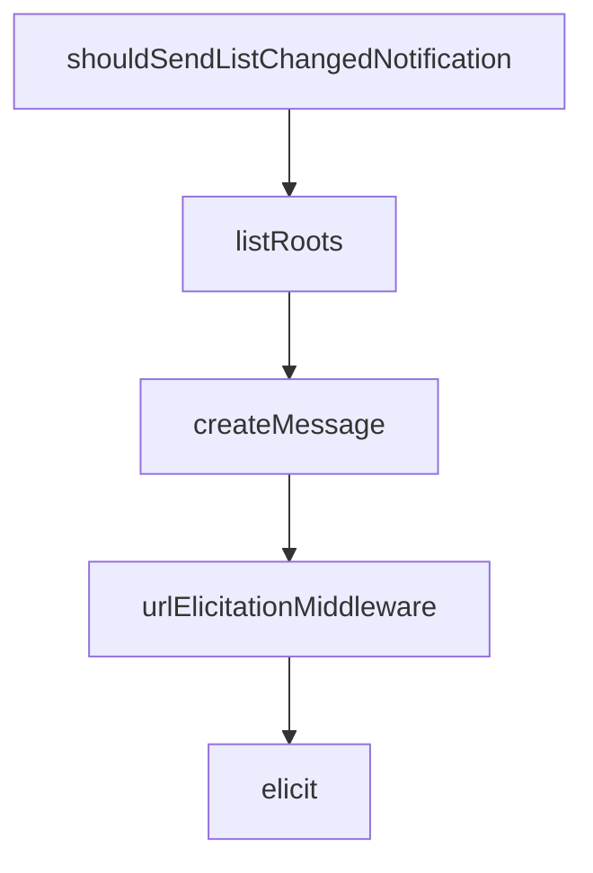

# Chapter 5: Client Capabilities: Roots, Sampling, and Elicitation

Welcome to **Chapter 5: Client Capabilities: Roots, Sampling, and Elicitation**. In this part of **MCP Go SDK Tutorial: Building Robust MCP Clients and Servers in Go**, you will build an intuitive mental model first, then move into concrete implementation details and practical production tradeoffs.


Client capability behavior should be explicit and policy-aware.

## Learning Goals

- configure roots and roots change notifications predictably
- implement sampling and elicitation handlers with strong controls
- manage inferred vs explicit capabilities in `ClientOptions`
- prevent accidental capability over-advertising

## Capability Strategy

- use `Client.AddRoots`/`RemoveRoots` for dynamic boundary updates
- wire `CreateMessageHandler` only when sampling behavior is governed
- wire `ElicitationHandler` and declare form/URL support explicitly
- override defaults by setting `ClientOptions.Capabilities` when needed

## Practical Guardrails

1. treat URL-mode elicitation as higher-risk than form mode
2. validate elicited content against requested schema before use
3. disable unnecessary default capabilities for minimal hosts
4. document capabilities for every deployment profile

## Source References

- [Client Features](https://github.com/modelcontextprotocol/go-sdk/blob/main/docs/client.md)
- [Protocol Security Section](https://github.com/modelcontextprotocol/go-sdk/blob/main/docs/protocol.md#security)
- [pkg.go.dev - ClientOptions](https://pkg.go.dev/github.com/modelcontextprotocol/go-sdk/mcp#ClientOptions)

## Summary

You now have a client capability model that keeps advanced features controlled and observable.

Next: [Chapter 6: Auth, Security, and Runtime Hardening](06-auth-security-and-runtime-hardening.md)

## Depth Expansion Playbook

## Source Code Walkthrough

### `mcp/client.go`

The `shouldSendListChangedNotification` function in [`mcp/client.go`](https://github.com/modelcontextprotocol/go-sdk/blob/HEAD/mcp/client.go) handles a key part of this chapter's functionality:

```go
	if change() {
		// Check if listChanged is enabled for this notification type.
		if c.shouldSendListChangedNotification(notification) {
			sessions = slices.Clone(c.sessions)
		}
	}
	c.mu.Unlock()
	notifySessions(sessions, notification, params, c.opts.Logger)
}

// shouldSendListChangedNotification checks if the client's capabilities allow
// sending the given list-changed notification.
func (c *Client) shouldSendListChangedNotification(notification string) bool {
	// Get effective capabilities (considering user-provided defaults).
	caps := c.opts.Capabilities

	switch notification {
	case notificationRootsListChanged:
		// If user didn't specify capabilities, default behavior sends notifications.
		if caps == nil {
			return true
		}
		// Check RootsV2 first (preferred), then fall back to Roots.
		if caps.RootsV2 != nil {
			return caps.RootsV2.ListChanged
		}
		return caps.Roots.ListChanged
	default:
		// Unknown notification, allow by default.
		return true
	}
}
```

This function is important because it defines how MCP Go SDK Tutorial: Building Robust MCP Clients and Servers in Go implements the patterns covered in this chapter.

### `mcp/client.go`

The `listRoots` function in [`mcp/client.go`](https://github.com/modelcontextprotocol/go-sdk/blob/HEAD/mcp/client.go) handles a key part of this chapter's functionality:

```go
}

func (c *Client) listRoots(_ context.Context, req *ListRootsRequest) (*ListRootsResult, error) {
	c.mu.Lock()
	defer c.mu.Unlock()
	roots := slices.Collect(c.roots.all())
	if roots == nil {
		roots = []*Root{} // avoid JSON null
	}
	return &ListRootsResult{
		Roots: roots,
	}, nil
}

func (c *Client) createMessage(ctx context.Context, req *CreateMessageWithToolsRequest) (*CreateMessageWithToolsResult, error) {
	if c.opts.CreateMessageWithToolsHandler != nil {
		return c.opts.CreateMessageWithToolsHandler(ctx, req)
	}
	if c.opts.CreateMessageHandler != nil {
		// Downconvert the request for the basic handler.
		baseParams, err := req.Params.toBase()
		if err != nil {
			return nil, err
		}
		baseReq := &CreateMessageRequest{
			Session: req.Session,
			Params:  baseParams,
		}
		res, err := c.opts.CreateMessageHandler(ctx, baseReq)
		if err != nil {
			return nil, err
		}
```

This function is important because it defines how MCP Go SDK Tutorial: Building Robust MCP Clients and Servers in Go implements the patterns covered in this chapter.

### `mcp/client.go`

The `createMessage` function in [`mcp/client.go`](https://github.com/modelcontextprotocol/go-sdk/blob/HEAD/mcp/client.go) handles a key part of this chapter's functionality:

```go
	// Logger may be set to a non-nil value to enable logging of client activity.
	Logger *slog.Logger
	// CreateMessageHandler handles incoming requests for sampling/createMessage.
	//
	// Setting CreateMessageHandler to a non-nil value automatically causes the
	// client to advertise the sampling capability, with default value
	// &SamplingCapabilities{}. If [ClientOptions.Capabilities] is set and has a
	// non nil value for [ClientCapabilities.Sampling], that value overrides the
	// inferred capability.
	CreateMessageHandler func(context.Context, *CreateMessageRequest) (*CreateMessageResult, error)
	// CreateMessageWithToolsHandler handles incoming sampling/createMessage
	// requests that may involve tool use. It returns
	// [CreateMessageWithToolsResult], which supports array content for parallel
	// tool calls.
	//
	// Setting this handler causes the client to advertise the sampling
	// capability with tools support (sampling.tools). As with
	// [CreateMessageHandler], [ClientOptions.Capabilities].Sampling overrides
	// the inferred capability.
	//
	// It is a panic to set both CreateMessageHandler and
	// CreateMessageWithToolsHandler.
	CreateMessageWithToolsHandler func(context.Context, *CreateMessageWithToolsRequest) (*CreateMessageWithToolsResult, error)
	// ElicitationHandler handles incoming requests for elicitation/create.
	//
	// Setting ElicitationHandler to a non-nil value automatically causes the
	// client to advertise the elicitation capability, with default value
	// &ElicitationCapabilities{}. If [ClientOptions.Capabilities] is set and has
	// a non nil value for [ClientCapabilities.ELicitattion], that value
	// overrides the inferred capability.
	ElicitationHandler func(context.Context, *ElicitRequest) (*ElicitResult, error)
	// Capabilities optionally configures the client's default capabilities,
```

This function is important because it defines how MCP Go SDK Tutorial: Building Robust MCP Clients and Servers in Go implements the patterns covered in this chapter.

### `mcp/client.go`

The `urlElicitationMiddleware` function in [`mcp/client.go`](https://github.com/modelcontextprotocol/go-sdk/blob/HEAD/mcp/client.go) handles a key part of this chapter's functionality:

```go
}

// urlElicitationMiddleware returns middleware that automatically handles URL elicitation
// required errors by executing the elicitation handler, waiting for completion notifications,
// and retrying the operation.
//
// This middleware should be added to clients that want automatic URL elicitation handling:
//
//	client := mcp.NewClient(impl, opts)
//	client.AddSendingMiddleware(mcp.urlElicitationMiddleware())
//
// TODO(rfindley): this isn't strictly necessary for the SEP, but may be
// useful. Propose exporting it.
func urlElicitationMiddleware() Middleware {
	return func(next MethodHandler) MethodHandler {
		return func(ctx context.Context, method string, req Request) (Result, error) {
			// Call the underlying handler.
			res, err := next(ctx, method, req)
			if err == nil {
				return res, nil
			}

			// Check if this is a URL elicitation required error.
			var rpcErr *jsonrpc.Error
			if !errors.As(err, &rpcErr) || rpcErr.Code != CodeURLElicitationRequired {
				return res, err
			}

			// Notifications don't support retries.
			if strings.HasPrefix(method, "notifications/") {
				return res, err
			}
```

This function is important because it defines how MCP Go SDK Tutorial: Building Robust MCP Clients and Servers in Go implements the patterns covered in this chapter.


## How These Components Connect


