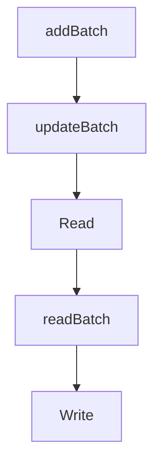

# Chapter 6: Auth, Security, and Runtime Hardening

Welcome to **Chapter 6: Auth, Security, and Runtime Hardening**. In this part of **MCP Go SDK Tutorial: Building Robust MCP Clients and Servers in Go**, you will build an intuitive mental model first, then move into concrete implementation details and practical production tradeoffs.


This chapter turns Go SDK auth features into a production hardening baseline.

## Learning Goals

- apply bearer-token enforcement middleware to streamable HTTP endpoints
- expose OAuth protected resource metadata correctly
- manage session and request verification defensively
- align runtime controls with MCP security best practices

## Hardening Baseline

| Control | Go SDK Path |
|:--------|:------------|
| bearer token verification | `auth.RequireBearerToken` |
| protected resource metadata endpoint | `auth.ProtectedResourceMetadataHandler` |
| token context propagation | `auth.TokenInfoFromContext` and request extras |
| session defense | secure IDs + inbound request verification |

## Deployment Checklist

- enforce auth on all MCP HTTP endpoints except explicit public metadata routes
- configure CORS intentionally for metadata and MCP endpoints
- validate scopes for tool categories with different blast radius
- log authentication failures with actionable context

## Source References

- [Protocol Authorization](https://github.com/modelcontextprotocol/go-sdk/blob/main/docs/protocol.md#authorization)
- [Auth Middleware Example](https://github.com/modelcontextprotocol/go-sdk/blob/main/examples/server/auth-middleware/README.md)
- [Security Policy](https://github.com/modelcontextprotocol/go-sdk/blob/main/SECURITY.md)

## Summary

You now have an implementation-level auth and security baseline for Go MCP deployments.

Next: [Chapter 7: Testing, Troubleshooting, and Rough Edges](07-testing-troubleshooting-and-rough-edges.md)

## Source Code Walkthrough

### `mcp/transport.go`

The `addBatch` function in [`mcp/transport.go`](https://github.com/modelcontextprotocol/go-sdk/blob/HEAD/mcp/transport.go) handles a key part of this chapter's functionality:

```go
}

// addBatch records a msgBatch for an incoming batch payload.
// It returns an error if batch is malformed, containing previously seen IDs.
//
// See [msgBatch] for more.
func (t *ioConn) addBatch(batch *msgBatch) error {
	t.batchMu.Lock()
	defer t.batchMu.Unlock()
	for id := range batch.unresolved {
		if _, ok := t.batches[id]; ok {
			return fmt.Errorf("%w: batch contains previously seen request %v", jsonrpc2.ErrInvalidRequest, id.Raw())
		}
	}
	for id := range batch.unresolved {
		if t.batches == nil {
			t.batches = make(map[jsonrpc2.ID]*msgBatch)
		}
		t.batches[id] = batch
	}
	return nil
}

// updateBatch records a response in the message batch tracking the
// corresponding incoming call, if any.
//
// The second result reports whether resp was part of a batch. If this is true,
// the first result is nil if the batch is still incomplete, or the full set of
// batch responses if resp completed the batch.
func (t *ioConn) updateBatch(resp *jsonrpc.Response) ([]*jsonrpc.Response, bool) {
	t.batchMu.Lock()
	defer t.batchMu.Unlock()
```

This function is important because it defines how MCP Go SDK Tutorial: Building Robust MCP Clients and Servers in Go implements the patterns covered in this chapter.

### `mcp/transport.go`

The `updateBatch` function in [`mcp/transport.go`](https://github.com/modelcontextprotocol/go-sdk/blob/HEAD/mcp/transport.go) handles a key part of this chapter's functionality:

```go
}

// updateBatch records a response in the message batch tracking the
// corresponding incoming call, if any.
//
// The second result reports whether resp was part of a batch. If this is true,
// the first result is nil if the batch is still incomplete, or the full set of
// batch responses if resp completed the batch.
func (t *ioConn) updateBatch(resp *jsonrpc.Response) ([]*jsonrpc.Response, bool) {
	t.batchMu.Lock()
	defer t.batchMu.Unlock()

	if batch, ok := t.batches[resp.ID]; ok {
		idx, ok := batch.unresolved[resp.ID]
		if !ok {
			panic("internal error: inconsistent batches")
		}
		batch.responses[idx] = resp
		delete(batch.unresolved, resp.ID)
		delete(t.batches, resp.ID)
		if len(batch.unresolved) == 0 {
			return batch.responses, true
		}
		return nil, true
	}
	return nil, false
}

// A msgBatch records information about an incoming batch of jsonrpc.2 calls.
//
// The jsonrpc.2 spec (https://www.jsonrpc.org/specification#batch) says:
//
```

This function is important because it defines how MCP Go SDK Tutorial: Building Robust MCP Clients and Servers in Go implements the patterns covered in this chapter.

### `mcp/transport.go`

The `Read` function in [`mcp/transport.go`](https://github.com/modelcontextprotocol/go-sdk/blob/HEAD/mcp/transport.go) handles a key part of this chapter's functionality:

```go
// A Connection is a logical bidirectional JSON-RPC connection.
type Connection interface {
	// Read reads the next message to process off the connection.
	//
	// Connections must allow Read to be called concurrently with Close. In
	// particular, calling Close should unblock a Read waiting for input.
	Read(context.Context) (jsonrpc.Message, error)

	// Write writes a new message to the connection.
	//
	// Write may be called concurrently, as calls or responses may occur
	// concurrently in user code.
	Write(context.Context, jsonrpc.Message) error

	// Close closes the connection. It is implicitly called whenever a Read or
	// Write fails.
	//
	// Close may be called multiple times, potentially concurrently.
	Close() error

	// TODO(#148): remove SessionID from this interface.
	SessionID() string
}

// A ClientConnection is a [Connection] that is specific to the MCP client.
//
// If client connections implement this interface, they may receive information
// about changes to the client session.
//
// TODO: should this interface be exported?
type clientConnection interface {
	Connection
```

This function is important because it defines how MCP Go SDK Tutorial: Building Robust MCP Clients and Servers in Go implements the patterns covered in this chapter.

### `mcp/transport.go`

The `readBatch` function in [`mcp/transport.go`](https://github.com/modelcontextprotocol/go-sdk/blob/HEAD/mcp/transport.go) handles a key part of this chapter's functionality:

```go
	}

	msgs, batch, err := readBatch(raw)
	if err != nil {
		return nil, err
	}
	var protocolVersion string
	t.sessionMu.Lock()
	protocolVersion = t.protocolVersion
	t.sessionMu.Unlock()
	if batch && protocolVersion >= protocolVersion20250618 {
		return nil, fmt.Errorf("JSON-RPC batching is not supported in %s and later (request version: %s)", protocolVersion20250618, protocolVersion)
	}

	t.queue = msgs[1:]

	if batch {
		var respBatch *msgBatch // track incoming requests in the batch
		for _, msg := range msgs {
			if req, ok := msg.(*jsonrpc.Request); ok {
				if respBatch == nil {
					respBatch = &msgBatch{
						unresolved: make(map[jsonrpc2.ID]int),
					}
				}
				if _, ok := respBatch.unresolved[req.ID]; ok {
					return nil, fmt.Errorf("duplicate message ID %q", req.ID)
				}
				respBatch.unresolved[req.ID] = len(respBatch.responses)
				respBatch.responses = append(respBatch.responses, nil)
			}
		}
```

This function is important because it defines how MCP Go SDK Tutorial: Building Robust MCP Clients and Servers in Go implements the patterns covered in this chapter.


## How These Components Connect


