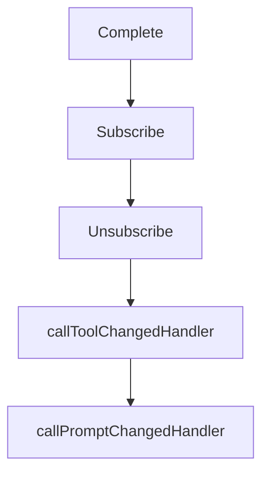

# Chapter 6: Auth, Security, and Runtime Hardening

Welcome to **Chapter 6: Auth, Security, and Runtime Hardening**. In this part of **MCP Go SDK Tutorial: Building Robust MCP Clients and Servers in Go**, you will build an intuitive mental model first, then move into concrete implementation details and practical production tradeoffs.


This chapter turns Go SDK auth features into a production hardening baseline.

## Learning Goals

- apply bearer-token enforcement middleware to streamable HTTP endpoints
- expose OAuth protected resource metadata correctly
- manage session and request verification defensively
- align runtime controls with MCP security best practices

## Hardening Baseline

| Control | Go SDK Path |
|:--------|:------------|
| bearer token verification | `auth.RequireBearerToken` |
| protected resource metadata endpoint | `auth.ProtectedResourceMetadataHandler` |
| token context propagation | `auth.TokenInfoFromContext` and request extras |
| session defense | secure IDs + inbound request verification |

## Deployment Checklist

- enforce auth on all MCP HTTP endpoints except explicit public metadata routes
- configure CORS intentionally for metadata and MCP endpoints
- validate scopes for tool categories with different blast radius
- log authentication failures with actionable context

## Source References

- [Protocol Authorization](https://github.com/modelcontextprotocol/go-sdk/blob/main/docs/protocol.md#authorization)
- [Auth Middleware Example](https://github.com/modelcontextprotocol/go-sdk/blob/main/examples/server/auth-middleware/README.md)
- [Security Policy](https://github.com/modelcontextprotocol/go-sdk/blob/main/SECURITY.md)

## Summary

You now have an implementation-level auth and security baseline for Go MCP deployments.

Next: [Chapter 7: Testing, Troubleshooting, and Rough Edges](07-testing-troubleshooting-and-rough-edges.md)

## Depth Expansion Playbook

## Source Code Walkthrough

### `mcp/client.go`

The `Complete` function in [`mcp/client.go`](https://github.com/modelcontextprotocol/go-sdk/blob/HEAD/mcp/client.go) handles a key part of this chapter's functionality:

```go
	// Elicitation field is nil), the inferred capability will be used.
	Capabilities *ClientCapabilities
	// ElicitationCompleteHandler handles incoming notifications for notifications/elicitation/complete.
	ElicitationCompleteHandler func(context.Context, *ElicitationCompleteNotificationRequest)
	// Handlers for notifications from the server.
	ToolListChangedHandler      func(context.Context, *ToolListChangedRequest)
	PromptListChangedHandler    func(context.Context, *PromptListChangedRequest)
	ResourceListChangedHandler  func(context.Context, *ResourceListChangedRequest)
	ResourceUpdatedHandler      func(context.Context, *ResourceUpdatedNotificationRequest)
	LoggingMessageHandler       func(context.Context, *LoggingMessageRequest)
	ProgressNotificationHandler func(context.Context, *ProgressNotificationClientRequest)
	// If non-zero, defines an interval for regular "ping" requests.
	// If the peer fails to respond to pings originating from the keepalive check,
	// the session is automatically closed.
	KeepAlive time.Duration
}

// bind implements the binder[*ClientSession] interface, so that Clients can
// be connected using [connect].
func (c *Client) bind(mcpConn Connection, conn *jsonrpc2.Connection, state *clientSessionState, onClose func()) *ClientSession {
	assert(mcpConn != nil && conn != nil, "nil connection")
	cs := &ClientSession{conn: conn, mcpConn: mcpConn, client: c, onClose: onClose}
	if state != nil {
		cs.state = *state
	}
	c.mu.Lock()
	defer c.mu.Unlock()
	c.sessions = append(c.sessions, cs)
	return cs
}

// disconnect implements the binder[*Client] interface, so that
```

This function is important because it defines how MCP Go SDK Tutorial: Building Robust MCP Clients and Servers in Go implements the patterns covered in this chapter.

### `mcp/client.go`

The `Subscribe` function in [`mcp/client.go`](https://github.com/modelcontextprotocol/go-sdk/blob/HEAD/mcp/client.go) handles a key part of this chapter's functionality:

```go
}

// Subscribe sends a "resources/subscribe" request to the server, asking for
// notifications when the specified resource changes.
func (cs *ClientSession) Subscribe(ctx context.Context, params *SubscribeParams) error {
	_, err := handleSend[*emptyResult](ctx, methodSubscribe, newClientRequest(cs, orZero[Params](params)))
	return err
}

// Unsubscribe sends a "resources/unsubscribe" request to the server, cancelling
// a previous subscription.
func (cs *ClientSession) Unsubscribe(ctx context.Context, params *UnsubscribeParams) error {
	_, err := handleSend[*emptyResult](ctx, methodUnsubscribe, newClientRequest(cs, orZero[Params](params)))
	return err
}

func (c *Client) callToolChangedHandler(ctx context.Context, req *ToolListChangedRequest) (Result, error) {
	if h := c.opts.ToolListChangedHandler; h != nil {
		h(ctx, req)
	}
	return nil, nil
}

func (c *Client) callPromptChangedHandler(ctx context.Context, req *PromptListChangedRequest) (Result, error) {
	if h := c.opts.PromptListChangedHandler; h != nil {
		h(ctx, req)
	}
	return nil, nil
}

func (c *Client) callResourceChangedHandler(ctx context.Context, req *ResourceListChangedRequest) (Result, error) {
	if h := c.opts.ResourceListChangedHandler; h != nil {
```

This function is important because it defines how MCP Go SDK Tutorial: Building Robust MCP Clients and Servers in Go implements the patterns covered in this chapter.

### `mcp/client.go`

The `Unsubscribe` function in [`mcp/client.go`](https://github.com/modelcontextprotocol/go-sdk/blob/HEAD/mcp/client.go) handles a key part of this chapter's functionality:

```go
}

// Unsubscribe sends a "resources/unsubscribe" request to the server, cancelling
// a previous subscription.
func (cs *ClientSession) Unsubscribe(ctx context.Context, params *UnsubscribeParams) error {
	_, err := handleSend[*emptyResult](ctx, methodUnsubscribe, newClientRequest(cs, orZero[Params](params)))
	return err
}

func (c *Client) callToolChangedHandler(ctx context.Context, req *ToolListChangedRequest) (Result, error) {
	if h := c.opts.ToolListChangedHandler; h != nil {
		h(ctx, req)
	}
	return nil, nil
}

func (c *Client) callPromptChangedHandler(ctx context.Context, req *PromptListChangedRequest) (Result, error) {
	if h := c.opts.PromptListChangedHandler; h != nil {
		h(ctx, req)
	}
	return nil, nil
}

func (c *Client) callResourceChangedHandler(ctx context.Context, req *ResourceListChangedRequest) (Result, error) {
	if h := c.opts.ResourceListChangedHandler; h != nil {
		h(ctx, req)
	}
	return nil, nil
}

func (c *Client) callResourceUpdatedHandler(ctx context.Context, req *ResourceUpdatedNotificationRequest) (Result, error) {
	if h := c.opts.ResourceUpdatedHandler; h != nil {
```

This function is important because it defines how MCP Go SDK Tutorial: Building Robust MCP Clients and Servers in Go implements the patterns covered in this chapter.

### `mcp/client.go`

The `callToolChangedHandler` function in [`mcp/client.go`](https://github.com/modelcontextprotocol/go-sdk/blob/HEAD/mcp/client.go) handles a key part of this chapter's functionality:

```go
	methodElicit:                    newClientMethodInfo(clientMethod((*Client).elicit), missingParamsOK),
	notificationCancelled:           newClientMethodInfo(clientSessionMethod((*ClientSession).cancel), notification|missingParamsOK),
	notificationToolListChanged:     newClientMethodInfo(clientMethod((*Client).callToolChangedHandler), notification|missingParamsOK),
	notificationPromptListChanged:   newClientMethodInfo(clientMethod((*Client).callPromptChangedHandler), notification|missingParamsOK),
	notificationResourceListChanged: newClientMethodInfo(clientMethod((*Client).callResourceChangedHandler), notification|missingParamsOK),
	notificationResourceUpdated:     newClientMethodInfo(clientMethod((*Client).callResourceUpdatedHandler), notification|missingParamsOK),
	notificationLoggingMessage:      newClientMethodInfo(clientMethod((*Client).callLoggingHandler), notification),
	notificationProgress:            newClientMethodInfo(clientSessionMethod((*ClientSession).callProgressNotificationHandler), notification),
	notificationElicitationComplete: newClientMethodInfo(clientMethod((*Client).callElicitationCompleteHandler), notification|missingParamsOK),
}

func (cs *ClientSession) sendingMethodInfos() map[string]methodInfo {
	return serverMethodInfos
}

func (cs *ClientSession) receivingMethodInfos() map[string]methodInfo {
	return clientMethodInfos
}

func (cs *ClientSession) handle(ctx context.Context, req *jsonrpc.Request) (any, error) {
	if req.IsCall() {
		jsonrpc2.Async(ctx)
	}
	return handleReceive(ctx, cs, req)
}

func (cs *ClientSession) sendingMethodHandler() MethodHandler {
	cs.client.mu.Lock()
	defer cs.client.mu.Unlock()
	return cs.client.sendingMethodHandler_
}

```

This function is important because it defines how MCP Go SDK Tutorial: Building Robust MCP Clients and Servers in Go implements the patterns covered in this chapter.


## How These Components Connect


