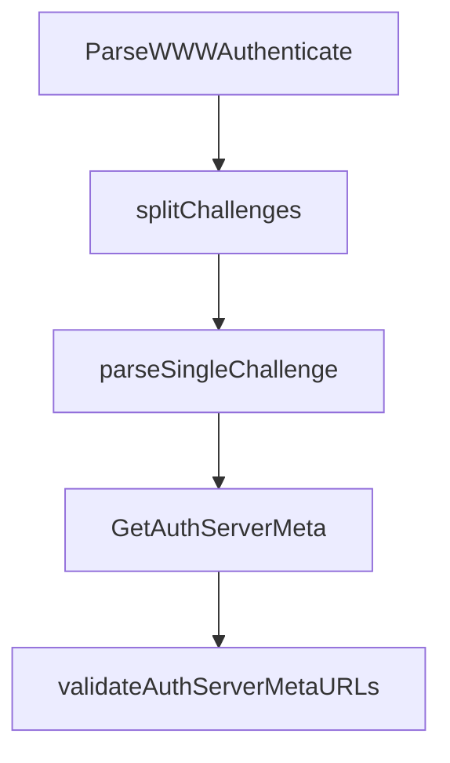

# Chapter 7: Testing, Troubleshooting, and Rough Edges

Welcome to **Chapter 7: Testing, Troubleshooting, and Rough Edges**. In this part of **MCP Go SDK Tutorial: Building Robust MCP Clients and Servers in Go**, you will build an intuitive mental model first, then move into concrete implementation details and practical production tradeoffs.


Operational quality improves when teams treat debugging and known limitations as first-class concerns.

## Learning Goals

- build a practical troubleshooting loop for MCP transport and handler issues
- use inspector and HTTP traffic inspection effectively
- account for known v1 rough edges in API usage
- reduce recurring production support incidents

## Troubleshooting Workflow

1. reproduce against a minimal example transport path
2. inspect MCP wire logs and HTTP traces
3. validate capability advertisement vs actual handlers
4. cross-check behavior against rough-edge notes before escalating

## Rough-Edge Themes to Track

- default capabilities behavior can surprise teams expecting empty defaults
- some naming and capability field decisions are scheduled for v2 cleanup
- event store and stream semantics need careful design in resumable deployments

## Source References

- [Troubleshooting Guide](https://github.com/modelcontextprotocol/go-sdk/blob/main/docs/troubleshooting.md)
- [Rough Edges](https://github.com/modelcontextprotocol/go-sdk/blob/main/docs/rough_edges.md)
- [MCP Inspector Tutorial](../mcp-inspector-tutorial/)

## Summary

You now have a disciplined debugging approach and awareness of v1 API edges that affect production behavior.

Next: [Chapter 8: Conformance, Operations, and Upgrade Strategy](08-conformance-operations-and-upgrade-strategy.md)

## Depth Expansion Playbook

## Source Code Walkthrough

### `oauthex/resource_meta.go`

The `ParseWWWAuthenticate` function in [`oauthex/resource_meta.go`](https://github.com/modelcontextprotocol/go-sdk/blob/HEAD/oauthex/resource_meta.go) handles a key part of this chapter's functionality:

```go
		return nil, nil
	}
	cs, err := ParseWWWAuthenticate(headers)
	if err != nil {
		return nil, err
	}
	metadataURL := resourceMetadataURL(cs)
	if metadataURL == "" {
		return nil, nil
	}
	return GetProtectedResourceMetadata(ctx, metadataURL, serverURL, c)
}

// resourceMetadataURL returns a resource metadata URL from the given "WWW-Authenticate" header challenges,
// or the empty string if there is none.
func resourceMetadataURL(cs []Challenge) string {
	for _, c := range cs {
		if u := c.Params["resource_metadata"]; u != "" {
			return u
		}
	}
	return ""
}

// GetProtectedResourceMetadataFromID issues a GET request to retrieve protected resource
// metadata from a resource server.
// The metadataURL is typically a URL with a host:port and possibly a path.
// The resourceURL is the resource URI the metadataURL is for.
// The following checks are performed:
//   - The metadataURL must use HTTPS or be a local address.
//   - The resource field of the resulting metadata must match the resourceURL.
//   - The authorization_servers field of the resulting metadata is checked for dangerous URL schemes.
```

This function is important because it defines how MCP Go SDK Tutorial: Building Robust MCP Clients and Servers in Go implements the patterns covered in this chapter.

### `oauthex/resource_meta.go`

The `splitChallenges` function in [`oauthex/resource_meta.go`](https://github.com/modelcontextprotocol/go-sdk/blob/HEAD/oauthex/resource_meta.go) handles a key part of this chapter's functionality:

```go
	var challenges []Challenge
	for _, h := range headers {
		challengeStrings, err := splitChallenges(h)
		if err != nil {
			return nil, err
		}
		for _, cs := range challengeStrings {
			if strings.TrimSpace(cs) == "" {
				continue
			}
			challenge, err := parseSingleChallenge(cs)
			if err != nil {
				return nil, fmt.Errorf("failed to parse challenge %q: %w", cs, err)
			}
			challenges = append(challenges, challenge)
		}
	}
	return challenges, nil
}

// splitChallenges splits a header value containing one or more challenges.
// It correctly handles commas within quoted strings and distinguishes between
// commas separating auth-params and commas separating challenges.
func splitChallenges(header string) ([]string, error) {
	var challenges []string
	inQuotes := false
	start := 0
	for i, r := range header {
		if r == '"' {
			if i > 0 && header[i-1] != '\\' {
				inQuotes = !inQuotes
			} else if i == 0 {
```

This function is important because it defines how MCP Go SDK Tutorial: Building Robust MCP Clients and Servers in Go implements the patterns covered in this chapter.

### `oauthex/resource_meta.go`

The `parseSingleChallenge` function in [`oauthex/resource_meta.go`](https://github.com/modelcontextprotocol/go-sdk/blob/HEAD/oauthex/resource_meta.go) handles a key part of this chapter's functionality:

```go
				continue
			}
			challenge, err := parseSingleChallenge(cs)
			if err != nil {
				return nil, fmt.Errorf("failed to parse challenge %q: %w", cs, err)
			}
			challenges = append(challenges, challenge)
		}
	}
	return challenges, nil
}

// splitChallenges splits a header value containing one or more challenges.
// It correctly handles commas within quoted strings and distinguishes between
// commas separating auth-params and commas separating challenges.
func splitChallenges(header string) ([]string, error) {
	var challenges []string
	inQuotes := false
	start := 0
	for i, r := range header {
		if r == '"' {
			if i > 0 && header[i-1] != '\\' {
				inQuotes = !inQuotes
			} else if i == 0 {
				// A challenge begins with an auth-scheme, which is a token, which cannot contain
				// a quote.
				return nil, errors.New(`challenge begins with '"'`)
			}
		} else if r == ',' && !inQuotes {
			// This is a potential challenge separator.
			// A new challenge does not start with `key=value`.
			// We check if the part after the comma looks like a parameter.
```

This function is important because it defines how MCP Go SDK Tutorial: Building Robust MCP Clients and Servers in Go implements the patterns covered in this chapter.

### `oauthex/auth_meta.go`

The `GetAuthServerMeta` function in [`oauthex/auth_meta.go`](https://github.com/modelcontextprotocol/go-sdk/blob/HEAD/oauthex/auth_meta.go) handles a key part of this chapter's functionality:

```go
}

// GetAuthServerMeta issues a GET request to retrieve authorization server metadata
// from an OAuth authorization server with the given metadataURL.
//
// It follows [RFC 8414]:
//   - The metadataURL must use HTTPS or be a local address.
//   - The Issuer field is checked against metadataURL.Issuer.
//
// It also verifies that the authorization server supports PKCE and that the URLs
// in the metadata don't use dangerous schemes.
//
// It returns an error if the request fails with a non-4xx status code or the fetched
// metadata doesn't pass security validations.
// It returns nil if the request fails with a 4xx status code.
//
// [RFC 8414]: https://tools.ietf.org/html/rfc8414
func GetAuthServerMeta(ctx context.Context, metadataURL, issuer string, c *http.Client) (*AuthServerMeta, error) {
	// Only allow HTTP for local addresses (testing or development purposes).
	if err := checkHTTPSOrLoopback(metadataURL); err != nil {
		return nil, fmt.Errorf("metadataURL: %v", err)
	}
	asm, err := getJSON[AuthServerMeta](ctx, c, metadataURL, 1<<20)
	if err != nil {
		var httpErr *httpStatusError
		if errors.As(err, &httpErr) {
			if 400 <= httpErr.StatusCode && httpErr.StatusCode < 500 {
				return nil, nil
			}
		}
		return nil, fmt.Errorf("%v", err) // Do not expose error types.
	}
```

This function is important because it defines how MCP Go SDK Tutorial: Building Robust MCP Clients and Servers in Go implements the patterns covered in this chapter.


## How These Components Connect


