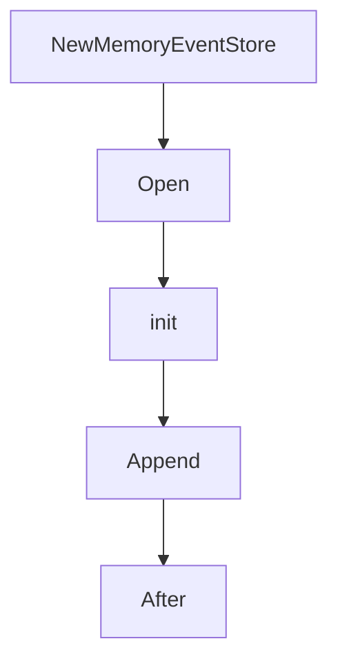

# Chapter 7: Testing, Troubleshooting, and Rough Edges

Welcome to **Chapter 7: Testing, Troubleshooting, and Rough Edges**. In this part of **MCP Go SDK Tutorial: Building Robust MCP Clients and Servers in Go**, you will build an intuitive mental model first, then move into concrete implementation details and practical production tradeoffs.


Operational quality improves when teams treat debugging and known limitations as first-class concerns.

## Learning Goals

- build a practical troubleshooting loop for MCP transport and handler issues
- use inspector and HTTP traffic inspection effectively
- account for known v1 rough edges in API usage
- reduce recurring production support incidents

## Troubleshooting Workflow

1. reproduce against a minimal example transport path
2. inspect MCP wire logs and HTTP traces
3. validate capability advertisement vs actual handlers
4. cross-check behavior against rough-edge notes before escalating

## Rough-Edge Themes to Track

- default capabilities behavior can surprise teams expecting empty defaults
- some naming and capability field decisions are scheduled for v2 cleanup
- event store and stream semantics need careful design in resumable deployments

## Source References

- [Troubleshooting Guide](https://github.com/modelcontextprotocol/go-sdk/blob/main/docs/troubleshooting.md)
- [Rough Edges](https://github.com/modelcontextprotocol/go-sdk/blob/main/docs/rough_edges.md)
- [MCP Inspector Tutorial](../mcp-inspector-tutorial/)

## Summary

You now have a disciplined debugging approach and awareness of v1 API edges that affect production behavior.

Next: [Chapter 8: Conformance, Operations, and Upgrade Strategy](08-conformance-operations-and-upgrade-strategy.md)

## Source Code Walkthrough

### `mcp/event.go`

The `NewMemoryEventStore` function in [`mcp/event.go`](https://github.com/modelcontextprotocol/go-sdk/blob/HEAD/mcp/event.go) handles a key part of this chapter's functionality:

```go
const defaultMaxBytes = 10 << 20 // 10 MiB

// NewMemoryEventStore creates a [MemoryEventStore] with the default value
// for MaxBytes.
func NewMemoryEventStore(opts *MemoryEventStoreOptions) *MemoryEventStore {
	return &MemoryEventStore{
		maxBytes: defaultMaxBytes,
		store:    make(map[string]map[string]*dataList),
	}
}

// Open implements [EventStore.Open]. It ensures that the underlying data
// structures for the given session are initialized and ready for use.
func (s *MemoryEventStore) Open(_ context.Context, sessionID, streamID string) error {
	s.mu.Lock()
	defer s.mu.Unlock()
	s.init(sessionID, streamID)
	return nil
}

// init is an internal helper function that ensures the nested map structure for a
// given sessionID and streamID exists, creating it if necessary. It returns the
// dataList associated with the specified IDs.
// Requires s.mu.
func (s *MemoryEventStore) init(sessionID, streamID string) *dataList {
	streamMap, ok := s.store[sessionID]
	if !ok {
		streamMap = make(map[string]*dataList)
		s.store[sessionID] = streamMap
	}
	dl, ok := streamMap[streamID]
	if !ok {
```

This function is important because it defines how MCP Go SDK Tutorial: Building Robust MCP Clients and Servers in Go implements the patterns covered in this chapter.

### `mcp/event.go`

The `Open` function in [`mcp/event.go`](https://github.com/modelcontextprotocol/go-sdk/blob/HEAD/mcp/event.go) handles a key part of this chapter's functionality:

```go
// All of an EventStore's methods must be safe for use by multiple goroutines.
type EventStore interface {
	// Open is called when a new stream is created. It may be used to ensure that
	// the underlying data structure for the stream is initialized, making it
	// ready to store and replay event streams.
	Open(_ context.Context, sessionID, streamID string) error

	// Append appends data for an outgoing event to given stream, which is part of the
	// given session.
	Append(_ context.Context, sessionID, streamID string, data []byte) error

	// After returns an iterator over the data for the given session and stream, beginning
	// just after the given index.
	//
	// Once the iterator yields a non-nil error, it will stop.
	// After's iterator must return an error immediately if any data after index was
	// dropped; it must not return partial results.
	// The stream must have been opened previously (see [EventStore.Open]).
	After(_ context.Context, sessionID, streamID string, index int) iter.Seq2[[]byte, error]

	// SessionClosed informs the store that the given session is finished, along
	// with all of its streams.
	//
	// A store cannot rely on this method being called for cleanup. It should institute
	// additional mechanisms, such as timeouts, to reclaim storage.
	SessionClosed(_ context.Context, sessionID string) error

	// There is no StreamClosed method. A server doesn't know when a stream is finished, because
	// the client can always send a GET with a Last-Event-ID referring to the stream.
}

// A dataList is a list of []byte.
```

This function is important because it defines how MCP Go SDK Tutorial: Building Robust MCP Clients and Servers in Go implements the patterns covered in this chapter.

### `mcp/event.go`

The `init` function in [`mcp/event.go`](https://github.com/modelcontextprotocol/go-sdk/blob/HEAD/mcp/event.go) handles a key part of this chapter's functionality:

```go
type EventStore interface {
	// Open is called when a new stream is created. It may be used to ensure that
	// the underlying data structure for the stream is initialized, making it
	// ready to store and replay event streams.
	Open(_ context.Context, sessionID, streamID string) error

	// Append appends data for an outgoing event to given stream, which is part of the
	// given session.
	Append(_ context.Context, sessionID, streamID string, data []byte) error

	// After returns an iterator over the data for the given session and stream, beginning
	// just after the given index.
	//
	// Once the iterator yields a non-nil error, it will stop.
	// After's iterator must return an error immediately if any data after index was
	// dropped; it must not return partial results.
	// The stream must have been opened previously (see [EventStore.Open]).
	After(_ context.Context, sessionID, streamID string, index int) iter.Seq2[[]byte, error]

	// SessionClosed informs the store that the given session is finished, along
	// with all of its streams.
	//
	// A store cannot rely on this method being called for cleanup. It should institute
	// additional mechanisms, such as timeouts, to reclaim storage.
	SessionClosed(_ context.Context, sessionID string) error

	// There is no StreamClosed method. A server doesn't know when a stream is finished, because
	// the client can always send a GET with a Last-Event-ID referring to the stream.
}

// A dataList is a list of []byte.
// The zero dataList is ready to use.
```

This function is important because it defines how MCP Go SDK Tutorial: Building Robust MCP Clients and Servers in Go implements the patterns covered in this chapter.

### `mcp/event.go`

The `Append` function in [`mcp/event.go`](https://github.com/modelcontextprotocol/go-sdk/blob/HEAD/mcp/event.go) handles a key part of this chapter's functionality:

```go
	Open(_ context.Context, sessionID, streamID string) error

	// Append appends data for an outgoing event to given stream, which is part of the
	// given session.
	Append(_ context.Context, sessionID, streamID string, data []byte) error

	// After returns an iterator over the data for the given session and stream, beginning
	// just after the given index.
	//
	// Once the iterator yields a non-nil error, it will stop.
	// After's iterator must return an error immediately if any data after index was
	// dropped; it must not return partial results.
	// The stream must have been opened previously (see [EventStore.Open]).
	After(_ context.Context, sessionID, streamID string, index int) iter.Seq2[[]byte, error]

	// SessionClosed informs the store that the given session is finished, along
	// with all of its streams.
	//
	// A store cannot rely on this method being called for cleanup. It should institute
	// additional mechanisms, such as timeouts, to reclaim storage.
	SessionClosed(_ context.Context, sessionID string) error

	// There is no StreamClosed method. A server doesn't know when a stream is finished, because
	// the client can always send a GET with a Last-Event-ID referring to the stream.
}

// A dataList is a list of []byte.
// The zero dataList is ready to use.
type dataList struct {
	size  int // total size of data bytes
	first int // the stream index of the first element in data
	data  [][]byte
```

This function is important because it defines how MCP Go SDK Tutorial: Building Robust MCP Clients and Servers in Go implements the patterns covered in this chapter.


## How These Components Connect


