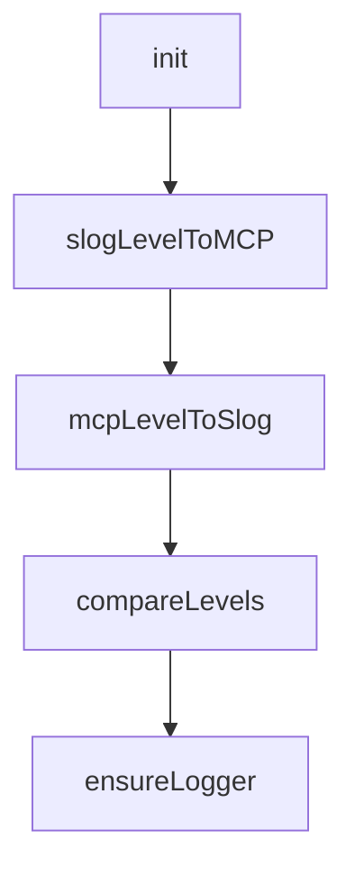

# Chapter 8: Conformance, Operations, and Upgrade Strategy

Welcome to **Chapter 8: Conformance, Operations, and Upgrade Strategy**. In this part of **MCP Go SDK Tutorial: Building Robust MCP Clients and Servers in Go**, you will build an intuitive mental model first, then move into concrete implementation details and practical production tradeoffs.


Conformance and release discipline keep Go MCP systems reliable across protocol evolution.

## Learning Goals

- run client and server conformance workflows continuously
- interpret baseline skips and failure classes pragmatically
- connect SDK upgrades to protocol revision planning
- maintain a stable release process for MCP services

## Conformance Loop

- run `scripts/server-conformance.sh` and `scripts/client-conformance.sh` in CI
- store result artifacts for trend analysis and regression triage
- review `conformance/baseline.yml` regularly to shrink accepted exceptions
- pair conformance with service-level integration tests

## Upgrade Strategy

1. track protocol revision deltas from the specification changelog
2. map SDK release notes to impacted capabilities in your services
3. stage transport/auth upgrades behind feature flags when possible
4. publish internal migration notes for all MCP-consuming teams

## Source References

- [Server Conformance Script](https://github.com/modelcontextprotocol/go-sdk/blob/main/scripts/server-conformance.sh)
- [Client Conformance Script](https://github.com/modelcontextprotocol/go-sdk/blob/main/scripts/client-conformance.sh)
- [Conformance Baseline](https://github.com/modelcontextprotocol/go-sdk/blob/main/conformance/baseline.yml)
- [Go SDK Releases](https://github.com/modelcontextprotocol/go-sdk/releases)
- [MCP Specification Changelog](https://github.com/modelcontextprotocol/modelcontextprotocol/blob/main/docs/specification/2025-11-25/changelog.mdx)

## Summary

You now have an operations-ready model for validating and evolving Go SDK MCP deployments over time.

Next: Continue with [MCP TypeScript SDK Tutorial](../mcp-typescript-sdk-tutorial/)

## Source Code Walkthrough

### `mcp/logging.go`

The `init` function in [`mcp/logging.go`](https://github.com/modelcontextprotocol/go-sdk/blob/HEAD/mcp/logging.go) handles a key part of this chapter's functionality:

```go
var mcpToSlog = make(map[LoggingLevel]slog.Level)

func init() {
	for sl, ml := range slogToMCP {
		mcpToSlog[ml] = sl
	}
}

func slogLevelToMCP(sl slog.Level) LoggingLevel {
	if ml, ok := slogToMCP[sl]; ok {
		return ml
	}
	return "debug" // for lack of a better idea
}

func mcpLevelToSlog(ll LoggingLevel) slog.Level {
	if sl, ok := mcpToSlog[ll]; ok {
		return sl
	}
	// TODO: is there a better default?
	return LevelDebug
}

// compareLevels behaves like [cmp.Compare] for [LoggingLevel]s.
func compareLevels(l1, l2 LoggingLevel) int {
	return cmp.Compare(mcpLevelToSlog(l1), mcpLevelToSlog(l2))
}

// LoggingHandlerOptions are options for a LoggingHandler.
type LoggingHandlerOptions struct {
	// The value for the "logger" field of logging notifications.
	LoggerName string
```

This function is important because it defines how MCP Go SDK Tutorial: Building Robust MCP Clients and Servers in Go implements the patterns covered in this chapter.

### `mcp/logging.go`

The `slogLevelToMCP` function in [`mcp/logging.go`](https://github.com/modelcontextprotocol/go-sdk/blob/HEAD/mcp/logging.go) handles a key part of this chapter's functionality:

```go
}

func slogLevelToMCP(sl slog.Level) LoggingLevel {
	if ml, ok := slogToMCP[sl]; ok {
		return ml
	}
	return "debug" // for lack of a better idea
}

func mcpLevelToSlog(ll LoggingLevel) slog.Level {
	if sl, ok := mcpToSlog[ll]; ok {
		return sl
	}
	// TODO: is there a better default?
	return LevelDebug
}

// compareLevels behaves like [cmp.Compare] for [LoggingLevel]s.
func compareLevels(l1, l2 LoggingLevel) int {
	return cmp.Compare(mcpLevelToSlog(l1), mcpLevelToSlog(l2))
}

// LoggingHandlerOptions are options for a LoggingHandler.
type LoggingHandlerOptions struct {
	// The value for the "logger" field of logging notifications.
	LoggerName string
	// Limits the rate at which log messages are sent.
	// Excess messages are dropped.
	// If zero, there is no rate limiting.
	MinInterval time.Duration
}

```

This function is important because it defines how MCP Go SDK Tutorial: Building Robust MCP Clients and Servers in Go implements the patterns covered in this chapter.

### `mcp/logging.go`

The `mcpLevelToSlog` function in [`mcp/logging.go`](https://github.com/modelcontextprotocol/go-sdk/blob/HEAD/mcp/logging.go) handles a key part of this chapter's functionality:

```go
}

func mcpLevelToSlog(ll LoggingLevel) slog.Level {
	if sl, ok := mcpToSlog[ll]; ok {
		return sl
	}
	// TODO: is there a better default?
	return LevelDebug
}

// compareLevels behaves like [cmp.Compare] for [LoggingLevel]s.
func compareLevels(l1, l2 LoggingLevel) int {
	return cmp.Compare(mcpLevelToSlog(l1), mcpLevelToSlog(l2))
}

// LoggingHandlerOptions are options for a LoggingHandler.
type LoggingHandlerOptions struct {
	// The value for the "logger" field of logging notifications.
	LoggerName string
	// Limits the rate at which log messages are sent.
	// Excess messages are dropped.
	// If zero, there is no rate limiting.
	MinInterval time.Duration
}

// A LoggingHandler is a [slog.Handler] for MCP.
type LoggingHandler struct {
	opts LoggingHandlerOptions
	ss   *ServerSession
	// Ensures that the buffer reset is atomic with the write (see Handle).
	// A pointer so that clones share the mutex. See
	// https://github.com/golang/example/blob/master/slog-handler-guide/README.md#getting-the-mutex-right.
```

This function is important because it defines how MCP Go SDK Tutorial: Building Robust MCP Clients and Servers in Go implements the patterns covered in this chapter.

### `mcp/logging.go`

The `compareLevels` function in [`mcp/logging.go`](https://github.com/modelcontextprotocol/go-sdk/blob/HEAD/mcp/logging.go) handles a key part of this chapter's functionality:

```go
}

// compareLevels behaves like [cmp.Compare] for [LoggingLevel]s.
func compareLevels(l1, l2 LoggingLevel) int {
	return cmp.Compare(mcpLevelToSlog(l1), mcpLevelToSlog(l2))
}

// LoggingHandlerOptions are options for a LoggingHandler.
type LoggingHandlerOptions struct {
	// The value for the "logger" field of logging notifications.
	LoggerName string
	// Limits the rate at which log messages are sent.
	// Excess messages are dropped.
	// If zero, there is no rate limiting.
	MinInterval time.Duration
}

// A LoggingHandler is a [slog.Handler] for MCP.
type LoggingHandler struct {
	opts LoggingHandlerOptions
	ss   *ServerSession
	// Ensures that the buffer reset is atomic with the write (see Handle).
	// A pointer so that clones share the mutex. See
	// https://github.com/golang/example/blob/master/slog-handler-guide/README.md#getting-the-mutex-right.
	mu              *sync.Mutex
	lastMessageSent time.Time // for rate-limiting
	buf             *bytes.Buffer
	handler         slog.Handler
}

// ensureLogger returns l if non-nil, otherwise a discard logger.
func ensureLogger(l *slog.Logger) *slog.Logger {
```

This function is important because it defines how MCP Go SDK Tutorial: Building Robust MCP Clients and Servers in Go implements the patterns covered in this chapter.


## How These Components Connect


