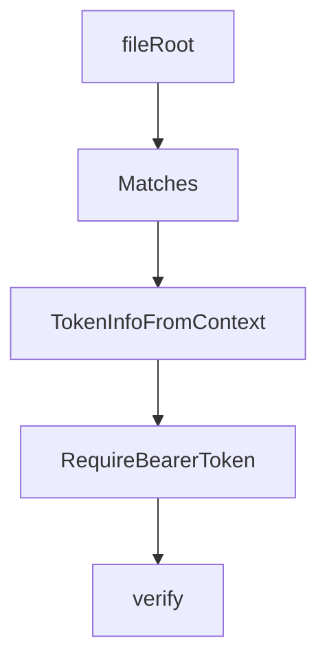

# Chapter 8: Conformance, Operations, and Upgrade Strategy

Welcome to **Chapter 8: Conformance, Operations, and Upgrade Strategy**. In this part of **MCP Go SDK Tutorial: Building Robust MCP Clients and Servers in Go**, you will build an intuitive mental model first, then move into concrete implementation details and practical production tradeoffs.


Conformance and release discipline keep Go MCP systems reliable across protocol evolution.

## Learning Goals

- run client and server conformance workflows continuously
- interpret baseline skips and failure classes pragmatically
- connect SDK upgrades to protocol revision planning
- maintain a stable release process for MCP services

## Conformance Loop

- run `scripts/server-conformance.sh` and `scripts/client-conformance.sh` in CI
- store result artifacts for trend analysis and regression triage
- review `conformance/baseline.yml` regularly to shrink accepted exceptions
- pair conformance with service-level integration tests

## Upgrade Strategy

1. track protocol revision deltas from the specification changelog
2. map SDK release notes to impacted capabilities in your services
3. stage transport/auth upgrades behind feature flags when possible
4. publish internal migration notes for all MCP-consuming teams

## Source References

- [Server Conformance Script](https://github.com/modelcontextprotocol/go-sdk/blob/main/scripts/server-conformance.sh)
- [Client Conformance Script](https://github.com/modelcontextprotocol/go-sdk/blob/main/scripts/client-conformance.sh)
- [Conformance Baseline](https://github.com/modelcontextprotocol/go-sdk/blob/main/conformance/baseline.yml)
- [Go SDK Releases](https://github.com/modelcontextprotocol/go-sdk/releases)
- [MCP Specification Changelog](https://github.com/modelcontextprotocol/modelcontextprotocol/blob/main/docs/specification/2025-11-25/changelog.mdx)

## Summary

You now have an operations-ready model for validating and evolving Go SDK MCP deployments over time.

Next: Continue with [MCP TypeScript SDK Tutorial](../mcp-typescript-sdk-tutorial/)

## Depth Expansion Playbook

## Source Code Walkthrough

### `mcp/resource.go`

The `fileRoot` function in [`mcp/resource.go`](https://github.com/modelcontextprotocol/go-sdk/blob/HEAD/mcp/resource.go) handles a key part of this chapter's functionality:

```go
}

// fileRoots transforms the Roots obtained from the client into absolute paths on
// the local filesystem.
// TODO(jba): expose this functionality to user ResourceHandlers,
// so they don't have to repeat it.
func fileRoots(rawRoots []*Root) ([]string, error) {
	var fileRoots []string
	for _, r := range rawRoots {
		fr, err := fileRoot(r)
		if err != nil {
			return nil, err
		}
		fileRoots = append(fileRoots, fr)
	}
	return fileRoots, nil
}

// fileRoot returns the absolute path for Root.
func fileRoot(root *Root) (_ string, err error) {
	defer util.Wrapf(&err, "root %q", root.URI)

	// Convert to absolute file path.
	rurl, err := url.Parse(root.URI)
	if err != nil {
		return "", err
	}
	if rurl.Scheme != "file" {
		return "", errors.New("not a file URI")
	}
	if rurl.Path == "" {
		// A more specific error than the one below, to catch the
```

This function is important because it defines how MCP Go SDK Tutorial: Building Robust MCP Clients and Servers in Go implements the patterns covered in this chapter.

### `mcp/resource.go`

The `Matches` function in [`mcp/resource.go`](https://github.com/modelcontextprotocol/go-sdk/blob/HEAD/mcp/resource.go) handles a key part of this chapter's functionality:

```go
}

// Matches reports whether the receiver's uri template matches the uri.
func (sr *serverResourceTemplate) Matches(uri string) bool {
	tmpl, err := uritemplate.New(sr.resourceTemplate.URITemplate)
	if err != nil {
		return false
	}
	return tmpl.Regexp().MatchString(uri)
}

```

This function is important because it defines how MCP Go SDK Tutorial: Building Robust MCP Clients and Servers in Go implements the patterns covered in this chapter.

### `auth/auth.go`

The `TokenInfoFromContext` function in [`auth/auth.go`](https://github.com/modelcontextprotocol/go-sdk/blob/HEAD/auth/auth.go) handles a key part of this chapter's functionality:

```go
type tokenInfoKey struct{}

// TokenInfoFromContext returns the [TokenInfo] stored in ctx, or nil if none.
func TokenInfoFromContext(ctx context.Context) *TokenInfo {
	ti := ctx.Value(tokenInfoKey{})
	if ti == nil {
		return nil
	}
	return ti.(*TokenInfo)
}

// RequireBearerToken returns a piece of middleware that verifies a bearer token using the verifier.
// If verification succeeds, the [TokenInfo] is added to the request's context and the request proceeds.
// If verification fails, the request fails with a 401 Unauthenticated, and the WWW-Authenticate header
// is populated to enable [protected resource metadata].
//
// [protected resource metadata]: https://datatracker.ietf.org/doc/rfc9728
func RequireBearerToken(verifier TokenVerifier, opts *RequireBearerTokenOptions) func(http.Handler) http.Handler {
	// Based on typescript-sdk/src/server/auth/middleware/bearerAuth.ts.

	return func(handler http.Handler) http.Handler {
		return http.HandlerFunc(func(w http.ResponseWriter, r *http.Request) {
			tokenInfo, errmsg, code := verify(r, verifier, opts)
			if code != 0 {
				if code == http.StatusUnauthorized || code == http.StatusForbidden {
					if opts != nil {
						var params []string
						if opts.ResourceMetadataURL != "" {
							params = append(params, fmt.Sprintf("resource_metadata=%q", opts.ResourceMetadataURL))
						}
						if len(opts.Scopes) > 0 {
							params = append(params, fmt.Sprintf("scope=%q", strings.Join(opts.Scopes, " ")))
```

This function is important because it defines how MCP Go SDK Tutorial: Building Robust MCP Clients and Servers in Go implements the patterns covered in this chapter.

### `auth/auth.go`

The `RequireBearerToken` function in [`auth/auth.go`](https://github.com/modelcontextprotocol/go-sdk/blob/HEAD/auth/auth.go) handles a key part of this chapter's functionality:

```go
type TokenVerifier func(ctx context.Context, token string, req *http.Request) (*TokenInfo, error)

// RequireBearerTokenOptions are options for [RequireBearerToken].
type RequireBearerTokenOptions struct {
	// The URL for the resource server metadata OAuth flow, to be returned as part
	// of the WWW-Authenticate header.
	ResourceMetadataURL string
	// The required scopes.
	Scopes []string
}

type tokenInfoKey struct{}

// TokenInfoFromContext returns the [TokenInfo] stored in ctx, or nil if none.
func TokenInfoFromContext(ctx context.Context) *TokenInfo {
	ti := ctx.Value(tokenInfoKey{})
	if ti == nil {
		return nil
	}
	return ti.(*TokenInfo)
}

// RequireBearerToken returns a piece of middleware that verifies a bearer token using the verifier.
// If verification succeeds, the [TokenInfo] is added to the request's context and the request proceeds.
// If verification fails, the request fails with a 401 Unauthenticated, and the WWW-Authenticate header
// is populated to enable [protected resource metadata].
//
// [protected resource metadata]: https://datatracker.ietf.org/doc/rfc9728
func RequireBearerToken(verifier TokenVerifier, opts *RequireBearerTokenOptions) func(http.Handler) http.Handler {
	// Based on typescript-sdk/src/server/auth/middleware/bearerAuth.ts.

	return func(handler http.Handler) http.Handler {
```

This function is important because it defines how MCP Go SDK Tutorial: Building Robust MCP Clients and Servers in Go implements the patterns covered in this chapter.


## How These Components Connect


