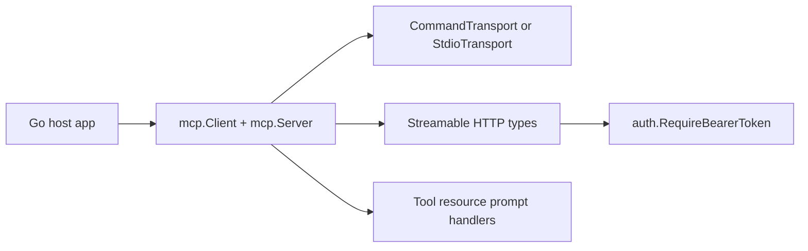

# MCP Go SDK Tutorial: Building Robust MCP Clients and Servers in Go

> Learn how to use `modelcontextprotocol/go-sdk` for production MCP workloads across stdio and streamable HTTP, including auth middleware, conformance, and upgrade planning.

## Why This Track Matters

Go is frequently used for high-reliability infrastructure and backend systems. The official Go SDK lets teams implement MCP with strong runtime control, typed handlers, and transport flexibility.

This track focuses on:

- mapping package boundaries (`mcp`, `jsonrpc`, `auth`, `oauthex`) to architecture decisions
- implementing lifecycle, session, and transport behavior with fewer runtime surprises
- designing safe tool/resource/prompt handlers with schema-aware contracts
- running conformance, troubleshooting, and rough-edge-aware upgrade loops

## Current Snapshot (Verified February 12, 2026)

- repository: [`modelcontextprotocol/go-sdk`](https://github.com/modelcontextprotocol/go-sdk)
- stars: about **3.8k**
- latest release: [`v1.3.0`](https://github.com/modelcontextprotocol/go-sdk/releases/tag/v1.3.0) (**February 9, 2026**)
- recent activity: updated on **February 12, 2026**
- branch posture: `main` with active protocol and conformance updates
- licensing note: project transition from MIT to Apache-2.0 (documentation non-spec content under CC-BY-4.0)

## Mental Model

## Chapter Guide

| Chapter | Key Question | Outcome |
|:--------|:-------------|:--------|
| [01 - Getting Started and SDK Package Map](01-getting-started-and-sdk-package-map.md) | Which Go SDK packages should I use first? | Clean dependency baseline |
| [02 - Client/Server Lifecycle and Session Management](02-client-server-lifecycle-and-session-management.md) | How do sessions and initialization flows really work? | Fewer lifecycle bugs |
| [03 - Transports: stdio, Streamable HTTP, and Custom Flows](03-transports-stdio-streamable-http-and-custom-flows.md) | Which transport model should I deploy and how? | More resilient connectivity |
| [04 - Building Tools, Resources, and Prompts in Go](04-building-tools-resources-and-prompts-in-go.md) | How do I design server primitives with strong contracts? | Higher interface quality |
| [05 - Client Capabilities: Roots, Sampling, and Elicitation](05-client-capabilities-roots-sampling-and-elicitation.md) | How do clients expose advanced features safely? | Better client governance |
| [06 - Auth, Security, and Runtime Hardening](06-auth-security-and-runtime-hardening.md) | How do we secure HTTP deployments and session handling? | Lower security risk |
| [07 - Testing, Troubleshooting, and Rough Edges](07-testing-troubleshooting-and-rough-edges.md) | How do teams debug and avoid known API traps? | Faster issue resolution |
| [08 - Conformance, Operations, and Upgrade Strategy](08-conformance-operations-and-upgrade-strategy.md) | How do we verify behavior and keep pace with spec changes? | Stable long-term operations |

## What You Will Learn

- how to structure Go MCP systems around explicit transport and capability boundaries
- how to implement and test server/client behavior with practical conformance loops
- how to apply auth middleware and security guidance in production HTTP deployments
- how to plan upgrades around SDK rough edges and protocol revision drift

## Source References

- [Go SDK README](https://github.com/modelcontextprotocol/go-sdk/blob/main/README.md)
- [Features Index](https://github.com/modelcontextprotocol/go-sdk/blob/main/docs/README.md)
- [Protocol Support](https://github.com/modelcontextprotocol/go-sdk/blob/main/docs/protocol.md)
- [Server Features](https://github.com/modelcontextprotocol/go-sdk/blob/main/docs/server.md)
- [Client Features](https://github.com/modelcontextprotocol/go-sdk/blob/main/docs/client.md)
- [Troubleshooting](https://github.com/modelcontextprotocol/go-sdk/blob/main/docs/troubleshooting.md)
- [Rough Edges](https://github.com/modelcontextprotocol/go-sdk/blob/main/docs/rough_edges.md)
- [Server Conformance Script](https://github.com/modelcontextprotocol/go-sdk/blob/main/scripts/server-conformance.sh)
- [Client Conformance Script](https://github.com/modelcontextprotocol/go-sdk/blob/main/scripts/client-conformance.sh)

## Related Tutorials

- [MCP Specification Tutorial](../mcp-specification-tutorial/)
- [MCP Python SDK Tutorial](../mcp-python-sdk-tutorial/)
- [MCP TypeScript SDK Tutorial](../mcp-typescript-sdk-tutorial/)
- [FastMCP Tutorial](../fastmcp-tutorial/)

---

Start with [Chapter 1: Getting Started and SDK Package Map](01-getting-started-and-sdk-package-map.md).
