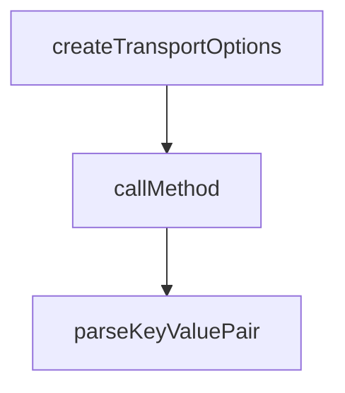

# Chapter 1: Getting Started

Welcome to **Chapter 1: Getting Started**. In this part of **MCP Inspector Tutorial: Debugging and Validating MCP Servers**, you will build an intuitive mental model first, then move into concrete implementation details and practical production tradeoffs.


This chapter gives you the fastest path to a usable Inspector baseline.

## Learning Goals

- launch Inspector in UI mode with default local-safe settings
- connect to a local MCP server process
- confirm core methods (`tools/list`, `resources/list`, `prompts/list`) work
- capture a reproducible baseline command for your team

## Fast Start Loop

1. ensure Node.js version satisfies `^22.7.5`
2. run `npx @modelcontextprotocol/inspector`
3. open `http://localhost:6274`
4. connect a known test server (for example `node build/index.js`)
5. run one list call per capability area and verify outputs in the UI

## Baseline Command Variants

```bash
# Start inspector UI and proxy on defaults
npx @modelcontextprotocol/inspector

# Start inspector against a local stdio server
npx @modelcontextprotocol/inspector node build/index.js

# Override ports if defaults are occupied
CLIENT_PORT=8080 SERVER_PORT=9000 npx @modelcontextprotocol/inspector node build/index.js
```

## Source References

- [Inspector README - Quick Start](https://github.com/modelcontextprotocol/inspector/blob/main/README.md)
- [Inspector README - Running from an MCP server repository](https://github.com/modelcontextprotocol/inspector/blob/main/README.md#from-an-mcp-server-repository)

## Summary

You now have a working Inspector baseline with validated server connectivity.

Next: [Chapter 2: Architecture, Transports, and Session Model](02-architecture-transports-and-session-model.md)

## Depth Expansion Playbook

## Source Code Walkthrough

### `cli/src/index.ts`

The `createTransportOptions` function in [`cli/src/index.ts`](https://github.com/modelcontextprotocol/inspector/blob/HEAD/cli/src/index.ts) handles a key part of this chapter's functionality:

```ts
};

function createTransportOptions(
  target: string[],
  transport?: "sse" | "stdio" | "http",
  headers?: Record<string, string>,
): TransportOptions {
  if (target.length === 0) {
    throw new Error(
      "Target is required. Specify a URL or a command to execute.",
    );
  }

  const [command, ...commandArgs] = target;

  if (!command) {
    throw new Error("Command is required.");
  }

  const isUrl = command.startsWith("http://") || command.startsWith("https://");

  if (isUrl && commandArgs.length > 0) {
    throw new Error("Arguments cannot be passed to a URL-based MCP server.");
  }

  let transportType: "sse" | "stdio" | "http";
  if (transport) {
    if (!isUrl && transport !== "stdio") {
      throw new Error("Only stdio transport can be used with local commands.");
    }
    if (isUrl && transport === "stdio") {
      throw new Error("stdio transport cannot be used with URLs.");
```

This function is important because it defines how MCP Inspector Tutorial: Debugging and Validating MCP Servers implements the patterns covered in this chapter.

### `cli/src/index.ts`

The `callMethod` function in [`cli/src/index.ts`](https://github.com/modelcontextprotocol/inspector/blob/HEAD/cli/src/index.ts) handles a key part of this chapter's functionality:

```ts
}

async function callMethod(args: Args): Promise<void> {
  // Read package.json to get name and version for client identity
  const pathA = "../package.json"; // We're in package @modelcontextprotocol/inspector-cli
  const pathB = "../../package.json"; // We're in package @modelcontextprotocol/inspector
  let packageJson: { name: string; version: string };
  let packageJsonData = await import(fs.existsSync(pathA) ? pathA : pathB, {
    with: { type: "json" },
  });
  packageJson = packageJsonData.default;

  const transportOptions = createTransportOptions(
    args.target,
    args.transport,
    args.headers,
  );
  const transport = createTransport(transportOptions);

  const [, name = packageJson.name] = packageJson.name.split("/");
  const version = packageJson.version;
  const clientIdentity = { name, version };

  const client = new Client(clientIdentity);

  try {
    await connect(client, transport);

    let result: McpResponse;

    // Tools methods
    if (args.method === "tools/list") {
```

This function is important because it defines how MCP Inspector Tutorial: Debugging and Validating MCP Servers implements the patterns covered in this chapter.

### `cli/src/index.ts`

The `parseKeyValuePair` function in [`cli/src/index.ts`](https://github.com/modelcontextprotocol/inspector/blob/HEAD/cli/src/index.ts) handles a key part of this chapter's functionality:

```ts
}

function parseKeyValuePair(
  value: string,
  previous: Record<string, JsonValue> = {},
): Record<string, JsonValue> {
  const parts = value.split("=");
  const key = parts[0];
  const val = parts.slice(1).join("=");

  if (val === undefined || val === "") {
    throw new Error(
      `Invalid parameter format: ${value}. Use key=value format.`,
    );
  }

  // Try to parse as JSON first
  let parsedValue: JsonValue;
  try {
    parsedValue = JSON.parse(val) as JsonValue;
  } catch {
    // If JSON parsing fails, keep as string
    parsedValue = val;
  }

  return { ...previous, [key as string]: parsedValue };
}

function parseHeaderPair(
  value: string,
  previous: Record<string, string> = {},
): Record<string, string> {
```

This function is important because it defines how MCP Inspector Tutorial: Debugging and Validating MCP Servers implements the patterns covered in this chapter.


## How These Components Connect


