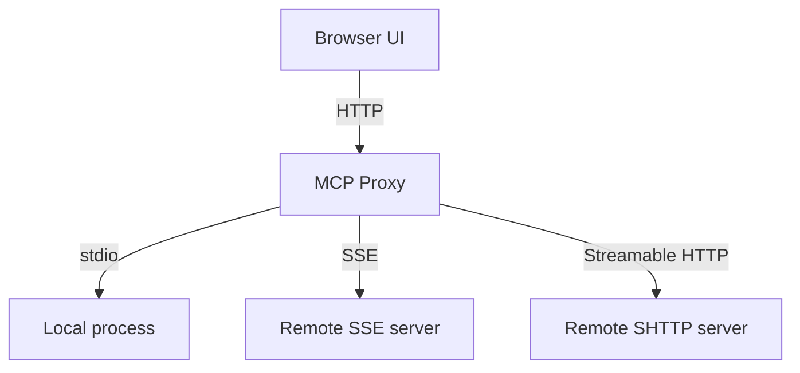

# Chapter 2: Architecture, Transports, and Session Model

Inspector has two runtime pieces: a web client and a proxy that speaks MCP transports to your target server.

## Learning Goals

- distinguish UI concerns from proxy transport concerns
- choose the right transport (`stdio`, `sse`, `streamable-http`) per test
- understand how session token auth gates proxy requests
- avoid misdiagnosing transport errors as schema/tool errors

## Architecture Map

## Transport Selection Heuristics

| Transport | Best For | Common Pitfall |
|:----------|:---------|:---------------|
| `stdio` | local server development | process startup env vars not aligned |
| `sse` | existing SSE endpoints | missing auth header or stale token |
| `streamable-http` | modern remote MCP services | incorrect endpoint path assumptions |

## Session Model

Inspector proxy auth is enabled by default and generates a session token at startup. Keep this token scoped to local workflows and rotate by restarting the process.

## Source References

- [Inspector README - Architecture Overview](https://github.com/modelcontextprotocol/inspector/blob/main/README.md#architecture-overview)
- [Inspector README - Transport Types in Config Files](https://github.com/modelcontextprotocol/inspector/blob/main/README.md#transport-types-in-config-files)
- [Inspector README - Authentication](https://github.com/modelcontextprotocol/inspector/blob/main/README.md#authentication-1)

## Summary

You now have a transport-first mental model for debugging with Inspector.

Next: [Chapter 3: UI Debugging Workflows: Tools, Resources, Prompts](03-ui-debugging-workflows-tools-resources-prompts.md)
